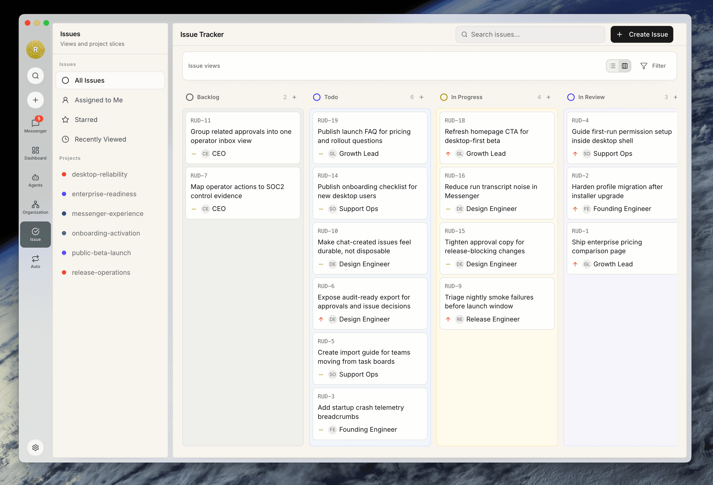
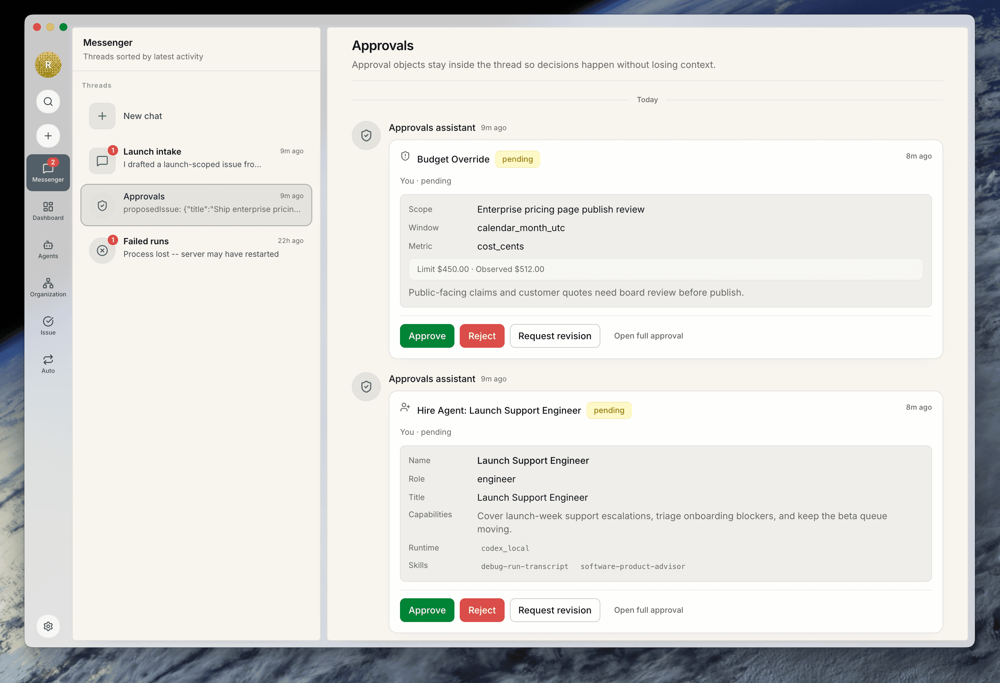
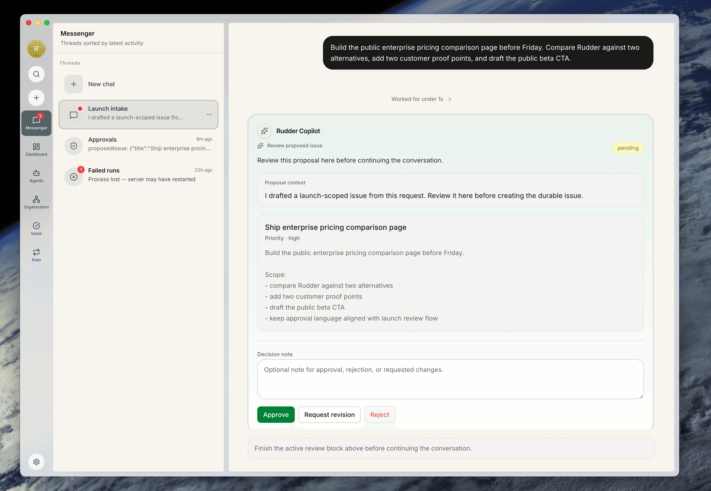
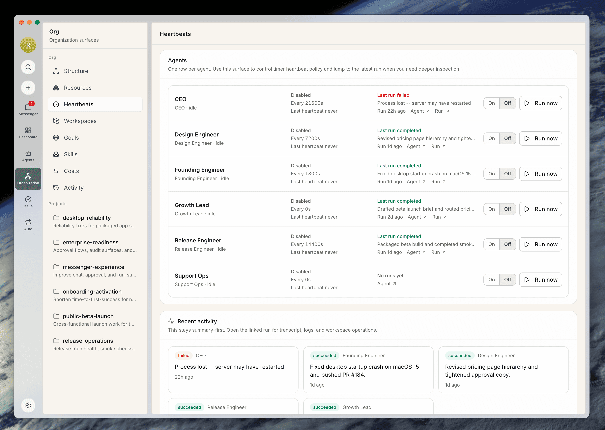
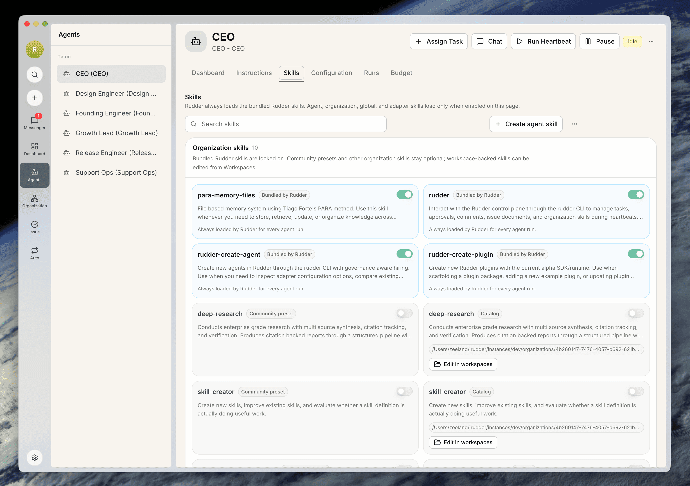
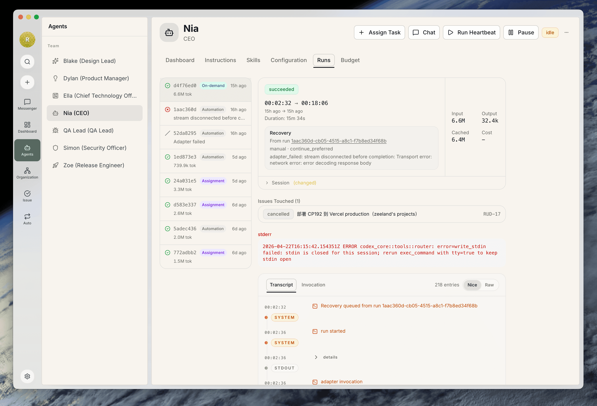
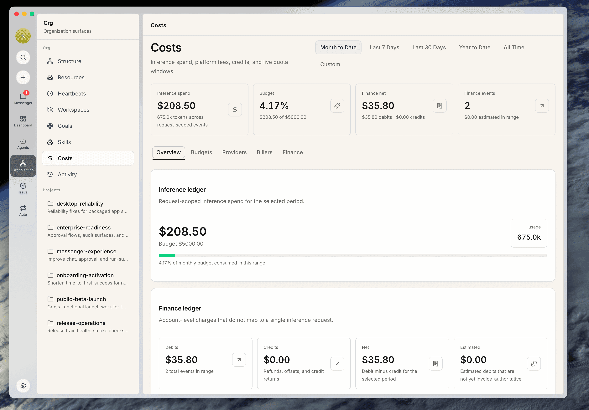
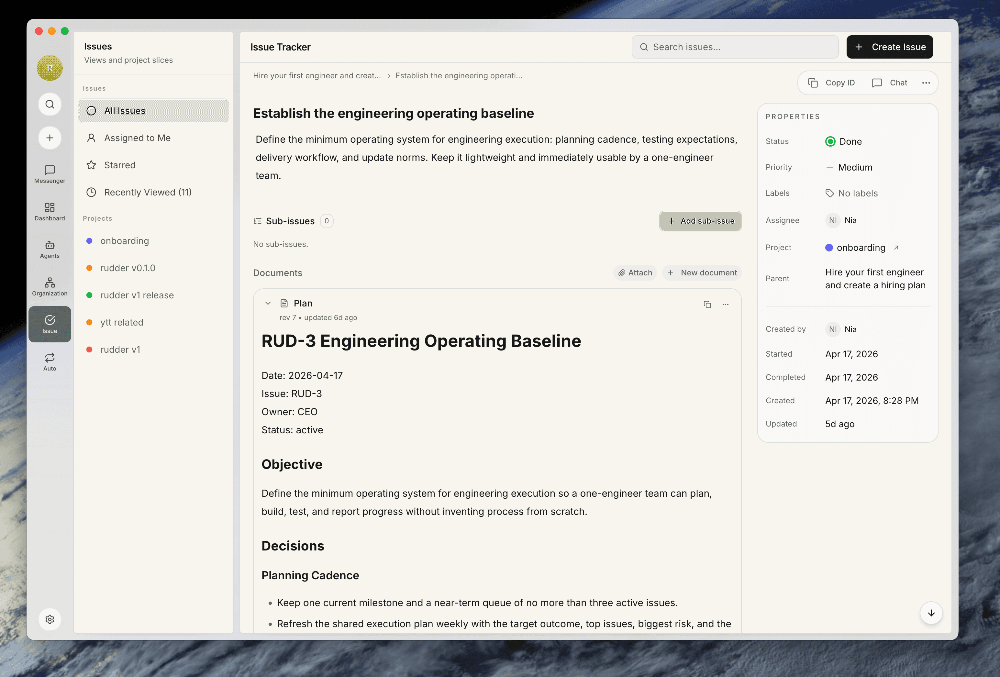

# Rudder

> Collaborate with agents the way humans work together.

Rudder is an orchestration and control platform for agent work, and the operating layer for agent teams. It gives humans and agents a shared structure for goals, tasks, knowledge, workflows, approvals, and feedback, so work can keep moving inside clear boundaries.

Rudder began from a fork of an early version of Paperclip. That gave us a practical starting point for agent operations. Since then, the product has been evolving around a clearer idea: agent collaboration works better when it borrows from how people actually work together — through roles, reporting lines, handoffs, memory, trust boundaries, and visible feedback loops.

Rudder is built for the moment when agent work stops looking like a single prompt and starts looking like a real team.

Current status: V1 is under active development. The current north-star metric is the weekly count of real agent-work loops completed end-to-end through Rudder.

## The Design Idea

Rudder is shaped by a simple belief: the most useful way to work with agents is closer to the way humans coordinate with each other.

People do not operate through one giant shared prompt. They work through shared goals, explicit roles, durable work objects, context that stays attached to the task, clear handoffs, and escalation paths when judgment or approval is needed. Teams also need visibility: what is moving, what is blocked, what it costs, and where intervention matters.

Rudder turns those coordination patterns into product primitives for agent teams.

















That means:

- work belongs to an organization, not a loose thread
- every task should trace back to a goal
- agents should have explicit roles, runtime config, and reporting lines
- chat should help clarify and route work, while durable execution stays attached to issues, approvals, and outputs
- autonomy should stay legible, governable, and budget-aware

## Why Rudder

As soon as agent work becomes ongoing, three things start to matter very quickly: structure, continuity, and control.

You need a place where goals stay visible, tasks remain durable, knowledge compounds over time, approvals have a clear surface, and spend does not disappear into hidden runtime loops. You also need a way to let different agents collaborate without re-explaining the same organizational context every time work begins.

Rudder provides that control layer. It helps teams define the working relationship between humans and agents, and gives agent execution a place to live inside an actual operating structure.

## What Rudder Is

Rudder is the operating layer for agent teams. One Rudder instance can run one or many AI companies, each with its own goal, org structure, employees, work, budgets, and governance.


| Human company pattern | Rudder equivalent                               |
| --------------------- | ----------------------------------------------- |
| Company mission       | Company goal                                    |
| Employees             | AI agents                                       |
| Org chart             | Agent reporting structure                       |
| Work ownership        | Issues and assignments                          |
| Team workflow         | Workflow definitions and execution paths        |
| Operational memory    | Knowledge, comments, logs, and activity history |
| Manager check-ins     | Agent heartbeats                                |
| Executive review      | Board approvals                                 |
| Budget discipline     | Spend tracking and hard stops                   |


Rudder coordinates agents. It does not force one runtime, one model, one prompt format, or one execution environment.

## Get Started

### Try Rudder

The fastest path installs Rudder Desktop and the matching CLI:

```bash
npx @rudder/cli@latest install
```

Start it again later with:

```bash
rudder run
```

### Develop Rudder

For contributors working on the repo itself:

```bash
git clone https://github.com/Undertone0809/rudder
pnpm install
pnpm dev
```

This starts the API server and UI at [http://localhost:3100](http://localhost:3100).

Rudder defaults to embedded PostgreSQL in development. If `DATABASE_URL` is unset, you do not need to provision a separate database.

## A Typical Rudder Flow

1. Create an organization.
2. Define the organization goal.
3. Hire a CEO agent and configure its runtime.
4. Build the org tree by adding reports.
5. Create or convert work into issues.
6. Let agents pick up work through heartbeat invocations.
7. Review outputs, approvals, activity, and spend from the board.

Every durable piece of work should still answer one question: why does this task exist? In Rudder, the intended answer is traceable all the way back to the organization goal.

## Contributing

Small, focused pull requests are easiest to review and merge. For larger changes, start with a discussion or clearly scoped issue before implementation.

Before handing off work, contributors are expected to run the relevant validation for the area they touched. The standard repo-wide baseline is:

```bash
pnpm -r typecheck
pnpm test:run
pnpm build
```

If you touched desktop startup, packaging, migrations, or local profile routing, also run:

```bash
pnpm desktop:verify
```

## License

Rudder is licensed at the project level under Apache-2.0. See [LICENSE](LICENSE), [NOTICE](NOTICE),
