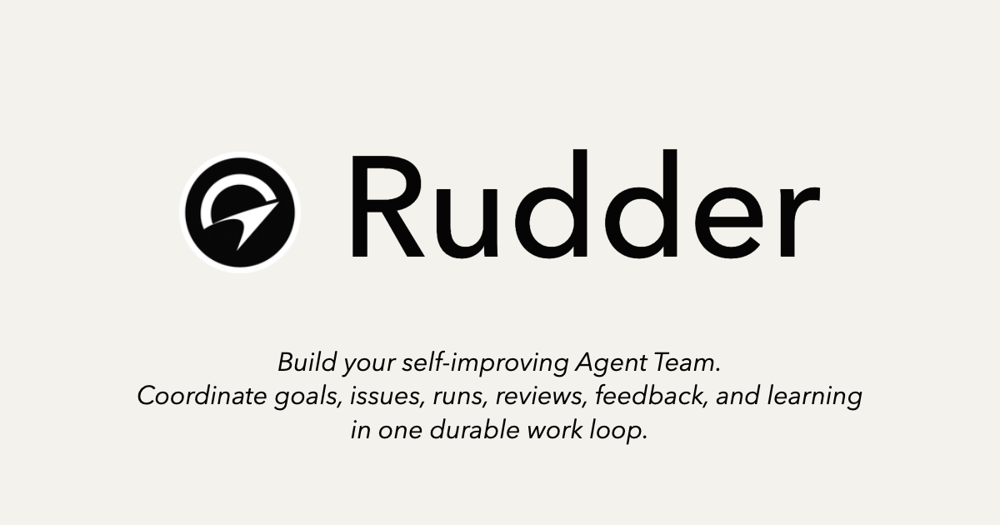
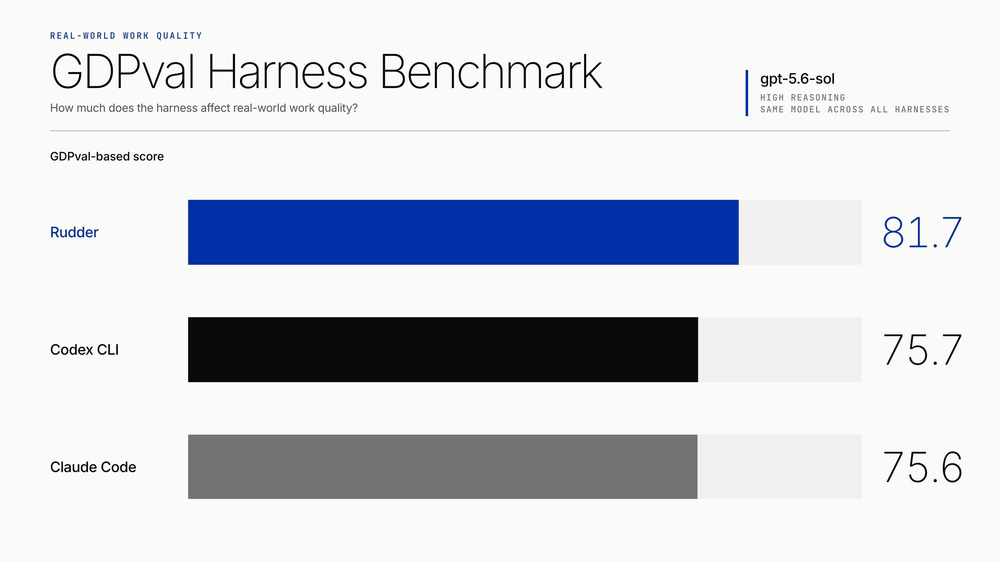
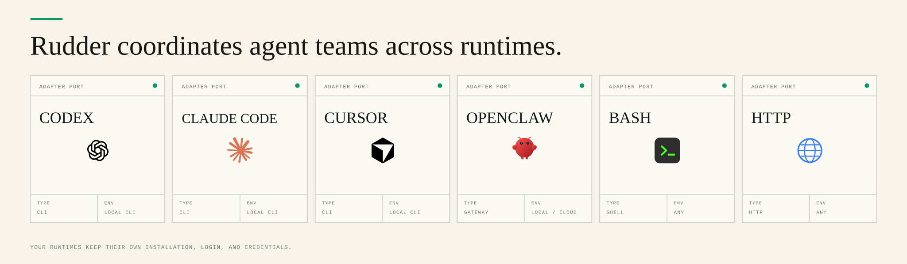

# Rudder

> Build your self-improving Agent Team.

Agents that think, build, play, and learn from real work.

[Website](https://rudderhq.dev) | [Docs](https://docs.rudderhq.dev) | [Code signing policy](docs/reference/code-signing-policy.mdx) | [Privacy](docs/reference/privacy.mdx) | [Discord](https://discord.gg/ZcfWwPVkUz)

Rudder turns goals, tasks, chats, issues, agent runs, reviews, and feedback into a work loop for agent teams. It gives humans and agents a shared operating structure for moving work forward, running agents, reviewing outputs, controlling spend, and preserving the lessons that should make the next run better.

Rudder began as a fork of an early version of Paperclip. That gave the project a practical starting point for agent operations; Rudder is now evolving around a sharper product idea: agent teams improve when real work leaves behind durable context, decisions, feedback, and reusable operating patterns.

Rudder is built for the moment when agent work stops looking like a single prompt and starts looking like a real team.

## A Better Harness for Agent Work

We benchmarked Rudder, Codex CLI, and Claude Code on a random sample of professional tasks from OpenAI's GDPval dataset, with every system requesting the same model and reasoning effort. Rudder achieved the highest score under our local case-equal rubric metric.

[](https://docs.rudderhq.dev/benchmarks/gdpval-harness)

A model is only as effective as the environment around it. Rudder gives agents durable context, coordinated tools, structured work, review feedback, budgets, and memory—helping them stay focused, preserve what they learn, and produce stronger results across real work.

The benchmark provides directional evidence that the harness and work environment matter; it is not an official GDPval score or leaderboard result. [Read the methodology and evidence limits.](https://docs.rudderhq.dev/benchmarks/gdpval-harness)

## The Work Loop

Rudder is designed around the loop that makes agent work compound:

```text
Goal -> Plan -> Chat or Issue -> Agent run -> Review -> Feedback -> Learning -> Better future runs
```

This loop needs inspectable execution and the right amount of structure. Goals explain why work exists. Chat supports conversation-driven execution; issues add explicit coordination fields. Agent runs keep execution visible. Reviews and approvals keep autonomy governable. Feedback, comments, documents, run history, and skills give the team a place to keep what it learned.

Rudder does not assume every lesson is automatically promoted into a new skill or workflow. The product direction is to make those promotion paths explicit, reviewable, and reusable instead of leaving them buried in chat transcripts or one-off prompts.

## The Design Idea

The most useful way to work with agents is closer to the way humans coordinate with each other.

People work through shared goals, explicit roles, durable work objects, context attached to the task, clear handoffs, and escalation paths when judgment or approval is needed. Teams also need visibility: what is moving, what is blocked, what it costs, and where intervention matters.

- work belongs to an organization, not a loose thread
- every issue should trace back to a goal
- agents have roles, runtime config, capabilities, and skills
- chat and issues provide conversational and structured ways to move work forward, with execution attached to inspectable runs, outputs, reviews, and history
- autonomy stays legible, governable, and budget-aware

## What Rudder Is

Rudder is open-source software for assigning, running, reviewing, and improving agent work. One Rudder instance can run one or many organizations, each with its own goal, agents, issues, budgets, approvals, feedback, and governance.

| Human team pattern | Rudder equivalent |
| --- | --- |
| Mission | Organization goal |
| Employees | AI agents |
| Work ownership | Issues and assignments |
| Team workflow | Workflow definitions and execution paths |
| Operational memory | Comments, documents, run history, activity, and skills |
| Manager check-ins | Agent heartbeats |
| Executive review | Board approvals |
| Budget discipline | Spend tracking and hard stops |

Rudder coordinates agents. It does not force one runtime, one model, one prompt format, or one execution environment.

## Bring Your Own Runtime

Rudder is the coordination layer, not the model provider. Run agents with the local tools and provider accounts you already use—including Codex, Claude Code, Cursor, OpenClaw, Bash, or your own HTTP service. Local runtimes keep their existing installation, login, and credentials; Rudder connects assignment, context, execution, review, budgets, and memory around them.



[See supported runtimes and configuration options.](https://docs.rudderhq.dev/reference/runtime-types)

## Get Started

### Try Rudder

The fastest path prepares the matching persistent CLI/runtime and opens Rudder
as a per-user app:

```bash
npx @rudderhq/cli@latest start
```

On Windows, `start` reads (but never changes) Smart App Control. When enforcement
is on and the Rudder Desktop channel is still unsigned, it creates a Start Menu
shortcut and opens the same local workspace in Microsoft Edge app mode instead
of installing an executable that Windows may block. Use
`--desktop-mode native` to explicitly retain the portable Electron path or
`--desktop-mode browser` to select the compatibility path yourself. This
loopback-only fallback is an un-packaged `local_trusted` client and does not use
the packaged Desktop Account Gate.

For a server or headless host where the Desktop app should not be installed,
prepare only the server runtime and persistent CLI:

```bash
npx @rudderhq/cli@latest start --server-only
```

After the persistent CLI is available, the direct `rudder` form is the same command surface:

```bash
rudder start
rudder start --server-only
```

### Develop Rudder

For contributors working on the repo itself:

```bash
git clone https://github.com/Undertone0809/rudder
pnpm install
pnpm dev
```

This starts the API server and UI at [http://localhost:3100](http://localhost:3100).

Rudder defaults to embedded PostgreSQL in development. If `DATABASE_URL` is unset, you do not need to provision a separate database.

## A Typical Rudder Flow

1. Create an organization.
2. Define the organization goal.
3. Create or use a default agent with a clear role and runtime.
4. Add more agents only when repeated work needs stable ownership.
5. Choose Chat for conversation-driven execution or an issue for structured coordination.
6. Let agents execute through Chat turns or issue heartbeat invocations.
7. Review outputs, approvals, activity, and spend from the board.
8. Leave feedback in the conversation, run, issue, or output.
9. Preserve reusable lessons as better context, skills, decisions, or workflows.
10. Future runs use the improved team context.

Every durable piece of work should still answer one question: why does this task exist? In Rudder, the answer should remain traceable from its Chat or issue context back to the organization goal.

## Contributing

Small, focused pull requests are easiest to review and merge. For larger changes, start with a discussion or clearly scoped issue before implementation.

Before handing off work, contributors are expected to run the relevant validation for the area they touched. The standard repo-wide baseline is:

```bash
pnpm -r typecheck
pnpm test:run
pnpm build
```

If you touched desktop startup, packaging, migrations, or local profile routing, also run:

```bash
pnpm desktop:verify
```

## Community

Join the [Rudder Discord](https://discord.gg/ZcfWwPVkUz) for setup help, build logs, product feedback, and a Build Review every two weeks. Use [GitHub Issues](https://github.com/Undertone0809/rudder/issues) for reproducible bugs and concrete code changes.

You can also find Rudder on [LINUX DO](https://linux.do/).

## License

Rudder is licensed at the project level under Apache-2.0. See [LICENSE](LICENSE), [NOTICE](NOTICE),

## Code signing policy

Rudder is applying to the SignPath Foundation program for its Windows Desktop
release artifacts. Until the application is accepted and the release pipeline
is configured, released binaries are not represented as SignPath-signed.

Free code signing provided by [SignPath.io](https://about.signpath.io/),
certificate by [SignPath Foundation](https://signpath.org/).

See the full [code signing policy](docs/reference/code-signing-policy.mdx) and
[privacy policy](docs/reference/privacy.mdx).
