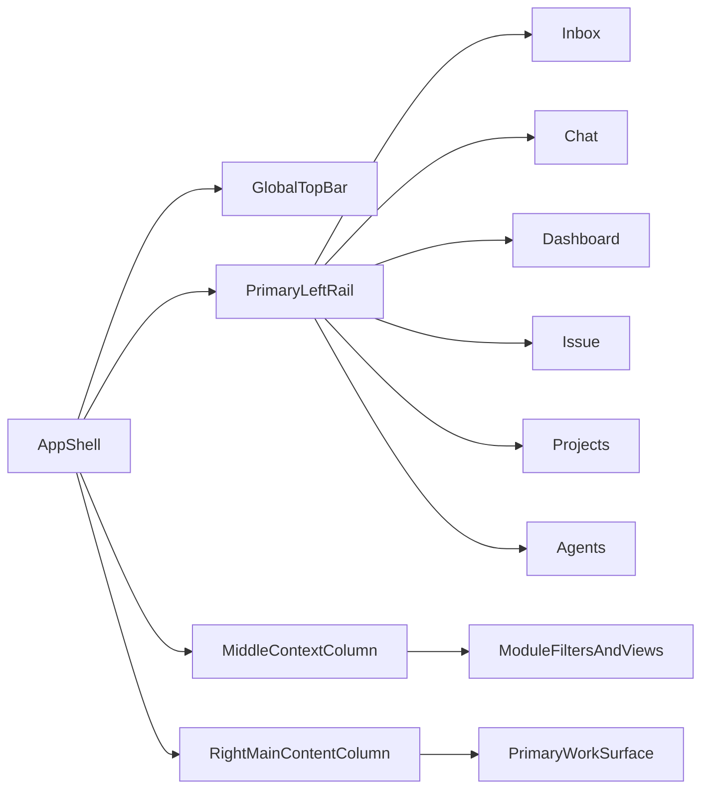

# Feishu-Style Three-Column Layout Proposal

## Objective

Replace the current Rudder shell with a Feishu-like three-column layout while preserving current route semantics and core control-plane behaviors.

## Scope (Confirmed)

- Full IA redesign intent, but v1 implementation starts with layout-first migration.
- Single big-bang release target.
- Desktop-first shell implementation for v1.

## Locked Requirements

- Shell baseline is three-column:
  - Left primary rail
  - Middle context column
  - Right main content column
- Left primary rail must follow this exact order:
  1. Organization avatar
  2. Search quick action
  3. Create quick action
  4. Inbox
  5. Chat
  6. Dashboard
  7. Issue
  8. Projects
  9. Agents
  10. Bottom-anchored settings button
- Organization avatar menu must be exact parity with the current organization menu:
  - Same items
  - Same order
  - Same copy
  - Same permission behavior
- Organization avatar opens as anchored dropdown.
- Search and create actions reuse existing current actions.
- Left-rail module click keeps current route semantics (layout-first, no route behavior drift).

## Current Architecture Baseline

- Main shell: `ui/src/components/Layout.tsx`
- Main sidebar surfaces:
  - `ui/src/components/Sidebar.tsx`
  - `ui/src/components/OrganizationSettingsSidebar.tsx`
  - `ui/src/components/InstanceSidebar.tsx`
- Header: `ui/src/components/BreadcrumbBar.tsx`
- Right panel: `ui/src/components/PropertiesPanel.tsx`
- Routing contracts:
  - `ui/src/App.tsx`
  - `ui/src/lib/router.tsx`
  - `ui/src/lib/organization-routes.ts`

## Target Shell Model

## Execution Plan

1. Build left-rail shell primitives and preserve existing route behavior.
2. Move current sidebar content into middle-column responsibility.
3. Keep top bar compatible with existing breadcrumb/plugin integrations.
4. Keep optional inspectors as page-scoped drawers, not fixed shell columns.
5. Validate route compatibility and organization-prefix behavior.
6. Add/update E2E coverage for navigation flows impacted by shell changes.

## Risks

- Route contract mismatch with organization-prefix routing.
- Plugin slot placement regressions due to shell region movement.
- Mobile/desktop navigation divergence if nav source-of-truth is not unified.

## Validation

- `pnpm -r typecheck`
- `pnpm test:run`
- `pnpm build`
- Visual verification for desktop shell and key flows.

