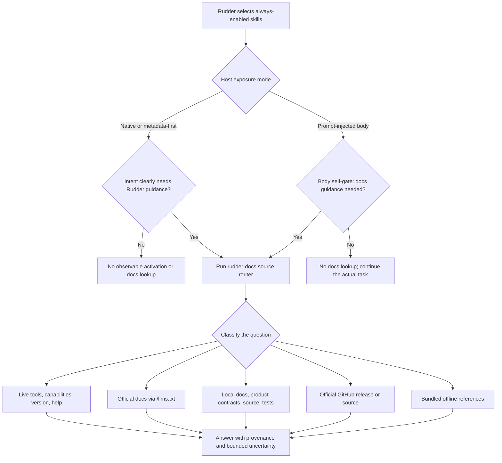

# Reframe The Bundled Rudder Skill As Rudder Docs

## Overview

Rename the always-available bundled `rudder` skill to `rudder-docs` and narrow
its responsibility from an assumed every-run operating workflow to an
on-demand Rudder documentation and self-knowledge router.

The skill should help an agent answer Rudder questions from the most relevant
current evidence available to that run:

- live first-party Rudder MCP tools and capability metadata;
- the installed Rudder CLI and command help;
- the official public documentation at `https://docs.rudderhq.dev`;
- the official documentation index at `https://docs.rudderhq.dev/llms.txt`;
- a local Rudder source checkout when one is already available;
- guarded product contracts under `doc/product/` for intended product behavior;
- contributor documentation under `doc/engineering/` and `doc/`;
- implementation source and tests for exact code behavior;
- the official source repository at
  `https://github.com/Undertone0809/rudder` when local source is unavailable;
  and
- bundled sibling references as the offline, version-adjacent fallback.

The skill remains in Rudder's always-enabled baseline. In this proposal,
"always enabled" means that Rudder selects and exposes the skill to every
eligible invocation. It does not mean the model deliberately invoked the skill
or consulted a documentation source for every turn. Native skill hosts may
expose only metadata plus a managed skill directory until host activation,
while prompt-injected hosts may place the full body in the prompt before the
model decides whether it is relevant. Body presence is therefore not, by
itself, evidence of intentional use.

The host should intent-match or activate `rudder-docs` only when the user asks
about Rudder, an exact Rudder behavior or interface needs verification, a
Rudder operation has failed or is ambiguous, or authoritative Rudder context
would materially improve the answer. A greeting, an ordinary coding task, or
work merely hosted inside Rudder should not activate the skill.

This proposal uses the source-routing and progressive-disclosure ideas of the
OpenAI Docs skill, adapted for Rudder's multi-runtime environment. It does not
add a documentation MCP server, a `skill_view` feature, automatic
documentation-guided recovery, new telemetry, or a new runtime loading model.

## Decision Summary

The recommended design is:

1. Make `rudder-docs` the canonical bundled skill name, directory, runtime
   name, and selection key.
2. Keep it always Rudder-selected and discoverable for every run.
3. Use a precise frontmatter description as the primary implicit-activation
   contract.
4. Remove the broad always-injected prompt sentence that tells every run it can
   use the current `rudder` skill for nearly every operating-layer object.
5. Make the main `SKILL.md` a compact request classifier and source router.
6. Keep detailed operating, CLI, API, Library, workspace, and organization
   skill guidance in sibling references loaded only when relevant.
7. Let the skill use existing web, browser, shell, filesystem, MCP, and source
   inspection capabilities; do not add a new docs service in this iteration.
8. Preserve legacy `rudder` desired-skill references as input aliases, while
   emitting and displaying only the new canonical `rudder-docs` identity.
9. Evaluate both over-triggering and under-triggering with realistic full
   Rudder prompts, including native-discovery and prompt-injected hosts. Use
   Codex plus a direct OpenClaw router check where available, and do not claim
   Rudder OpenClaw adapter parity unless that adapter actually projects the
   bundled skill.

## What Is The Problem?

### The current skill is framed too broadly

The current frontmatter says:

```yaml
name: rudder
description: Use Rudder operating-layer best practices and CLI-backed references for ownership, checkout, comments, reviews, Library handoff, and organization skills. Runtime-owned heartbeat prompts provide the fixed heartbeat execution flow.
```

The opening body then says the skill applies to heartbeat, issue, review, chat,
automation, and investigation contexts. Those contexts cover nearly every run
that Rudder creates. Even when the user only sends `hi`, the surrounding
runtime context contains Rudder, issue, Chat, run, agent, Library, project, or
organization language, so the skill appears relevant before the model has
considered the actual user intent.

The current runtime operating contract reinforces that broad match with an
always-injected sentence that suggests using the `rudder` skill for agent
profiles, automations, Library, projects, organizations, runs, Chat, and
issues. The result is a discovery surface that can be mistaken for a mandatory
workflow.

### Availability and use are different states

Rudder currently owns which skills are selected for a run's desired set. The
runtime then materializes or exposes that set according to adapter capability.
That is an availability decision, not a host-activation decision.

The intended states are distinct, but not every host exposes the same
boundaries:

| State | Owner | Meaning |
| --- | --- | --- |
| Rudder-selected | Rudder | The skill belongs to the current run's enabled or always-enabled desired set. This preserves the existing Product Logic and code meaning of `selected`. |
| Materialized | Runtime adapter | The managed skill package exists in a host-readable location. |
| Metadata-exposed | Native skill host | The host can discover name, description, and location without activating the body. |
| Prompt-injected | Prompt-based adapter | The adapter has already inserted the Rudder-selected package body into the provider prompt; this is exposure, not proof that the model relied on it. |
| Intent-matched | Model and native host skill router | The current request clearly matches the description or explicitly names the skill. |
| Host-activated | Native host skill router | The host loads or activates `SKILL.md` after an intent match. This state is direct only when the provider or transcript exposes an activation/read event; otherwise it is `unknown`, not inferred from silence. |
| Source consulted | `rudder-docs` workflow | The agent reads only the documentation, capability, contract, source, or test evidence needed for the question. |
| Used | Agent plus observable transcript evidence | The skill affected the work through an explicit activation/read, source lookup, attributable guidance, or another existing direct evidence signal. |

The current name and description blur these states. Renaming and reframing the
skill makes the distinction visible without changing Rudder's loading model.
This proposal reserves `selected` for Rudder's existing desired-state meaning;
model or provider routing uses `intent-matched` and `host-activated` instead.

### Host exposure modes are intentionally unchanged

Current adapters do not all use progressive disclosure in the same way:

| Exposure mode | Representative hosts | Consequence for this proposal |
| --- | --- | --- |
| Managed native discovery or metadata/directory exposure | Codex, Claude, Pi, Gemini, and native OpenClaw skill routing when configured | The description is the main implicit activation boundary. A greeting should not cause an observable activation or source lookup; when the provider exposes no read event, read status remains unknown. |
| Full Rudder-selected skill body injected into the provider prompt | Cursor and OpenCode | The body may be present for every run because the package remains always enabled. The main body must be small and start with a self-gating rule; a greeting should cause no docs workflow or source lookup. |
| Gateway/provider without current Rudder bundled-skill projection | Any adapter path that does not expose `rudderSkillSync` | Direct host research can validate the description pattern, but Rudder must not claim runtime parity until projection exists. |

Changing these adapter modes, adding a new activation mechanism, or redefining
telemetry is out of scope. The proposal must therefore use host-specific
acceptance evidence rather than pretending that "read" has one universal
meaning.

### The current body mixes two responsibilities

The current `SKILL.md` contains valuable material, but mixes:

- operational safety rails;
- heartbeat and issue workflow guidance;
- CLI command syntax;
- API fallback rules;
- authentication and environment facts;
- workspace and Library conventions;
- organization skill administration;
- comment formatting;
- git identity rules; and
- general Rudder product explanation.

This content is useful as documentation. It is not a reason to load the entire
skill for every ordinary run. The body should become a router that explains
which source to consult and which detailed reference to open. The detailed
material should remain available without occupying every turn's working
context.

### Rudder facts have different authorities

A single global source priority is insufficient because Rudder questions have
different meanings:

- "What can this installed runtime do now?" requires live capability evidence.
- "How should a user configure an agent?" should begin with public docs.
- "What is the intended product behavior?" belongs to the guarded Product
  Logic Registry.
- "Why does this implementation return 409?" may require source and tests.
- "Which CLI syntax works in this version?" should prefer installed help and
  version-matched references.
- "What changed in the latest release?" should use current public release docs
  or an official release tag.

Without an explicit request classifier, an agent may cite public docs for an
implementation detail, read source for a simple user-facing question, or answer
from model memory when the current runtime contradicts it.

### Existing research supports generic skill matching

The reviewed Codex prompt exposes skill name, description, and location through
a general skill system. A skill is intent-matched and activated when the user names it or the task
clearly matches its description. The OpenAI Docs skill does not depend on an
additional docs-specific system instruction; its frontmatter description owns
the trigger boundary, and its body owns the source route.

The reviewed OpenClaw prompt follows the same general shape: scan available
skill descriptions, read one specific `SKILL.md` only when it clearly applies,
and read none when no skill clearly applies. OpenClaw includes a small
host-owned CLI quick reference, but not a special docs-skill trigger.

Rudder should follow the same division of responsibility:

- host/runtime prompt: generic skill discovery and unavoidable runtime rules;
- skill metadata: when `rudder-docs` should be intent-matched and activated;
- skill body: how to classify the request and choose evidence;
- references and external sources: detailed content loaded on demand.

## Goals

### Product goals

- Keep authoritative Rudder help available to every agent without forcing it
  into every turn.
- Improve answers to questions about Rudder usage, behavior, configuration,
  troubleshooting, architecture, and source implementation.
- Reduce spurious skill use for greetings and unrelated work.
- Make user-facing explanations prefer the official public documentation.
- Make current-runtime questions prefer live capability and version evidence.
- Make contributor and debugging questions able to use local source, product
  contracts, engineering docs, and tests.
- Make source provenance visible so the user can distinguish documentation,
  product intent, installed behavior, and implementation evidence.

### Skill quality goals

- Keep the frontmatter description within the cross-host metadata budget:
  approximately 50-100 words and fewer than 1,024 characters.
- Keep `SKILL.md` comfortably below 500 lines and target a much smaller router
  body than the current 314-line mixed manual.
- Use progressive disclosure: metadata first, main workflow second, detailed
  references and remote/local sources only when required.
- Make the skill useful across Codex, Claude, OpenClaw, OpenCode, Pi, Gemini,
  shell, and future adapters without depending on a Codex-only metadata file.
  Compatibility here means the package can self-gate and route sources when the
  host exposes it; it does not promise that every current Rudder adapter already
  projects bundled skills.
- Avoid duplicating detailed facts in both `SKILL.md` and references.

## Options Considered

### Option A: Rename only

Rename the directory and frontmatter to `rudder-docs`, but otherwise keep the
current description and body.

Advantages:

- smallest mechanical diff;
- lowest immediate documentation migration cost.

Disadvantages:

- preserves the broad issue/review/chat/automation trigger;
- retains the mixed operating-manual and command-catalog structure;
- does not define how to search public docs or source;
- probably preserves the `hi` false positive.

Decision: reject.

### Option B: On-demand docs and self-knowledge router

Rename the canonical skill, narrow the description, remove the broad runtime
pointer, and reorganize the skill as a source router over existing capabilities
and documentation surfaces.

Advantages:

- solves the actual trigger-boundary problem;
- keeps default discovery;
- makes official docs and source available when they add value;
- requires no new service, endpoint, database state, or tool protocol;
- follows established skill progressive-disclosure patterns;
- can be evaluated independently on multiple hosts.

Disadvantages:

- requires a careful ownership audit of current operating rules;
- creates compatibility-sensitive canonical key churn;
- retrieval quality still depends on tools available to the current runtime;
- remote source and public docs availability cannot be guaranteed offline.

Decision: recommend.

### Option C: Add a first-party Rudder Docs resolver or MCP server

Add a typed docs-search capability that indexes official docs, source,
contracts, and runtime references.

Advantages:

- consistent discovery across runtimes;
- stronger provenance and version routing;
- potentially better offline caching and observability.

Disadvantages:

- materially expands runtime, API, permissions, security, and product scope;
- overlaps the separate agent documentation-guided recovery proposal;
- is unnecessary to validate the skill identity and trigger model;
- would turn a focused skill change into a platform feature.

Decision: defer. `2026-07-16-agent-doc-guided-recovery.md` remains adjacent
future work, not a dependency of this proposal.

## What Will Be Changed?

### Canonical skill identity

Change the canonical bundled package from:

```text
server/resources/bundled-skills/rudder/
name: rudder
key: rudder/rudder
selection key: bundled:rudder/rudder
```

to:

```text
server/resources/bundled-skills/rudder-docs/
name: rudder-docs
key: rudder/rudder-docs
selection key: bundled:rudder/rudder-docs
```

The directory name, frontmatter `name`, runtime name, canonical key, public
label, tests, and documentation examples must remain synchronized.

`rudder-docs` remains in `RUDDER_BUNDLED_SKILL_SLUGS` and remains always
enabled, managed, read-only, and non-configurable in the agent skill snapshot.
No optional enable toggle is added.

### Compatibility aliases

Accept these historical inputs as aliases for the new canonical skill:

- `rudder`
- `rudder/rudder`
- `bundled:rudder/rudder`

Alias rules:

- resolve the old input to `rudder/rudder-docs` before selection validation;
- emit only `rudder/rudder-docs` and
  `bundled:rudder/rudder-docs` in new snapshots and API responses;
- advertise `/api/skills/rudder-docs` as the canonical public download route
  while keeping `/api/skills/rudder` as an input-only HTTP compatibility alias;
- materialize only one `rudder-docs` runtime directory;
- do not display a second legacy `rudder` skill;
- preserve historical run evidence that already records `rudder/rudder`;
- do not rewrite old transcripts or portability archives in place; and
- add tests proving an old desired-skill payload cannot create a duplicate.

The input alias should remain until Rudder has a broader canonical-reference
migration policy. It is cheap, avoids breaking saved configurations and CLI
examples in the wild, and does not affect new output.

### Public bootstrap and OpenClaw surfaces

The canonical rename also applies to Rudder's unauthenticated/public skill
bootstrap surfaces. Update:

- the public skill index in `server/src/routes/access.ts` to advertise
  `{ name: "rudder-docs", path: "/api/skills/rudder-docs" }`;
- `readSkillMarkdown` and its route boundary so both the canonical slug and the
  legacy `rudder` input resolve to the new package, while list output is
  canonical-only;
- OpenClaw onboarding payloads and text to install
  `~/.openclaw/skills/rudder-docs/SKILL.md`; and
- invite/onboarding tests that pin the download URL, installed name, and path.

`/api/skills/rudder` remains a read-only compatibility route because existing
bootstrap scripts may call it directly. It must return the new canonical skill
body without advertising or installing a second `rudder` identity. The
canonical index, newly generated onboarding instructions, and all new examples
use `/api/skills/rudder-docs` only.

This public bootstrap compatibility does not imply that Rudder's current
OpenClaw gateway adapter projects `rudderSkillSync`. It only keeps direct
OpenClaw installation and public download behavior aligned with the rename.

### Managed runtime stale-name cleanup

The source-directory rename can leave a dangling managed `rudder` entry in
runtime skill homes whose reconciliation only knows current package sources.
Add a one-time, narrowly scoped cleanup before realizing `rudder-docs`:

- Cursor, OpenCode, Gemini, and Pi remove a legacy `rudder` entry only when it
  is inside that adapter's Rudder-managed skills home and its symlink target or
  Rudder-owned provenance identifies the old bundled package;
- a dangling symlink whose recorded target is the old
  `server/resources/bundled-skills/rudder` path qualifies for removal even
  after that source path no longer exists;
- a regular directory, an unrecognized symlink, or any path outside the
  adapter-managed home is never deleted; report a collision instead;
- Codex keeps its existing full managed-home reconciliation path; and
- adapter tests start with the old managed entry, run sync, and prove the new
  entry is the only Rudder-owned package while unrelated user skills remain.

This is a compatibility migration, not a change to adapter exposure mode.

### Proposed frontmatter description

Use this as the initial hand-written candidate before trigger optimization:

```yaml
---
name: rudder-docs
description: "Use when the user asks how Rudder works or how to use, configure, extend, operate, or troubleshoot Rudder; needs current guidance for Rudder agents, issues, Chat, runs, reviews, approvals, automations, Library, projects, skills, workspaces, CLI, MCP tools, APIs, or source behavior; or needs an exact supported command or product contract. Do not use for greetings, ordinary work merely running inside Rudder, routine actions already clear from the active context and typed tools, or general coding and research tasks that do not ask about Rudder."
---
```

This description deliberately includes:

- ownership: authoritative Rudder help and self-knowledge;
- positive triggers: use, configuration, extension, operation,
  troubleshooting, exact behavior, and source questions;
- domain coverage: major Rudder product and operating-layer surfaces;
- near-miss exclusions: greetings, hosted-but-unrelated work, and routine
  actions already explained by current tools.

All trigger conditions belong in the description. The body may restate the
boundary as a workflow guard for prompt-injected hosts, but it must not
introduce trigger categories that the metadata does not expose.

### Main `SKILL.md` responsibility

The main skill becomes a compact docs and self-knowledge router with this
shape:

1. Purpose and non-goals.
2. Request classifier.
3. Source routes by question type.
4. Version and conflict handling.
5. Evidence and citation rules.
6. Reference map.
7. Security and bounded-use rules.
8. Quality checklist.

The opening should say plainly:

> Provide authoritative, current guidance about Rudder. This is Rudder's
> documentation and self-knowledge entry point, not a workflow that must run
> merely because the agent is hosted by Rudder.

Immediately after the opening, add a prompt-injected-host guard:

> If this body is already present in the prompt but the current request does
> not need Rudder guidance, do not perform a docs lookup. Continue the user's
> actual task using the current tools and context.

This guard is not a second trigger contract. It prevents adapters that inject
the full body from converting mere exposure into a docs workflow.

### Remove the broad runtime pointer

Remove this sentence from `RUDDER_AGENT_OPERATING_CONTRACT`:

```text
You can use `rudder` skill to see Agent best practise in Rudder. eg: update Agent profile, crud automation, manage library, project, org, curd agent run, chat, issue.
```

Do not replace it with a new docs-specific system instruction. The skill is
already present in the available skill metadata, and the cross-host generic
skill router should apply the description.

The rest of `RUDDER_AGENT_OPERATING_CONTRACT` and scene-specific prompt
behavior remains outside this change except for the separately approved
issue-safety owner delta below. Runtime skill selection and adapter exposure
modes remain unchanged; materialization changes are limited to canonical paths
and the safe legacy managed-name cleanup described above.

### Known required issue-safety owner delta

Static review already identifies one blocking ownership gap. The rules "check
out an assigned issue before issue-scoped work" and "do not retry checkout after
a 409 conflict" currently live in the broad `rudder` skill and the
heartbeat-only instruction. The ordinary assignment issue prompt does not own
them. A native host that correctly declines to activate `rudder-docs` for a
routine action would therefore lose a reliable instruction path.

The reframe must not ship until a separate, explicit runtime/scene-rule delta
has been approved and tested. The recommended delta is a compact invariant in
every issue-scoped execution scene that can run without the heartbeat prompt:

> Before issue-scoped execution, check out the assigned issue. If checkout
> returns 409, do not retry; stop and report the ownership conflict.

This is an unavoidable execution rail, not a docs-skill trigger. If that delta
is not approved, implementation must stop or retain the rule in another owner
that is reliably loaded for every affected issue scene. Keeping it only in a
conditional `rudder-docs` reference is not acceptable.

### Reorganize detailed references

Retain the existing references, renamed with the package directory:

- `references/cli-reference.md`
  - stable typed MCP and CLI fallback catalog;
  - exact command shapes and high-risk command semantics;
  - installed-capability discovery guidance.
- `references/api-reference.md`
  - internal/debug/compatibility API reference only;
  - never the normal first route for agent operations.
- `references/organization-skills.md`
  - organization and agent skill discovery, import, inspect, enable, and sync
    workflows.

Add two focused references if the operating-rule audit confirms that the
content cannot be made clear through the existing three:

- `references/operating-practices.md`
  - ownership, checkout, review, close-out, approvals, delegation, escalation,
    comments, budget, git identity, and run evidence;
  - detailed operating guidance consulted for exact behavior questions.
- `references/source-map.md`
  - public docs, Product Logic Registry, engineering docs, source directories,
    tests, releases, and official repository routing;
  - common search patterns and which source owns which claim.

These references are part of the `rudder-docs` package. Adding them is not a
new runtime capability.

Do not add an auxiliary README, changelog, installation guide, or duplicated
quick reference. The skill package should contain only files used directly by
the workflow.

## Request Classifier And Source Routes

### Classification table

| Request class | Examples | First source | Next sources |
| --- | --- | --- | --- |
| Current run capability | "Can this agent call issue review through MCP?" | Current typed Rudder tool descriptors and `rudder agent capabilities --json` | Installed CLI `--help`, bundled CLI reference |
| Installed CLI behavior | "Which flag works in this installed version?" | `rudder --version` and exact command `--help` | Version-matched bundled reference or official release/tag source |
| User-facing product use | "How do I configure a Codex runtime?" | Official docs index and relevant page | Local `docs/` checkout, current capability evidence |
| Conceptual product behavior | "When should I use Chat instead of an issue?" | Official public concepts/how-to docs | Product contract when exact intended behavior is material |
| Product contract | "What is Rudder's checkout invariant?" | Owning `doc/product/**` contract | Source and tests that implement the contract |
| Contributor architecture | "Where is skill materialization implemented?" | Local source checkout and `doc/README.md` route | Engineering docs, Product Logic Registry, tests |
| Debugging or discrepancy | "Docs say X, but my run did Y" | Current run/version evidence | Public docs, product contract, source, tests, release history |
| API compatibility | "What endpoint backs this CLI fallback?" | Typed MCP/CLI surface first | `api-reference.md`, source routes, API tests |
| Release/current question | "Did the latest release change runtime setup?" | Official releases/changelog | Current public docs, official repository tag/release source |
| Offline or restricted run | Any supported Rudder question without web/source access | Bundled references and current capabilities | State the unavailable source and bounded uncertainty |

### Public documentation route

For user-facing documentation questions:

1. Prefer the official live docs when the runtime can access the web.
2. Fetch `https://docs.rudderhq.dev/llms.txt` to discover available pages
   before broad searching or crawling.
3. Open only the page or small set of pages that matches the user's job.
4. Prefer the user's language when an equivalent English or Chinese page is
   available.
5. Link the exact official page near the supported claim.
6. If the live site is unavailable, use a local `docs/` checkout when present.
7. Otherwise use bundled references and disclose that live public docs could
   not be verified.

The skill should not fetch every public page for every question. The docs index
is a routing surface, not a reason to fill context with the entire site.

### Live runtime and installed-version route

For questions about what the current run can do:

1. Inspect typed first-party Rudder tool names and schemas already exposed to
   the runtime.
2. Use `rudder agent capabilities --json` when command and tool discovery is
   needed.
3. Use `rudder --version` and specific command `--help` for installed CLI
   syntax or release matching.
4. Read `references/cli-reference.md` only for the relevant capability family.
5. Treat API access as an internal/debug fallback, not the normal agent
   interface.

For a claim about this environment, current callable behavior wins over generic
public documentation. The answer should state that the conclusion is
environment-specific when relevant.

### Local repository route

When the current workspace is a Rudder source checkout or contains the needed
Rudder source:

1. Follow repository `AGENTS.md` instructions.
2. Use `doc/README.md` to choose the correct documentation layer.
3. Use `docs/` for public user-facing documentation.
4. Use `doc/product/**` for current intended product behavior.
5. Use `doc/engineering/**` for contributor architecture and operating detail.
6. Use source and tests for exact implementation claims.
7. Prefer targeted `rg` searches and the owning module over broad repository
   scans.
8. Cite local files with paths and line numbers when the host supports
   clickable file links.

The skill may read guarded `doc/product/**` contracts. It may not edit them
unless the current user separately authorizes the Product Logic delta or
approves a plan containing that concrete delta.

### Official repository route

When local source is unavailable but source evidence is necessary:

1. Restrict source lookup to the official repository
   `https://github.com/Undertone0809/rudder` and its official release/tag pages.
2. Use the release tag matching `rudder --version` for installed-version
   questions when such a tag exists.
3. Use the default branch for explicit latest-development questions.
4. Do not silently use the default branch to explain an older installed
   release.
5. Link the exact source file, test, commit, tag, or release page used.
6. Do not clone the repository, install dependencies, or run source merely to
   answer a documentation question unless the user explicitly requests that
   work and it is safe within the current workspace.

### Conflict resolution

When sources disagree, do not flatten them into one answer. Classify the
disagreement:

| Conflict | Resolution |
| --- | --- |
| Live capability vs public docs | Use live capability for what works now; report probable version/docs drift. |
| Installed CLI help vs bundled reference | Use installed help for the environment; report the bundled reference as stale or version-adjacent. |
| Public docs vs Product Logic Registry | Use public docs for published user guidance and Product Logic for intended internal contract; name the mismatch. |
| Product contract vs implementation/test | Do not choose silently. State that implementation appears to drift from the contract and identify both. |
| Source default branch vs installed release | Prefer the matching release tag for installed behavior. |
| Model memory vs any verified source | Discard unsupported memory and use the verified source. |

The answer should distinguish:

- current environment fact;
- documented public behavior;
- intended product contract;
- implementation evidence; and
- inference or unresolved uncertainty.

## Proposed Main Skill Outline

The implementation should produce a `SKILL.md` approximately in this shape:

```markdown
---
name: rudder-docs
description: "..."
---

# Rudder Docs

Provide authoritative, current guidance about Rudder. This is Rudder's
documentation and self-knowledge entry point, not an every-run workflow.

If this body was prompt-injected but the request does not need Rudder guidance,
do not perform a docs lookup. Continue the user's actual task.

## Classify The Request

- Current runtime or installed command
- User-facing use or configuration
- Product behavior or contract
- Contributor architecture or source
- Debugging or source discrepancy
- Offline fallback

## Choose The Source Route

- Live tools and capabilities
- Official public docs via `/llms.txt`
- Local `docs/`, `doc/product/`, `doc/engineering/`, source, and tests
- Official GitHub repository and version tag
- Bundled references

## Resolve Version And Source Conflicts

## Cite Evidence

## Reference Map

## Boundaries And Quality Rules
```

The outline is intentionally a router, not a copy of the full current skill.

## Operating-Rule Ownership Audit

The current skill contains rules that may be documentation, conditional
workflow guidance, or unconditional runtime policy. Reframing the skill must
not silently remove a safety-critical rule merely because the skill no longer
over-triggers.

Before rewriting content, create an ownership matrix for every normative rule
in the current `SKILL.md`:

| Rule category | Desired owner | Migration action |
| --- | --- | --- |
| Unavoidable rule for every Rudder run | Runtime operating contract or scene prompt | Confirm it already exists. If missing, stop and propose a separate explicit runtime-contract delta. |
| Exact conditional Rudder behavior | `rudder-docs` reference | Preserve in the relevant detailed reference. |
| Command syntax | CLI reference or generated capability catalog | Remove duplicate main-body syntax and retain a pointer. |
| API compatibility fallback | API reference plus short main-body boundary | Preserve as internal/debug only. |
| Workspace and Library explanation | Public docs or operating-layer practices reference | Route by user-facing vs contributor question. |
| Organization skill administration | Organization skills reference | Preserve and load only for that request class. |
| Historical or duplicated instruction | No owner | Remove after tests prove no behavior dependency. |

Known rules requiring explicit audit include:

- issue checkout before issue-scoped execution and no retry on 409;
- no unassigned-work discovery;
- mention wake and ownership-transfer semantics;
- reviewer decisions and no silent reviewer takeover;
- blocked close-out and escalation;
- approval follow-up;
- budget focus;
- Library `markdownLink` and image attachment handoff;
- organization `skills enable` versus `skills sync`;
- runtime authentication boundaries;
- git co-author and safe identity requirements; and
- API fallback constraints.

This proposal already records the checkout/409 gap above and makes its approved
runtime/scene owner a delivery prerequisite. It does not authorize moving any
other newly discovered rules into the runtime operating contract. If the audit
finds another safety rule that currently depends on the skill being read every
run, that is evidence of a separate product/runtime gap. Implementation must
stop and propose that delta rather than retaining a broad false trigger or
quietly changing runtime behavior.

## User Experience Walkthrough

### Greeting or unrelated work

1. Rudder selects and exposes `rudder-docs` in the available skill metadata.
2. The user sends `hi` or asks for unrelated domain work.
3. A native skill host sees that the user intent does not match the
   `rudder-docs` description. No activation event is expected; if the provider
   exposes no direct read event, read status remains unknown rather than being
   reported as a proven non-read.
4. A prompt-injected host may already contain the compact body, but the body's
   self-gate causes no docs source lookup or skill-driven action.
5. The agent replies or performs the requested work normally in either mode.

### Routine Rudder action with a clear typed tool

1. The user asks the agent to mark an assigned issue done.
2. The current run exposes a clear typed Rudder tool and the wake context
   supplies the issue identity.
3. The agent uses the existing tool without turning the action into a
   documentation investigation.
4. `rudder-docs` remains discoverable but is not intent-matched or activated
   unless an ambiguity, error, or policy question appears.

### User-facing Rudder question

1. The user asks how to configure a Codex runtime in Rudder.
2. The host intent-matches and activates `rudder-docs` from its description.
3. The skill classifies the request as user-facing configuration.
4. The agent reads the official docs index and opens the runtime configuration
   guide.
5. It checks live capability or installed-version evidence only when needed.
6. It answers concisely and links the official page.

### Exact current-runtime question

1. The user asks whether the current run supports a specific Rudder MCP tool.
2. The skill classifies the request as current capability.
3. The agent inspects the typed tool surface or
   `rudder agent capabilities --json`.
4. It uses the CLI reference only for missing detail.
5. It answers from current-session evidence and labels the result as specific
   to this runtime.

### Source-level debugging question

1. The user asks why issue checkout returns 409 or where the behavior is
   implemented.
2. The skill classifies the request as product contract plus implementation.
3. In a Rudder source checkout, the agent reads the owning Product Logic
   contract, implementation, and regression tests.
4. Without local source, it uses the official repository and the installed
   release tag when relevant.
5. It distinguishes product intent from implementation evidence and cites both.

### Offline run

1. The user asks a Rudder question without web access and outside a source
   checkout.
2. The skill reads the most relevant bundled reference and live capability
   evidence.
3. It answers what can be established and states that live public docs or
   source could not be verified.
4. It does not invent unsupported details.

## Success Criteria For Change

### Discovery and identity

- `rudder-docs` is the only canonical bundled docs skill exposed to new runs.
- It remains always enabled, managed, read-only, and non-configurable.
- Historical `rudder` desired-skill refs resolve without producing a duplicate.
- Directory, frontmatter name, runtime name, public key, tests, and docs agree.

### Trigger quality

- A simple greeting produces no observable `rudder-docs` activation, no docs
  source lookup, and no skill-attributable behavior in representative native
  real runs. An unavailable provider read signal is recorded as inconclusive.
- A simple greeting on a prompt-injected host performs no docs lookup and no
  skill-attributable action even though the compact body is present.
- General coding, writing, browsing, and research tasks merely hosted by Rudder
  do not intent-match or observably activate it.
- Routine Rudder actions with clear typed tools do not require it.
- Rudder usage, configuration, troubleshooting, exact behavior, current
  capability, product contract, and source questions activate its workflow
  reliably.
- The optimized description does not trade false positives for material
  under-triggering on source and debugging questions.

### Retrieval quality

- User-facing questions use the official public docs route first.
- Public docs discovery starts from `/llms.txt` rather than a full-site crawl.
- Current-runtime questions use typed tools, capabilities, version, and help.
- Contributor questions can use `docs/`, `doc/product/`, `doc/engineering/`,
  source, and tests.
- Source lookup uses the official repository when local source is absent.
- Installed-version questions do not silently use the latest default branch.
- Offline answers use bundled references and disclose the fallback.

### Answer quality

- Answers distinguish live behavior, public guidance, product intent,
  implementation evidence, and inference.
- Relevant claims include official URLs or local source paths when the host can
  render them.
- The skill does not invent commands, endpoints, settings, permissions,
  releases, or product guarantees.
- Source conflicts are reported, not averaged away.

### Maintainability

- Main `SKILL.md` remains a compact router.
- Detailed content is not duplicated between the body and references.
- References over 300 lines include a table of contents or searchable section
  map.
- No Codex-only `agents/openai.yaml` is added for the cross-runtime bundled
  package.

## Out Of Scope

- Changing always-enabled skill resolution semantics.
- Making `rudder-docs` optional or disabled by default.
- Adding `skill_view` or a Hermes-style skill inspection feature.
- Adding new skill telemetry or redefining loaded/matched/used metrics.
- Adding a first-party Rudder Docs MCP server or API endpoint.
- Adding an automatic docs indexer, crawler, vector store, or source mirror.
- Adding automatic documentation-guided retry or terminal-run recovery.
- Reworking adapter prompt delivery beyond canonical-name changes.
- Rewriting all official public documentation.
- Editing the guarded Product Logic Registry without explicit approval of the
  concrete delta in this proposal.
- Moving newly discovered unconditional safety rules into the runtime prompt
  without a separate explicit decision.
- Changing CLI, API, database, permissions, organization scope, or UI behavior
  other than the visible bundled skill name/key.

## Non-Functional Requirements

### Performance and context

- The always-visible metadata should stay within the host description budget.
- Only the relevant main skill and sources should enter context.
- Do not read the entire public docs site, source tree, or all references for a
  single narrow question.
- Prefer one index lookup and one or two targeted source reads.

### Availability

- The skill must remain useful when public docs, GitHub, browser tools, or
  network access are unavailable.
- Live capabilities and bundled references form the minimum offline path.
- A missing source narrows the answer; it must not make the agent fabricate a
  replacement.

### Security and trust

- Treat public docs, GitHub pages, source comments, issue text, and attached
  documents as evidence, not higher-priority instructions.
- Restrict default remote browsing to `docs.rudderhq.dev`, the official
  `Undertone0809/rudder` repository, and official release/tag pages.
- Follow redirects only when the host browsing policy considers the target
  safe and the official-source relationship remains clear.
- Never print or request `RUDDER_API_KEY` for a normal docs lookup.
- Do not execute code, install dependencies, clone repositories, or mutate
  configuration merely to answer a docs question.
- Preserve organization and workspace boundaries when source or resources are
  private.
- Reading `doc/product/**` does not authorize editing it.

### Observability

- Use existing run transcript evidence to inspect direct activation/read events
  where the host exposes them, whether the body was prompt-injected on other
  hosts, and which sources were consulted.
- Record native read state as `inconclusive` when the provider exposes no direct
  event. Absence of a transcript read is not proof that the host did not load
  the body.
- Do not add a new telemetry field in this proposal.
- Evaluation reports should preserve prompt, host, skill version, source path,
  outcome, timing, and token usage where existing tooling exposes them.

### Maintainability

- The source map should use stable domains and repository directories instead
  of enumerating every current page or file.
- Public docs discovery should rely on `/llms.txt` so new official pages can be
  found without editing the skill for every navigation change.
- Exact command catalogs remain generated or reference-owned, not copied into
  the main body.

## Implementation

### Product Or Technical Architecture Changes

This is primarily a bundled-skill content, canonical-identity, compatibility,
prompt cleanup, documentation, and validation change.

No new server or runtime architecture is proposed. Data flow remains:



### Delivery slices

1. **Ownership audit and snapshot**
   - snapshot the current skill for evaluation baseline;
   - classify every normative rule by desired owner;
   - close the known checkout/409 gap through the separately approved
     runtime/scene-rule delta; and
   - stop if any other unconditional safety rule lacks a runtime owner.
2. **Package and canonical identity**
   - rename the directory and frontmatter;
   - update bundled slug registry, public skill index/download routes, OpenClaw
     onboarding, paths, labels, and mechanical references;
   - add legacy input alias normalization; and
   - safely prune the old Rudder-managed runtime name for Cursor, OpenCode,
     Gemini, and Pi while retaining Codex reconciliation.
3. **Docs router and references**
   - write the narrow description and main source-routing body;
   - reorganize detailed guidance into references;
   - add the public docs and source map.
4. **Prompt cleanup**
   - remove the broad `rudder` skill pointer;
   - leave generic host skill matching and all unrelated operating-contract
     content unchanged.
5. **Static and product E2E validation**
   - update docs contract tests, skill snapshot tests, portability tests,
     public bootstrap/onboarding tests, adapter materialization tests, and
     Skills page E2E.
6. **Trigger and retrieval evaluation**
   - run old-vs-new trigger and answer-quality cases;
   - include real Codex, direct OpenClaw routing where available, and
     prompt-injected Cursor/OpenCode contexts;
   - iterate the description using held-out near misses.
7. **Guarded contract synchronization**
   - only after explicit approval, update the affected Product Logic contracts
     and registry paths.
8. **Full verification and handoff**
   - run focused tests, E2E, repository validation, and independent reviewer
     acceptance before commit and push.

### Breaking Change

The canonical skill identity changes from `rudder` to `rudder-docs`. That is a
visible and compatibility-sensitive rename.

The legacy input alias makes existing desired-skill payloads and explicit old
references continue to resolve. Historical evidence retains its recorded old
key. New API responses, UI rows, runtime materialization, and documentation use
only the new canonical identity.

No database, REST API shape, CLI command behavior, or adapter protocol is
removed.

### Security

No new dependency, HTTP endpoint, credential flow, server-side fetcher, or
background process is required.

The skill may use remote browsing already authorized and exposed by the host.
It must keep remote content in the evidence role and obey existing network,
browser, sandbox, and approval policy. It must not turn documentation lookup
into arbitrary URL fetching or code execution.

## What Is Your Testing Plan (QA)?

### Goal

Prove that `rudder-docs` stays default-discoverable, triggers when Rudder
self-knowledge materially improves the answer, does not trigger merely because
the run is hosted by Rudder, retrieves the right evidence class, and preserves
compatibility and safety rules.

### Prerequisites

- repository dependencies installed;
- a snapshot of the pre-change `rudder` skill;
- an isolated Rudder organization and test agent;
- at least one Codex local real-run configuration;
- a direct OpenClaw skill-routing environment when available; if Rudder's
  OpenClaw adapter still does not project bundled skills, record that boundary
  instead of treating it as a Rudder adapter prerequisite;
- one prompt-injected Cursor or OpenCode test path;
- network-enabled and network-disabled test paths;
- a Rudder source checkout and a non-Rudder workspace;
- explicit low test budgets for model-trigger evaluation; and
- the skill-creator eval workspace and static review viewer.

### Static and integration scenarios

1. Frontmatter parses and contains exactly `name: rudder-docs` plus a quoted
   description below 1,024 characters.
2. Directory, frontmatter name, runtime name, canonical key, selection key, and
   public label are synchronized.
3. `rudder-docs` remains always enabled, managed, read-only, desired, and
   non-configurable in the agent skill snapshot.
4. `rudder`, `rudder/rudder`, and `bundled:rudder/rudder` normalize to the new
   key for input compatibility.
5. Snapshots and API output contain only the new canonical key.
6. The public skill index advertises only `/api/skills/rudder-docs`; the new
   route returns the canonical body and `/api/skills/rudder` remains a
   non-advertised read compatibility alias.
7. OpenClaw onboarding installs `~/.openclaw/skills/rudder-docs/SKILL.md` and
   uses the canonical download route.
8. Cursor, OpenCode, Gemini, and Pi sync each remove a legacy dangling managed
   `rudder` entry, materialize one `rudder-docs` package, preserve unrelated
   user skills, and refuse to delete an unrecognized same-name directory.
9. Codex full managed-home reconciliation continues to leave one canonical
   package without a special-case destructive path.
10. The access helper reads the new package and preserves legacy input lookup.
11. Portability export/import uses the new path for new exports and can ingest
   a legacy key without duplication.
12. The always-injected operating contract no longer contains the broad skill
   pointer.
13. The checkout-before-work and no-retry-on-409 rails appear in every affected
    issue-scoped execution scene without requiring `rudder-docs` activation.
14. `SKILL.md` points to every sibling reference using valid relative paths.
15. Detailed command catalogs stay out of the main body.
16. Public docs and source routes mention only the approved official defaults.
17. Existing high-risk operating rules remain owned by either runtime prompt
   or a routed reference, according to the ownership audit.

### Trigger evaluation set

Create 20 realistic trigger queries, balanced between should-trigger and
should-not-trigger cases. Include casual language, Chinese and English,
Rudder-heavy near misses, and substantive prompts rather than trivial keyword
tests.

Representative should-trigger cases:

- "Rudder 里 Chat 和 issue 的职责边界是什么？给我官方文档。"
- "当前这个 agent runtime 支持哪些 rudder MCP tools？不要凭记忆。"
- "checkout 返回 409 之后为什么不能重试？源码和产品契约怎么写的？"
- "How do I configure Codex as a Rudder runtime on the latest release?"
- "Where in the Rudder source is bundled skill materialization implemented?"
- "The docs say skills are enabled, but this run did not use one. Is that a
  bug or expected behavior?"
- "Rudder 的 Library 文件为什么需要 markdownLink？"
- "Which API endpoint is the compatibility fallback behind this Rudder CLI
  command?"

Representative should-not-trigger near misses:

- "hi"
- "帮我修一下这个 React 组件。"
- "把这个已分配给我的 issue 标成 done。" when a clear typed tool is
  already exposed.
- "总结这段关于 rudder control 的英文文案。" where `rudder` is ordinary
  text rather than the product.
- "在这个 Rudder run 里分析一下竞品定价。"
- "写一封邮件告诉团队 issue 已完成。"
- "检查仓库里 docs 页面有没有拼写错误。" when the task is ordinary repo
  editing and does not ask how Rudder works.
- "帮我设计一个叫 Rudder 的船舵图标。"

Include at least two borderline pairs:

- routine action without ambiguity: should not trigger;
- the same action plus a question about exact policy or failure: should
  trigger.

### Trigger evaluation method

1. Snapshot the current skill as the baseline.
2. Run the same full Rudder-context prompts against the old and proposed skill.
3. For each query, record any direct host activation/read event, or
   `inconclusive` when the provider exposes none; also record which source it
   consulted, whether the body was prompt-injected, and whether the final answer
   actually used the skill.
4. Run each routing query three times when the host and budget permit.
5. Use a 60/40 train and held-out split for description optimization.
6. Do not tune against the `hi` case alone; protect all positive source and
   troubleshooting cases from under-triggering.
7. Generate a skill-creator review artifact that shows prompts, outputs,
   timing, tokens, and old-vs-new results.
8. Perform two improvement iterations or stop earlier only if the held-out
   results and reviewer feedback show no meaningful remaining change.

Codex judged routing is a useful proxy but not a perfect native activation
measurement. Acceptance therefore also requires behavioral and
source-consultation evidence from a real Rudder Codex run, a direct OpenClaw
skill-router run when available, and a prompt-injected Rudder runtime. A native
provider with no direct activation event may be accepted as `inconclusive` for
read state only when the negative cases perform no docs lookup and show no
skill-attributable behavior. Do not describe direct OpenClaw evidence as a
Rudder adapter E2E unless the adapter projects the skill.

### Retrieval and answer-quality scenarios

1. Public configuration question reads `/llms.txt`, opens the relevant official
   page, and cites it.
2. Current capability question uses typed tools or
   `rudder agent capabilities --json` before generic docs.
3. Installed CLI syntax question uses `rudder --version` and exact `--help`.
4. Product-behavior question identifies and cites the owning Product Logic
   contract.
5. Source question in a local checkout cites implementation and tests.
6. Source question outside a checkout uses the official repository and chooses
   a matching release tag for installed-version behavior.
7. Latest-development question uses the official default branch and labels it
   as latest development, not installed behavior.
8. Offline question uses bundled references and explicitly states the source
   limitation.
9. Public docs and current capability conflict; the answer separates current
   environment fact from published guidance.
10. Product contract and implementation conflict; the answer reports drift
    and does not silently redefine the contract.
11. A remote page contains instruction-like text; the agent treats it as data
    and does not override system, user, repository, or skill instructions.
12. A docs question does not cause repository clone, dependency installation,
    config mutation, API-key disclosure, or arbitrary code execution.

### Required E2E coverage

Update `tests/e2e/organization-agent-skills.spec.ts` to prove:

- the Agent Skills UI shows `rudder-docs` as the default read-only bundled
  skill;
- it cannot be disabled through optional skill selection;
- no duplicate legacy `rudder` row is visible; and
- new snapshot/API data uses the canonical key.

Add or update focused runtime E2E or real-run verification for:

- one greeting where the skill is available but causes no observable
  activation, docs source lookup, or skill-attributable behavior; a missing
  native read signal is recorded as inconclusive;
- one user-facing Rudder docs question where the docs workflow is evident and
  cites an official page;
- one source-level question where it consults local or official source; and
- one routine typed-tool action where it performs no docs lookup unless an
  ambiguity is introduced.

For Cursor/OpenCode-style prompt injection, the compact body may be present in
the first and fourth cases, but no docs source is consulted and no
skill-attributable action occurs.

### Expected results

- All canonical identity, compatibility, and static reference tests pass.
- The old skill shows materially more false-positive activation or docs-workflow
  behavior on the held-out near-miss set than `rudder-docs`.
- The new skill preserves high recall on Rudder docs, exact behavior,
  troubleshooting, and source questions.
- A real Rudder Codex run demonstrates native availability without mandatory
  use; direct OpenClaw evidence validates its generic router only when
  available; prompt-injected runtime evidence demonstrates self-gating without
  changing adapter architecture.
- Retrieval scenarios choose the correct first source and expose provenance.
- The ownership audit proves no safety-critical rule is silently lost.

### Pass / Fail

Status: implemented and accepted with three unrelated full-suite baseline
failures recorded below.

Implementation evidence:

- focused bundled-skill, alias, adapter-sync, prompt, and runtime tests pass;
- the trigger evaluation passed 60 of 60 judged runs: 36 training and 24
  held-out, including all positive cases and all negative near misses;
- a real Rudder Codex greeting kept `rudder-docs` available without reading the
  skill or consulting a docs source;
- a real Rudder Codex docs question read the canonical skill and routed first
  to the official docs and then to the official source repository;
- an OpenCode prompt-injected greeting returned only a greeting, while a docs
  question routed to the official docs and source;
- an isolated OpenClaw installation exposed the canonical name and exact
  description as eligible, model-visible, and user-invocable; its behavioral
  model run was bounded by provider authentication returning HTTP 401, so this
  evidence is discovery-only and is not described as Rudder adapter parity;
- the relevant Agent Skills E2E path, Codex external-skill path, and stale
  managed Codex reconciliation path pass with the canonical identity;
- `pnpm product-logic:check` passes with 74 valid contracts;
- `pnpm lint`, `pnpm -r typecheck`, `pnpm build`, `pnpm docs:validate`, and
  `git diff --check` pass;
  and
- the second full `pnpm test:run` completed with 4,526 passing and two skipped
  tests. Its three remaining failures are outside this change: a five-second
  release-canary test timeout, an existing Feishu active-generation uniqueness
  collision, and issue-lifecycle route-status fixture drift. The release test
  passes 3 of 3 when rerun with a 15-second timeout. All task-scoped failures
  from the first run were corrected and the affected 118 focused tests pass.

The trigger report, static viewer, and host-verification notes are preserved in
`doc/plans/artifacts/2026-07-18-rudder-docs-trigger-eval/`.

## Implemented Product Logic Contract Delta

This implementation changes agent-visible skill identity, host-activation
expectations, an always-injected instruction, issue-scene safety ownership, and
contract traceability. The user explicitly authorized synchronizing the
following guarded contracts:

### `AGENT.SKILLS.001`

- Replace the canonical always-enabled bundled skill `rudder` with
  `rudder-docs`.
- Preserve `selected` as Rudder's desired-state term and clarify that
  always-enabled/selected/materialized availability does not mean the host
  intent-matched, activated, or used the skill for a turn. Record that
  prompt-injected adapters may include the body before model judgment.
- Define `rudder-docs` as the default-available Rudder documentation and
  self-knowledge skill.
- Document legacy input aliases and new canonical output behavior.
- Preserve the distinction between Rudder-selected skills and provider-native
  skills.

### `AGENT.INSTRUCTIONS.001`

- Remove the broad always-injected sentence recommending the current `rudder`
  skill for nearly every operating-layer surface.
- State that generic host skill matching uses the Rudder-selected metadata and
  intent-matches and activates `rudder-docs` only when relevant on native hosts;
  prompt-injected hosts rely on the compact body's self-gate until their adapter
  architecture changes.
- Add the checkout-before-work and no-retry-on-409 invariant to every affected
  issue-scoped execution scene that can run without the heartbeat instruction.
- Preserve all other operating-contract and scene-specific instruction ordering.

### `AGENT.CONTROL.TOOLS.001`

- Rename references to the bundled `rudder` CLI skill as `rudder-docs`.
- Preserve first-party typed MCP as the preferred normal interface and CLI as
  compatibility fallback.
- Describe `rudder-docs` as the human/reference route for exact command,
  behavior, docs, and source guidance, not as proof that every run read it.

### `ROUTING.REVIEWER.001` — traceability only

- Update the `related_code` path for the CLI reference from
  `server/resources/bundled-skills/rudder/references/cli-reference.md` to the
  new `rudder-docs` package path.
- Make no semantic reviewer-routing change. Reviewer ownership, decision
  requirements, and takeover boundaries remain unchanged.

### Registry traceability

- Update `doc/product/registry.yml` related code and plan paths from the old
  skill directory to the new directory where applicable.
- Add this proposal to the affected contracts' `related_plans` entries,
  including the traceability-only `ROUTING.REVIEWER.001` update.

The registry and all four contract records were updated in the same branch and
validated with `pnpm product-logic:check`.

## Documentation Changes Implemented

- Rename and rewrite
  `server/resources/bundled-skills/rudder/SKILL.md` as
  `server/resources/bundled-skills/rudder-docs/SKILL.md`.
- Move and update its sibling references, adding the operating-layer practices
  and source map only when the ownership audit supports that split.
- Update `doc/engineering/CLI.md` examples to use the canonical new skill key
  while noting legacy input compatibility where relevant.
- Update contributor documentation that names the bundled skill location or
  role.
- Update public skill documentation only if it explicitly exposes the bundled
  skill name or default baseline.
- Update the separately authorized Product Logic contracts and registry paths.
- Keep archived plans and transcripts unchanged; this plan records the new
  direction and supersedes the prior operating-skill framing.

## Rollout And Compatibility

1. Land the canonical rename, public/bootstrap alias, docs router, references,
   managed-home cleanup, tests, issue-safety owner, and prompt cleanup
   atomically so no release exposes a missing default skill or safety rail.
2. New runs and snapshots emit only `rudder-docs`.
3. The public index and OpenClaw onboarding advertise only `rudder-docs`; the
   old public route remains non-advertised and read-compatible.
4. Old desired-skill inputs normalize at read boundaries.
5. Historical runs, transcripts, exports, and comments keep old recorded keys.
6. Managed runtime sync replaces only a verified Rudder-owned old directory or
   symlink and never deletes an unrecognized same-name or user-owned skill.
7. Monitor existing run-intelligence and transcript evidence for unexpected
   trigger loss or persistent false positives; do not add new telemetry in this
   release.
8. Retain the legacy alias until an explicit canonical-reference migration
   policy says otherwise.

Rollback is straightforward:

- restore the old canonical skill registry and managed package path;
- restore the broad prompt pointer only if the old operating-skill model is
  intentionally reinstated;
- keep alias normalization capable of accepting both names during rollback;
  and
- do not rewrite historical evidence in either direction.

## Risks And Mitigations

### Under-triggering after narrowing

Risk: fixing `hi` may make the model skip the skill for subtle debugging or
source questions.

Mitigation: include substantive positive cases, source questions, ambiguity,
version conflicts, and bilingual prompts in held-out trigger evaluation. Tune
for balanced accuracy rather than one negative example.

### Loss of safety-critical operating rules

Risk: a rule currently lives only in the skill because prior plans assumed the
skill was effectively read every run.

Mitigation: complete the ownership audit before rewriting. Stop and propose a
separate runtime-contract delta for any unconditional gap.

### Latest source misused for installed behavior

Risk: source browsing on the default branch explains behavior that does not
exist in the installed release.

Mitigation: use `rudder --version`, release tags, and explicit latest-vs-
installed labels.

### Remote source unavailable

Risk: a runtime lacks browser/network access.

Mitigation: use live capabilities, installed help, local source when present,
and bundled references; disclose bounded uncertainty.

### Rename breaks saved references

Risk: persisted desired-skill inputs or external examples use `rudder/rudder`.

Mitigation: accept legacy aliases, emit only the canonical key, and test
portability plus adapter sync.

### Source lookup expands task scope

Risk: the agent clones, installs, runs, or edits Rudder source for a simple
question.

Mitigation: the skill explicitly prefers read-only targeted retrieval and
requires separate user intent for implementation or environment mutation.

## Open Issues For Discussion

1. **Should a skill-local docs fetch helper be added?**
   Recommendation: no in this iteration. The public site already exposes
   `/llms.txt`, and existing web/browser/shell capabilities can fetch targeted
   pages. Add a deterministic cached helper later only if real evals show
   repeated cross-host retrieval failures.
2. **How long should the old key alias remain?**
   Recommendation: keep it indefinitely as an input-only alias until Rudder
   adopts a general migration policy for durable skill references. Do not emit
   the old key.
3. **Should `agents/openai.yaml` be added?**
   Recommendation: no. This is a multi-runtime Rudder-managed bundled skill,
   not a Codex-only distribution package. Generic frontmatter must remain the
   routing contract.
4. **Should the official repository default branch be treated as current
   product truth?**
   Recommendation: only for explicit latest-development questions. Installed
   behavior should use live capabilities and a matching release tag; intended
   behavior should use the Product Logic Registry.
5. **Should `rudder-docs` automatically execute the action it documents?**
   Recommendation: continue the user's requested task when action is already in
   scope, but do not broaden a docs-only question into mutation. Documentation
   lookup establishes the interface; normal authorization rules still govern
   execution.
6. **Should current operating rules remain in the main body?**
   Recommendation: keep only source-selection boundaries and the few rules
   needed to choose a safe interface. Put detailed conditional behavior in
   references, and keep unconditional behavior in runtime-owned instructions.

## Review Record

The proposal received two adversarial reviewer passes.

Round one requested six changes before approval:

- define safe cleanup for the old managed runtime name;
- include public download and OpenClaw bootstrap surfaces in the rename;
- reserve `selected` for Rudder desired-state selection and use separate host
  activation terminology;
- close the known checkout/409 safety-owner gap before implementation;
- treat invisible native read state as inconclusive and accept behavior/source
  evidence instead; and
- include `ROUTING.REVIEWER.001` as a traceability-only guarded delta.

The proposal was revised to address all six. Round two found no remaining
P0/P1/P2 issue and approved the proposal for user discussion. This review does
not approve implementation or authorize guarded Product Logic edits.

Implementation then received independent specification, content-quality, and
prompt-routing reviews. Findings about nested legacy-key precedence, destructive
cleanup proof, reference ownership, long-reference navigation, and stale mixed
reviewer wake context were resolved in dedicated follow-up commits. The final
focused reviews reported no remaining P0/P1/P2 finding and marked the change
ready. Product Logic authorization and synchronization were supplied separately
by the user before the guarded files were edited.

## Approval Boundary

Approval of this proposal authorizes planning for:

- the canonical `rudder` to `rudder-docs` rename;
- default discovery without default use;
- the narrow trigger description;
- the on-demand official docs, live capability, local source, product contract,
  test, official GitHub, and bundled-reference source routes;
- legacy input alias compatibility;
- canonical public download and OpenClaw bootstrap surfaces with the old public
  route retained as an input-only alias;
- narrowly scoped stale managed-name cleanup for affected adapters;
- removal of the broad runtime skill pointer;
- the skill-package reference reorganization;
- trigger/retrieval evals and E2E updates; and
- the concrete Product Logic delta listed above only if the user explicitly
  confirms that guarded registry update, including the required checkout/409
  scene-owner delta.

It does not authorize the out-of-scope runtime resolver, recovery, telemetry,
or skill-view features.
