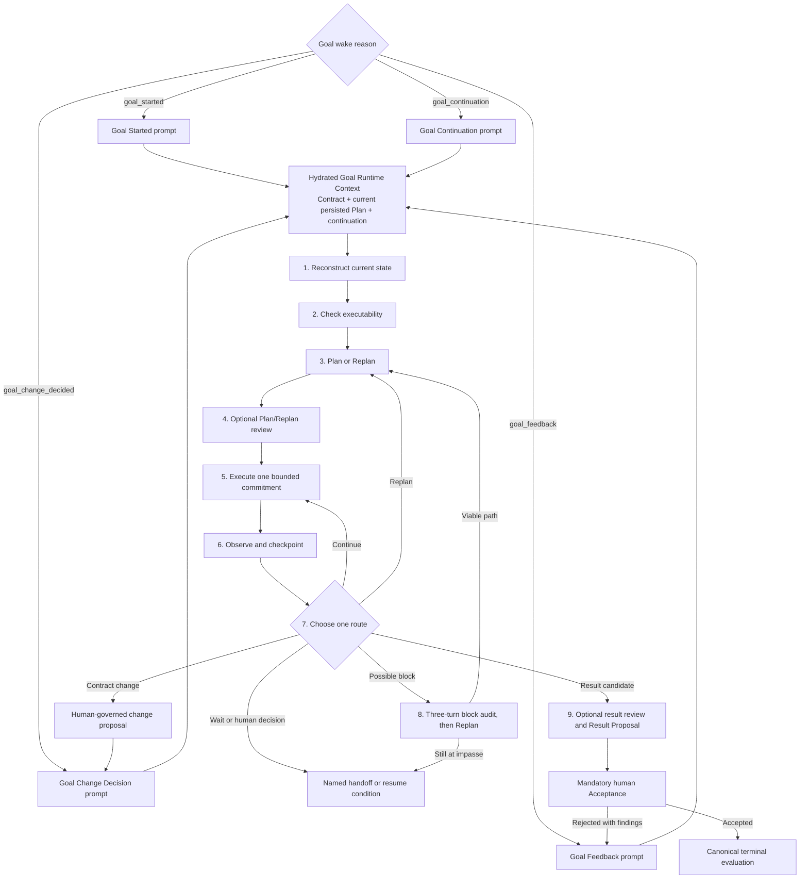

# Agent Instruction Loading

## AGENT.INSTRUCTIONS.001

## Contract Summary

Rudder must assemble each runtime agent's instruction frame from three kinds of
truth before invoking the provider:

- durable runtime-owned operating rules
- durable agent-owned instruction files
- dynamic run context for the current scene, workspace, resources, skills, and
  wake reason

The contract protects both the content and the ordering of that frame. A run
handoff must let a reviewer answer: what did the agent see, what was
intentionally omitted, what runtime context was persisted, and what evidence
shows the instruction stack used for this run.

## Intent / User Job

Operators rely on Rudder agents to resume work without rediscovering their
identity, boundaries, workspace, resources, issue context, and runtime-specific
rules on every run. Reviewers rely on the run record to explain why an agent
acted as it did.

This contract exists so future development can safely change agent runtimes,
skills, wakeups, resources, or prompt templates without accidentally removing a
loaded instruction layer, duplicating dynamic context, or adding heartbeat-only
behavior to comment-triggered issue work.

## Why / Design Reasoning

Instruction loading is split by ownership:

- Rudder runtime code owns the universal operating contract and heartbeat-only
  runtime instruction. These rules are stable platform behavior and cannot
  depend on mutable agent home files.
- The agent's instruction directory owns durable role/persona/tool/memory
  material. These files let an operator customize an agent without editing
  runtime code.
- The run context owns per-run workspace, resources, startup context, session
  handoff, issue/comment context, and wake reason. These sections must be late
  enough to be current, but early enough for prompt templates and providers to
  consume once.

The key tradeoff is explicit ordering over template convenience. Rudder moves
resource context into the shared instruction prefix, then clears duplicate
template aliases so adapters do not re-inject the same resource block later.
Heartbeat instructions are runtime-owned instead of read from legacy
`HEARTBEAT.md` because heartbeat behavior is a Rudder contract, not an
agent-local note. They are loaded only for `rudderScene=heartbeat`. Issue,
review, chat, and automation runs are excluded so task assignment, review,
comment mention, chat, and automation work are not framed as a generic
autonomous heartbeat loop.

The universal operating contract does not tell every run to consult product
documentation. The always-enabled `rudder-docs` skill advertises a self-gating
description to supported runtimes, and the heartbeat instruction mentions it
only as an optional source when exact Rudder details are needed.
Checkout-eligible assignee wake templates own the checkout/409 safety rail
because that rule applies at the assignment handoff boundary, not to generic
chat, review, heartbeat, or relationship-authorized explicit work.

## Actors / Objects / State

- Runtime agent: the assignee agent process invoked through a local runtime
  adapter.
- Operator or reviewer: the human reading the run transcript, issue surface,
  or run intelligence metadata.
- Agent record: `agents.id`, `agents.orgId`, `agents.agentRuntimeType`, and
  `agents.agentRuntimeConfig`.
- Runtime config: secret-resolved adapter config plus runtime skill entries
  exposed through `rudderRuntimeSkills`, `paperclipRuntimeSkills`,
  `rudderSkillSync.desiredSkills`, and `paperclipSkillSync.desiredSkills`.
- Workspace context: resolved project workspace, organization workspace,
  previous task session cwd, or canonical agent home.
- Scene context: `rudderScene`, `rudderWorkspace`, `rudderWorkspaces`,
  `rudderResourcesPrompt`, `rudderProjectResources`, `rudderStartupContext`,
  and optional runtime service intents.
- Agent files: configured entry instructions file plus sibling `SOUL.md`,
  `TOOLS.md`, and `MEMORY.md`.
- Runtime-owned prompt sections: `RUDDER_AGENT_OPERATING_CONTRACT` and optional
  `RUDDER_AGENT_HEARTBEAT_INSTRUCTION`.
- Wake context: `wakeReason`, `wakeSource`, `issue`, `comment`,
  `wakeCommentId`, session handoff fields, and recovery/passive follow-up
  fields when present.
- Goal Runtime Context: for `goal_started`, `goal_feedback`,
  `goal_change_decided`, and `goal_continuation`, the accepted Contract,
  current persisted Plan, latest checkpoint facts, continuation, and
  wake-specific feedback, continuation, or decision facts hydrated into the run
  snapshot.
- Persisted evidence: heartbeat run `contextSnapshot`, adapter invocation
  event payload, runtime command notes, runtime prompt metrics, run logs, and
  run intelligence metadata.

## Entry Points / Inputs

- Heartbeat execution loads instructions before invoking the agent runtime.
- Chat assistant runs build scene context for the chat scene and invoke the
  adapter with the same shared instruction loading utility.
- Runtime adapters for Claude, Codex, Cursor, Gemini, OpenCode, and Pi call
  `prepareAgentInstructionRuntimeContext` and
  `loadAgentInstructionsPrefix`.
- `instructionsFilePath` chooses the agent-owned entry instruction file.
- Sibling instruction files are discovered relative to the configured entry
  file.
- `rudderWorkspace.resourcesPrompt`, `rudderWorkspace.orgResourcesPrompt`, and
  top-level `rudderResourcesPrompt` are candidates for the resource/startup
  section.
- `rudderScene` decides whether runtime heartbeat instructions are included:
  only `rudderScene = heartbeat` may include them.
- Assignee-capable issue prompt templates include the issue checkout conflict
  rail. Custom prompt bodies still win, but Rudder appends the platform-owned
  rail for assignee-capable issue scenes. Reviewer and reviewer-recovery,
  generic chat, generic recovery, and default templates do not receive it.
- An explicit comment mention of the current assignee or reviewer receives a
  relationship-work rail instead. It states that the run already owns the issue
  execution lease, must not checkout or change ownership, and must preserve the
  current status unless the user explicitly requests a lifecycle change.
- Saved task session parameters and execution workspace settings affect the cwd
  and session handoff context that the adapter sees.
- Goal Owner wakeups use one of four runtime-owned prompt templates:
  `GOAL_STARTED_PROMPT_TEMPLATE`, `GOAL_FEEDBACK_PROMPT_TEMPLATE`,
  `GOAL_CHANGE_DECIDED_PROMPT_TEMPLATE`, or
  `GOAL_CONTINUATION_PROMPT_TEMPLATE`. Every Goal wake hydrates the current
  persisted Plan and latest checkpoint rather than assuming the activation Plan
  is still current.

## Product Logic Flow

1. Before adapter invocation, Rudder resolves the agent runtime config.
   Secret-backed config values are resolved for the agent organization. Enabled
   skills are resolved for the exact agent, organization, runtime type, and
   resolved config, then mapped to their stable installed sources as runtime
   skill entries in the adapter config. The shared preparation path ensures a
   missing legacy installation once at actual run startup; metadata-only Chat
   descriptors do not perform that work. Claude, Codex, Cursor, Gemini,
   OpenCode, and Pi all receive this same resolved installed set as input and
   must not add
   provider-native, operator-home, project, global, or adapter-home skills that
   Rudder did not resolve as enabled or always-enabled for the invocation.

2. Rudder resolves the working directory for the run. Project workspace wins
   when issue/project context points to an available project workspace.
   Otherwise Rudder may fall back to the shared organization workspace, a saved
   task-session cwd that still exists, or the canonical agent home. Missing
   configured project/session paths produce runtime workspace warnings.

3. Rudder builds scene context. The context includes `rudderScene`,
   `rudderWorkspace`, workspace hints, project resources, project library
   paths, startup context, and runtime service intents. Project resources,
   agent automations, and startup context are compiled into one resources
   prompt, exposed as workspace `resourcesPrompt`, workspace
   `orgResourcesPrompt`, and top-level `rudderResourcesPrompt` for adapter
   compatibility.

4. Heartbeat execution persists the current scene/workspace/startup context to
   the heartbeat run `contextSnapshot` before invoking the adapter. Runtime
   services and execution workspace IDs can update the same snapshot again
   before invocation when they are realized.

5. Each adapter prepares instruction runtime context. It picks one resources
   prompt by priority:
   `rudderWorkspace.resourcesPrompt`, then
   `rudderWorkspace.orgResourcesPrompt`, then top-level
   `rudderResourcesPrompt`. The selected prompt is moved into
   `instructionContextSections`. The matching aliases are cleared from
   the template context so default prompt templates do not inject the same
   resource/startup block again after the intended position.

6. Each adapter loads the instruction prefix. The prefix order is:
   - runtime `RUDDER_AGENT_OPERATING_CONTRACT`
   - configured entry instruction file, unless missing or legacy `HEARTBEAT.md`
   - sibling `SOUL.md`, when present
   - sibling `TOOLS.md`, when present
   - sibling `MEMORY.md`, when present
   - prepared runtime context sections, including the selected resources prompt
   - runtime `RUDDER_AGENT_HEARTBEAT_INSTRUCTION`, only when included

7. Missing optional sibling files are silently omitted. A missing configured
   entry file logs a warning and records a command note, but the run continues
   with the runtime-owned operating contract and dynamic context. A configured
   entry file named `HEARTBEAT.md` is treated as legacy heartbeat instructions,
   ignored as an entry file, and recorded as ignored.

8. Rudder selects the scene prompt. Assignment, assignee follow-up,
   changes-requested, and assignee issue recovery tell an assignee to check out
   the issue before execution and to stop and report an ownership conflict when
   checkout returns `409`. An explicit mention of the current assignee or
   reviewer instead states that the run already holds the issue execution
   lease, forbids checkout or implicit ownership/status changes, and remains
   executable regardless of current issue status. Other mention targets remain
   attention-scoped; checkout becomes relevant only after an explicit ownership
   handoff. Reviewer and reviewer-recovery, default, generic recovery, chat, and
   automation prompts do not receive the assignee checkout rail. A configured
   custom prompt keeps its body, with the matching platform rail appended.
   Reviewer context has precedence over stale or mixed assignee wake reasons, so
   it cannot acquire the assignee rail through `issue_passive_followup`,
   `issue_changes_requested`, assignment, or comment branches.

9. For a Goal Owner wake, Rudder routes `goal_started`, `goal_feedback`,
   `goal_change_decided`, or `goal_continuation` to its matching Goal prompt.
   Each template receives the same runtime boundary and nine-phase advancement
   protocol, plus an entry rule specific to the wake reason. The protocol
   advances the Goal as far as authority, evidence, and available tools allow
   in the current bounded Run; it is not a persisted workflow state machine.

10. Each adapter combines the loaded prefix with its runtime-specific prompt
   delivery mechanism. Codex-style stdin prompts append bootstrap prompt,
   session handoff markdown, and the selected heartbeat/chat prompt after the
   instruction prefix. Claude writes the loaded prefix to an appended system
   prompt file. Cursor, Gemini, OpenCode, and Pi use the shared loaded prefix
   while preserving their adapter-specific command invocation.

11. The adapter reports metadata before provider execution. Rudder persists or
   emits command notes, prompt metrics, loaded/realized skills, the sanitized
   prompt/model input, cwd, command, and selected runtime metadata through the
   adapter invocation event and run intelligence metadata.

## Goal Wake Advancement Protocol

The Goal prompt layer is a phase router over persisted Goal facts. It keeps the
Goal Contract, mutable Plan, and bounded Run distinct, then requires the Agent
to choose one primary continuation route from evidence. Phases may be skipped
when their exit condition is already satisfied; the Agent must not replay the
protocol as a ceremonial checklist or stop after planning when authorized work
can advance in the same Run.

Prompt routing and entry behavior:

| Wake reason | Prompt | Required entry behavior |
| --- | --- | --- |
| `goal_started` | `GOAL_STARTED_PROMPT_TEMPLATE` | Start at Plan/Replan because activation already confirmed the Contract; validate the persisted initial Plan, form a bounded commitment and expected Evidence, perform any required Plan review, and execute now when possible. |
| `goal_feedback` | `GOAL_FEEDBACK_PROMPT_TEMPLATE` | Classify feedback as Evidence, in-Contract strategy guidance, Contract change, review/result finding, or clarification; reconcile it with newer Goal facts and continue from the corresponding phase without treating feedback as implicit authority. |
| `goal_change_decided` | `GOAL_CHANGE_DECIDED_PROMPT_TEMPLATE` | For an applied change, use the latest Contract revision and Replan; for rejection, preserve the Contract and use the decision note as feedback; for stale or unapplied decisions, refresh authoritative context before acting. |
| `goal_continuation` | `GOAL_CONTINUATION_PROMPT_TEMPLATE` | Reconstruct the persisted checkpoint, current Plan revision, Evidence, and continuation; execute only an eligible commitment or verification once, and stop for wait/decision handoffs or ready Result Proposals. |

The shared prompt drives these nine phases:

1. Reconstruct the accepted Contract, current persisted Plan, continuation,
   recent Evidence and feedback, open proposals or reviews, deadlines, and
   autonomy envelope.
2. Check whether the next bounded decision is executable; discover safely
   discoverable facts instead of returning responsibility to the human.
3. Plan or Replan around one bounded commitment, expected Evidence, and a stop
   condition. A Replan must select a materially different path or explain why
   none exists.
4. Optionally review the Plan or Replan only when policy, risk, the Contract,
   continuation, or explicit instruction requires it and a real review
   mechanism exists.
5. Execute one coherent bounded commitment through the owning work domain.
6. Separate activity, output, and criterion-relevant Evidence, then record
   meaningful progress through `rudder_goal_progress` when supported.
7. Choose exactly one primary route: Continue, Replan, Wait, human decision,
   Contract change, blocked audit, or Result Proposal.
8. Audit a possible block. The first occurrence cannot establish blocked. On
   the third consecutive materially equivalent Goal turn, first attempt a
   materially different Replan; only a remaining demonstrated impasse may ask
   for the exact human input or external-state change. Resuming a previously
   blocked Goal starts a fresh three-turn audit. Equivalence is Agent judgment
   over recent context; there is no blocker fingerprint schema.
9. Build a criterion-to-Evidence result packet, optionally route it through a
   policy-required Result Reviewer, submit a Result Proposal, and stop for
   mandatory human Acceptance.

Reviewer gates are optional and policy-driven. A Reviewer returns findings but
does not become the Goal Owner, execute the Owner's work by reviewing it,
approve Contract changes, or replace final human Acceptance. A review is real
only when an available Review or Verification mechanism actually ran.

Persistence boundaries are explicit:

- The accepted Contract, initial/current Plan revision, Goal activities and
  Evidence references, feedback, change proposals and decisions, Result
  Proposals, and human Acceptance are persisted by their owning Goal services.
- Every Goal wake snapshot hydrates the current persisted Plan, latest
  checkpoint facts, and continuation.
- The current Agent-facing managed Goal tool set can read context, record
  progress, atomically persist a checkpoint with an optional Plan revision and
  continuation, propose a Contract change, and propose a result.
- Checkpoint idempotency, stale Plan revision conflicts, Owner/Run attribution,
  append-only audit, and continuation wake routing are server-enforced. A
  commitment or verification checkpoint queues one `goal_continuation` wake;
  `wait` and `decision` persist the handoff without an automatic wake.
- Optional Reviewer routing remains policy-driven and is only real when a
  Review or Verification mechanism actually ran. Unsupported review work must
  be labeled `Run-local and unpersisted`.
- Operationally blocked is a prompt-level judgment and handoff, not a new Goal
  lifecycle value, persisted state-machine node, or blocker fingerprint.

## Decision Table

| Case | Conditions | Product result | Must not happen | Evidence |
| --- | --- | --- | --- | --- |
| Heartbeat Run | `rudderScene = heartbeat`; timer/self-check or operator `Run heartbeat` manual trigger | Runtime operating contract, agent files, resources/startup context, runtime heartbeat instruction, then heartbeat prompt are available to the agent; the instruction may point to `rudder-docs` only when exact product details are needed | Heartbeat instruction must not appear before durable agent files, force `rudder-docs` loading, or carry the issue checkout rail | Prompt order and prompt contract tests, command notes, `runtimePromptMetrics.runtimeHeartbeatChars > 0`, adapter invocation event |
| Issue Run | `rudderScene = issue`; assignment, assignee follow-up, changes-requested, assignee recovery, or comment wake | Agent gets operating contract, agent files, resources/startup context, and issue/comment wake prompt; checkout-eligible assignee execution receives the checkout/409 rail, while explicit current-assignee/current-reviewer mention work receives the preserve-status execution-lease rail; runtime heartbeat instruction is excluded | Assignment work must not omit the ownership-conflict stop; explicit relationship work must not checkout, reassign, or silently transition status; collaborator mention must not gain ownership | `server-utils.prompts.test.ts`, `shouldIncludeRuntimeHeartbeatInstructions` tests, `runtimeHeartbeatChars = 0`, assignment, custom-template, recovery, and comment wake tests |
| Review Run | `rudderScene = review`; reviewer routing, reviewer recovery, or review follow-up after missing decision while issue remains `in_review` | Agent gets operating contract, agent files, resources/startup context, and review-scene prompt; reviewer recovery preserves review wording; runtime heartbeat instruction and assignee checkout rail are excluded | Review or reviewer recovery must stay reviewer-scoped and must not become assignee implementation | Prompt contract tests, scene derivation tests, and prompt metrics show reviewer recovery plus no assignee rail or runtime heartbeat section |
| Chat Run | `rudderScene = chat` | Agent gets the same operating contract and configured agent files plus chat-scene context; runtime heartbeat instruction is excluded and there is no global instruction to consult `rudder-docs` | Chat prompts must not be framed as autonomous heartbeat work or force documentation lookup | Adapter metadata and prompt metrics show no runtime heartbeat section; prompt contract tests show no global docs pointer |
| Automation Run | `rudderScene = automation` | Agent gets operating contract, agent files, resources/startup context, and automation context; runtime heartbeat instruction is excluded | Automation dispatch must not inherit heartbeat/self-check close-out instructions unless it explicitly creates a heartbeat scene run | Scene derivation tests and prompt metrics show no runtime heartbeat section |
| Goal start wake | `wakeReason = goal_started` | Goal Started prompt receives the accepted Contract, persisted initial/current Plan, and continuation, then enters at Plan/Replan and advances into bounded execution when possible | Agent must not restart broad Goal shaping, stop after restating a Plan, use Codex internal Goal tools, or claim unsupported Plan/review persistence | Prompt unit tests and `tests/e2e/goal-runtime-prompt.spec.ts` inspect the production adapter prompt |
| Goal feedback wake | `wakeReason = goal_feedback` | Goal Feedback prompt receives current Goal facts plus feedback and routes it to Evidence, Replan, governed Contract change, remediation, or clarification | Feedback must not silently change the Contract or count as authority for a governed action | Prompt unit tests and production Goal wake E2E |
| Goal change decision wake | `wakeReason = goal_change_decided` | Goal Change Decision prompt receives the latest persisted Contract/Plan plus decision facts and replans from the authoritative revision | Rejected, stale, or unapplied changes must not be treated as accepted Contract state | Prompt unit tests and production Goal wake E2E |
| Goal continuation wake | `wakeReason = goal_continuation` | Goal Continuation prompt receives the persisted checkpoint, current Plan revision, Evidence, and continuation, then executes only the eligible bounded commitment or verification once | It must not replay an unknown external effect, auto-run a wait/decision handoff, or continue past a ready Result Proposal | Prompt unit tests and production Goal wake E2E |
| No configured entry file | `instructionsFilePath` is empty | Prefix still contains runtime operating contract, prepared runtime context, and heartbeat instruction only for heartbeat scene runs | A missing entry path must not drop the runtime operating contract | `commandNotes` include operating contract note; prompt metrics include operating contract chars |
| Configured entry file missing | `instructionsFilePath` points to unreadable file | Run continues without that file, logs a warning, and records the missing-file command note | Runtime invocation must not fail solely because an operator removed an optional entry file | Runtime log warning and command note |
| Legacy `HEARTBEAT.md` configured as entry | Entry file basename is `HEARTBEAT.md` | The file is ignored as legacy agent-owned heartbeat notes; runtime heartbeat behavior remains controlled by `rudderScene` | Legacy file content must not be loaded as durable agent instructions | Command note and stdout log say legacy `HEARTBEAT.md` was ignored |
| Duplicate resource aliases | More than one of workspace resources, workspace org resources, and top-level resources contains the selected prompt | Selected resource block appears once in the instruction prefix; duplicate aliases are cleared from template context | Prompt templates must not re-inject the same resources later | `prepareAgentInstructionRuntimeContext` tests and rendered prompt order tests |
| Project workspace unavailable | Issue/project references a workspace path that does not exist | Run falls back to shared organization workspace or agent home and emits workspace warning; instruction context reports actual cwd/source | Agent must not believe it is running in a missing cwd | Workspace warning log, `rudderWorkspace.cwd`, run `contextSnapshot` |

## Actor-Visible Input

The runtime agent sees a provider-specific prompt surface, but the instruction
stack must preserve this semantic order:

1. Rudder runtime operating contract. It identifies the agent as operating
   inside Rudder's and is always injected from runtime code.
2. Configured entry instruction file, if readable and not legacy
   `HEARTBEAT.md`. The section includes a path directive that tells the agent
   where the file was loaded from and how to resolve relative references.
3. Sibling `SOUL.md`, if present.
4. Sibling `TOOLS.md`, if present.
5. Sibling `MEMORY.md`, if present.
6. The selected resources/startup context section, when non-empty.
7. Runtime heartbeat instruction, only for heartbeat scene runs.
8. Adapter-specific selected-skill boundary text inside the provider's system
   prompt layer when that provider can expose native or built-in skills outside
   Rudder's desired selection.
9. Adapter-specific bootstrap prompt, session handoff markdown, and wake/chat
    prompt after the instruction prefix or system prompt when the adapter uses
    stdin-style prompt assembly. Checkout-eligible assignee prompts include the
    checkout/409 rail; explicit current-assignee/current-reviewer mentions
    include the relationship execution-lease rail at this scene-specific layer.

The agent does not see duplicated resource aliases after the selected resource
prompt is moved into the instruction prefix. The agent does not see sibling
files that are absent. The agent does not see legacy `HEARTBEAT.md` content as
an agent-owned entry instruction.

Supported local runtime adapters may also receive `RUDDER_API_URL`,
`RUDDER_AGENT_ID`, `RUDDER_ORG_ID`, and a local agent JWT/API key when the
adapter supports local agent auth. That lets the runtime act as the agent
through Rudder APIs, but the auth injection is separate from prompt text.

### Adapter Final Input Matrix

| Adapter | Prefix transport | Final actor-visible input after shared prefix | Additional notes |
| --- | --- | --- | --- |
| Claude local | Writes the loaded prefix and Rudder enabled-skill boundary to an appended system prompt file | Provider receives the appended system prompt plus bootstrap/session/wake prompt through Claude Code invocation | Claude Code may advertise built-in provider-native skills in its own init metadata; Rudder keeps those out of loaded skill metadata and tells the agent to answer Rudder skill questions from the Rudder enabled-skill boundary |
| Codex local | Prepends the loaded prefix to the stdin prompt | Prefix, optional bootstrap prompt, optional session handoff markdown, then selected wake/chat prompt | Codex CLI can also auto-apply repo-scoped `AGENTS.md` from the current workspace; Rudder records this as a command note and does not suppress it |
| Cursor local | Pipes the prompt through stdin | Prefix, optional bootstrap prompt, optional session handoff markdown, runtime env note, then selected wake/chat prompt | Command notes record stdin transport and auto-trust flags when applied |
| Gemini local | Sends the full prompt through the Gemini `--prompt` argument | Prefix, optional bootstrap prompt, optional session handoff markdown, Rudder env note, API access note, then selected wake/chat prompt | Prompt metrics include `runtimeNoteChars` for the env/API notes |
| OpenCode local | Sends the full prompt to `opencode run` stdin | Prefix, selected skill prompt, optional bootstrap prompt, optional session handoff markdown, then selected wake/chat prompt | `selectedSkillPrompt` is runtime-specific skill guidance and sits after the shared instruction prefix |
| Pi local | Renders the loaded prefix into a system prompt extension | System prompt extension contains prefix plus "Continue your Rudder work"; user prompt contains optional bootstrap prompt, optional session handoff markdown, then selected wake prompt | Pi keeps system prompt extension and user wake prompt separate |

The shared prefix contract applies to every adapter. Adapter-specific notes are
part of final actor-visible input when they are inserted into the prompt, and
part of operator evidence when they are recorded only as command notes.

## Operator-Visible Output

Operators and reviewers can observe instruction loading indirectly through:

- run logs that state loaded instruction files, ignored legacy heartbeat files,
  unreadable instruction warnings, workspace warnings, and adapter invocation
  details
- issue comments created for workspace/runtime service readiness when execution
  workspace or runtime services are prepared
- run transcript/UI surfaces for lifecycle and log visibility, plus API or run
  intelligence metadata readback for adapter invocation events, command notes,
  command/cwd metadata, and prompt metrics
- issue/comment/chat surfaces that show the final work result produced by the
  agent after receiving the assembled instruction frame

The full prompt may be sanitized before persistence, especially startup context
sections that can include current-user content. UI surfaces do not have to show
every metadata field directly; command notes, prompt metrics, API readback, and
run intelligence metadata are the primary reviewer-facing explanation of what
layers were loaded.

## Persisted Evidence

The contract is evidenced by:

- run `contextSnapshot` containing `rudderScene`, `rudderWorkspace`,
  `rudderWorkspaces`, `rudderStartupContext`, startup metrics, wake reason,
  issue/comment context, and execution workspace/runtime service updates when
  present
- Goal Owner wake `contextSnapshot` containing the Goal Contract, current
  persisted Plan revision, continuation, and feedback or change-decision facts
  for the matching wake reason
- adapter invocation event with payload derived from adapter metadata, loaded
  skills, requested/used skills, command notes, prompt metrics, command, cwd,
  and runtime type; this is metadata/readback evidence even when not all fields
  are directly rendered in the UI
- runtime logs for instruction load, warning, legacy heartbeat ignore, and
  workspace fallback events
- package tests and adapter tests that assert ordering, heartbeat inclusion,
  heartbeat exclusion, resource de-duplication, command notes, and metrics

## Canonical Scenarios

1. Issue assignment run with configured agent memory:
   - Trigger: an issue assignment wakes the assignee agent in issue scene.
   - Expected state/action: Rudder resolves config, workspace, runtime skills,
     scene context, agent files, and resources before the assignment wake
     prompt. The issue prompt tells the assignee to check out
     before execution and to stop and report a `409` ownership conflict. Runtime
     heartbeat instruction is not loaded.
   - Visible output: command notes list the operating contract, entry file,
     and sibling files that exist; prompt metrics show
     `runtimeHeartbeatChars = 0`.
   - Evidence: `packages/agent-runtime-utils/src/server-utils.test.ts` and
     adapter execute tests for command notes and prompt metrics.

2. Manual heartbeat run:
   - Trigger: an operator clicks `Run heartbeat`, producing
     `rudderScene=heartbeat` with manual trigger detail.
   - Expected state/action: Rudder resolves config, workspace, runtime skills,
     scene context, agent files, resources, and runtime heartbeat instruction
     before the heartbeat prompt. `rudder-docs` remains
     discoverable and is consulted only if the heartbeat needs exact Rudder
     command, Library, organization-skill, or Rudder detail.
   - Visible output: command notes list the heartbeat instruction; prompt
     metrics show non-zero runtime heartbeat chars.
   - Evidence: scene derivation and prompt-order tests.

3. Comment mention wake:
   - Trigger: an operator mentions an agent in an issue comment, producing
     `issue_comment_mentioned`.
   - Expected state/action: the agent receives the issue/comment prompt and
   normal instruction stack, but not runtime heartbeat instructions. If the
   target is the current assignee or reviewer, the prompt recognizes that
   relationship, forbids checkout and implicit status changes, and permits the
   explicit request in every issue status. Other mentions stay
   attention-scoped; only an explicit handoff can make checkout relevant.
   - Visible output: run command notes omit the heartbeat instruction note;
     prompt metrics record `runtimeHeartbeatChars = 0`.
   - Evidence: `shouldIncludeRuntimeHeartbeatInstructions` and adapter tests
     prove prompt exclusion; comment-mention E2E coverage under work-routing
     contracts proves the wake path and issue/comment context.

4. Resource context with duplicate aliases:
   - Trigger: project resources/startup context are compiled into workspace and
     top-level resource prompt aliases.
   - Expected state/action: the selected resources prompt is inserted once in
     the instruction prefix; duplicate aliases are cleared from prompt
     template context.
   - Visible output: rendered prompt has one resource/startup section in the
     instruction prefix position.
   - Evidence: `prepareAgentInstructionRuntimeContext` tests and adapter prompt
     order tests.

5. Legacy heartbeat file:
   - Trigger: an agent config points `instructionsFilePath` at
     `HEARTBEAT.md`.
   - Expected state/action: the file is ignored as legacy agent-owned heartbeat
     notes; runtime heartbeat instruction inclusion is still decided from scene
     and wake reason.
   - Visible output: stdout and command notes say the legacy file was ignored.
   - Evidence: `loadAgentInstructionsPrefix` tests for ignored
     `HEARTBEAT.md`.

6. Goal Owner advancement wake:
   - Trigger: Goal start, human feedback, or a human decision on a Goal Contract
     change queues the Owner through `goal_started`, `goal_feedback`, or
     `goal_change_decided`.
   - Expected state/action: the matching prompt receives the latest Contract,
     current persisted Plan, continuation, and wake-specific facts. The Agent
     enters the shared nine-phase router at the relevant phase, executes a
     bounded commitment when possible, and reports one primary continuation.
   - Visible output: the adapter prompt names the correct wake entry, all nine
     phases, optional reviewer boundaries, the three-turn block audit, and the
     mandatory human Acceptance stop.
   - Evidence: `packages/agent-runtime-utils/src/server-utils.prompts.test.ts`
     and `tests/e2e/goal-runtime-prompt.spec.ts`.

## Invariants / Non-Goals

- Runtime operating contract is always injected from runtime code.
- Runtime operating contract does not contain a broad instruction to consult
  `rudder-docs`; skill availability and skill use remain separate.
- Stable agent instruction files and dynamic run context remain separate input
  layers.
- Runtime skill loading is scoped to the agent, organization, runtime type, and
  resolved config.
- Adapter-native skill discovery is candidate metadata only. It must not cause
  disabled or discovered-only skills to appear in prompt text,
  provider-visible skill directories, provider-native config, or loaded-skill
  metadata.
- Project and startup resources are injected once at the instruction-prefix
  position when available.
- The instruction prefix does not synthesize a wall-clock section; time-sensitive
  facts may appear only when explicitly supplied by the applicable run context.
- Runtime heartbeat instruction, when present, stays at the end of the
  instruction prefix.
- The heartbeat docs pointer is conditional and must not require
  `rudder-docs` loading merely because the run is a heartbeat.
- Issue, review, chat, and automation runs do not receive runtime heartbeat
  instruction.
- Checkout-eligible assignee prompts carry the checkout/409
  ownership-conflict rail. Custom prompt bodies cannot suppress the applicable
  platform rail. Explicit current-assignee/current-reviewer mentions carry the
  preserve-status execution-lease rail; collaborator mentions do not authorize
  ownership transfer. Reviewer, reviewer-recovery, generic recovery, default,
  chat, and automation prompts do not receive the assignee checkout rail.
- Missing optional sibling files do not fail the run.
- All four Goal Owner wake reasons use the shared nine-phase advancement
  protocol and hydrate the current persisted Plan.
- Goal prompt phases do not create a second persisted Goal state machine.
- The blocked audit is prompt-level Agent judgment without a blocker
  fingerprint schema. The third consecutive equivalent occurrence requires a
  materially different Replan before an operationally blocked handoff.
- Optional Plan/Replan and Result Reviewer gates cannot replace the Goal Owner,
  change the Contract, or waive mandatory human Acceptance.
- A ready Result Proposal stops Agent execution until a human accepts or rejects
  it; the Agent cannot claim the Goal complete from a Run outcome alone.
- Unsupported Plan/Wait/Review persistence must be labeled `Run-local and
  unpersisted` rather than described as durable or automatically resumable.
- This contract does not specify the full natural-language body of every
  prompt template. Prompt wording can change when the semantic layers, order,
  evidence, and branch behavior stay intact.
- This contract does not require every provider CLI to transport the prompt in
  the same way. It requires equivalent semantic ordering and evidence.

## Drift Boundaries

Update this contract when changing:

- instruction prefix ordering
- which files are loaded or ignored
- resource prompt priority, placement, or de-duplication
- heartbeat instruction inclusion/exclusion rules
- adapter metadata, command notes, or prompt metrics used as review evidence
- runtime skill injection surfaces
- the global-versus-scene placement of documentation routing or issue checkout
  safety rails
- persisted context fields that explain what the agent saw
- provider adapter prompt assembly in a way that changes the agent-visible
  order
- Goal wake reason routing, Goal Runtime Context hydration, phase semantics,
  blocker audit, Reviewer gates, Result Proposal stopping behavior, or the
  boundary between persisted and Run-local Goal state

This contract does not need updates for:

- internal refactors that preserve the same instruction layers, ordering, and
  evidence
- wording changes inside runtime operating contract or heartbeat instruction
  that do not change semantics
- new tests that cover existing behavior
- adapter command-line flag changes that do not change agent-visible prompt
  content or persisted evidence

## Traceability

Related plans:

- `doc/plans/2026-06-21-product-logic-registry.md`
- `doc/plans/2026-07-18-rudder-docs-skill-proposal.md`

Loaded sections:

1. Runtime operating contract from shared runtime utilities.
2. Configured entry instructions for the agent/runtime.
3. Sibling durable files in order when present: `SOUL.md`, `TOOLS.md`,
   `MEMORY.md`.
4. Prepared dynamic context sections: workspace facts, project resources,
   organization/Rudder resources, assigned automations, startup context, and
   scene-specific context.
5. Runtime heartbeat instructions only when the current scene is a heartbeat
   scene.

Why this order:

- Durable identity and policy must be read before dynamic work context.
- Dynamic context must be explicit and bounded so Project Context Resources do
  not become an unreviewed global memory dump.
- Heartbeat instructions are last only for heartbeat scenes so they can guide
  timer/self-check work without overriding issue, review, chat, or automation
  prompts.

Related code:

- `packages/agent-runtime-utils/src/server-utils.instructions.ts`
- `packages/agent-runtime-utils/src/server-utils.prompts.ts`
- `packages/agent-runtimes/claude-local/src/server/execute.ts`
- `packages/agent-runtimes/codex-local/src/server/execute.ts`
- `packages/agent-runtimes/cursor-local/src/server/execute.ts`
- `packages/agent-runtimes/gemini-local/src/server/execute.ts`
- `packages/agent-runtimes/opencode-local/src/server/execute.ts`
- `packages/agent-runtimes/pi-local/src/server/execute.ts`
- `server/src/services/agent-run-context.ts`
- `server/src/services/agent-instructions.ts`
- `server/src/services/agent-startup-context.ts`
- `server/src/services/runtime-kernel/heartbeat.core.ts`
- `server/src/services/runtime-kernel/heartbeat.execute.ts`
- `server/src/services/workspace-runtime.helpers.ts`

Related tests:

- `packages/agent-runtime-utils/src/server-utils.prompts.test.ts`
- `tests/e2e/goal-runtime-prompt.spec.ts`
- `packages/agent-runtime-utils/src/server-utils.test.ts`
- `server/src/__tests__/agent-instructions-service.test.ts`
- `server/src/__tests__/agent-run-context.test.ts`
- `server/src/__tests__/workspace-runtime.test.ts`
- `server/src/__tests__/codex-local-execute.test.ts`
- `server/src/__tests__/claude-local-execute.test.ts`
- `server/src/__tests__/cursor-local-execute.test.ts`
- `server/src/__tests__/gemini-local-execute.test.ts`
- `server/src/__tests__/opencode-local-execute.test.ts`
- `server/src/__tests__/pi-local-execute.test.ts`

Known gaps:

- Optional Goal Reviewer routing and review-result persistence are not
  implemented as a dedicated Goal workflow surface. Until then, the Goal prompt
  must report a review as `Run-local and unpersisted` unless a real Review or
  Verification mechanism ran.
- `RUN.WAKEUP.001` and `ROUTING.ATTENTION.001` remain compact and should be
  upgraded in a later slice to complete the full comment-mention wake to prompt
  handoff path.
