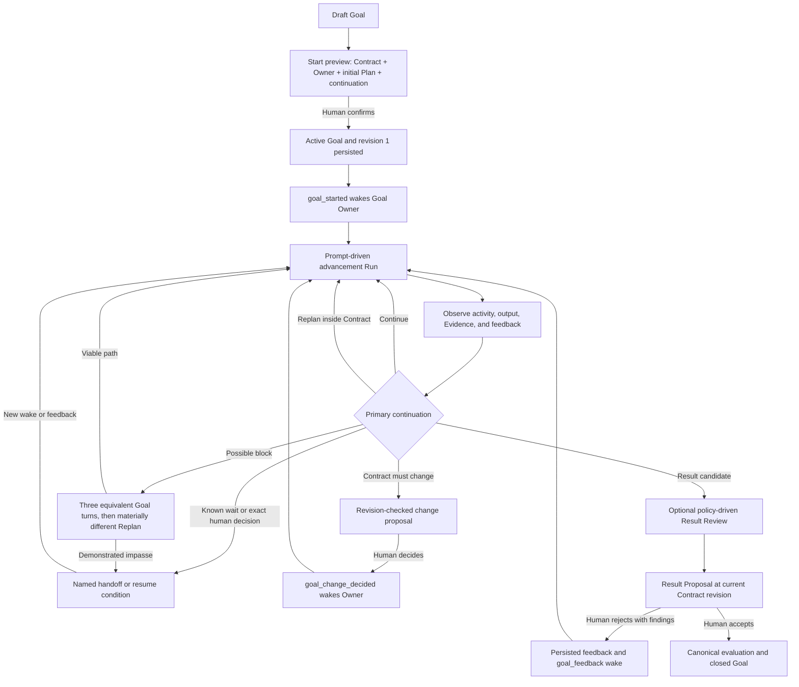

# Goals And Projects

## ORG.GOAL.001

Why:

- A Goal is the durable outcome and boundary for agent work. Without it, tasks
  and Runs become a queue of activity with no reliable answer to what outcome
  they advance or what evidence would finish the work.
- A Goal must support progressive human-Agent collaboration: the human owns the
  outcome, boundaries, governed decisions, and final acceptance; the Goal Owner
  Agent owns strategy and sustained advancement inside those boundaries.
- Goal hierarchy connects organization, project, team, agent, and task-level
  work without forcing every Chat or Issue to duplicate strategy text.

Product model:

- Goals belong to one organization. A Goal has a canonical lifecycle of
  `draft`, `active`, or `closed`; legacy level/status hierarchy fields remain
  compatibility surfaces and do not replace the canonical lifecycle.
- The Goal Contract is the accepted, revisioned definition of outcome,
  objective mode, required criteria, evidence/evaluation policy, autonomy
  envelope, human authorities, guardrails, and action/evaluation deadlines.
- The Plan is the mutable strategy for satisfying the Contract. It is
  revisioned separately so strategy can change without silently redefining the
  outcome or boundaries.
- A Run is one bounded attempt under the current Plan. A completed Run, Issue,
  task, or artifact is evidence-bearing activity; it is not Goal completion.
- Goal activities record meaningful progress, evidence, bottlenecks, decisions,
  and closeouts against a Contract revision and, for Agent work, the acting Run.
- The continuation names the current handoff hypothesis: what should happen
  next and, where applicable, the wake condition. It can be invalidated by
  newer evidence, feedback, or a Contract decision.
- One Goal Owner Agent is responsible for maintaining the Plan, advancing work,
  observing evidence, replanning, and proposing a result. Owner assignment is
  revisioned and organization-scoped.
- A Goal may have an optional parent and linked work. Parent goals must stay in
  the same organization and cannot form a cycle.
- A Goal description is durable Markdown and follows
  `MARKDOWN.DOCUMENT.LIVE.PREVIEW.001` in create and detail authoring surfaces.
  Full description views render Markdown; compact list/search summaries may
  flatten it to plain text.
- A valid organization has at least one root organization-level goal.
- Only an unlinked draft Goal can be deleted. Active or closed Goals and Goals
  with dependent projects, Issues, automations, or other linked work preserve
  their history.

Human and Agent responsibilities:

- The human confirms the Goal Contract and initial ownership before activation.
  Outcome, criteria, deadlines, budget/authority boundaries, guardrails, and
  evaluator meaning cannot be silently changed by the Agent.
- The Goal Owner Agent plans and replans inside the accepted autonomy envelope,
  performs or delegates bounded work, records evidence-backed progress, and
  raises an exact decision or Contract-change proposal when authority is
  insufficient.
- Human feedback steers the Goal but is not implicit authority for a Contract
  change or governed action. A Contract change is explicit, revision-checked,
  auditable, and human-decided.
- The Agent may propose a terminal result only with a criterion-to-Evidence
  packet at the current Contract revision. A human must accept every terminal
  result; a Result Proposal never closes the Goal by itself.

Goal advancement flow:

The prompt-driven advancement Run follows the nine phases defined by
`AGENT.INSTRUCTIONS.001`: reconstruct state, check executability, Plan/Replan,
optional Plan/Replan review, execute a bounded commitment, observe/checkpoint,
choose one continuation route, audit a possible block, and optionally review
and propose the result. These phases route Agent reasoning within a Run; they
are not additional persisted Goal lifecycle states.

Wake and feedback flow:

1. Starting a Goal atomically persists the accepted Contract, Owner assignment,
   initial Plan, initial continuation, and start activity, then queues a
   `goal_started` wake for the Owner.
2. Every Goal wake hydrates the latest accepted Contract, current persisted Plan
   revision, and continuation into Goal Runtime Context. Wake-specific feedback
   or change-decision facts are included when applicable.
3. `goal_started` enters at Plan/Replan and should continue into the first
   bounded commitment when authority and dependencies allow.
4. Human feedback is persisted and queues `goal_feedback`. The prompt classifies
   it as Evidence, in-Contract strategy guidance, Contract-change input,
   remediation/review findings, or clarification before acting.
5. A human decision on a Goal Contract change queues `goal_change_decided`.
   Applied changes advance the Contract revision and require Replan; rejected or
   unapplied changes preserve the current Contract.
6. The Owner records meaningful advancement with evidence references. The Run
   closeout names the phase reached, material change, evidence observed or
   missing, one primary continuation route, and the next actor or resume trigger.
7. A terminal candidate becomes a Result Proposal. Agent execution stops while
   a ready proposal awaits human Acceptance. Rejection returns scoped findings
   through feedback; acceptance performs the canonical evaluation and closes
   the Goal.

Reviewer policy:

- Plan/Replan review and Result review are optional nodes. They run only when
  required by the Contract, continuation, risk/evaluation policy, or explicit
  human instruction and when a real Review or Verification mechanism exists.
- A Reviewer checks assumptions, risk, authority, and evidence integrity, then
  returns findings. It does not become the Goal Owner, execute the Owner's work
  by reviewing it, approve Contract changes, choose the terminal outcome, or
  replace human Acceptance.
- A Plan/Replan finding returns to Replan. A Result finding returns to evidence
  correction, Replan, or a governed Contract-change route.

Blocked behavior:

- Operationally blocked is an Agent judgment guided by the Goal prompt, not a
  new schema field, lifecycle value, persisted state-machine node, or blocker
  fingerprint.
- The first occurrence of a blocker cannot establish blocked. If the materially
  same blocker persists for three consecutive Goal turns, the Agent must first
  audit the Plan and attempt a materially different path.
- If Replan finds a viable path, the Agent continues. Only when Replan still
  cannot produce meaningful progress may the Agent report an operational block
  and request the exact human input or external-state change required.
- Resuming after a blocked conclusion begins a fresh three-turn audit. Hard,
  slow, uncertain, incomplete, or clarification-benefiting work is not blocked
  unless it is a demonstrated impasse.
- Blocker equivalence is prompt-guided Agent judgment over recent Goal context;
  no structured blocker fingerprint is required.

Implemented persistence and current gaps:

- Implemented: canonical Goal Contract revisions; Owner assignments; initial
  and later Plan revisions through Goal services; continuation fields; Goal
  activities and evidence references; feedback; governed change proposals and
  decisions; Result Proposals; mandatory human Acceptance; Goal Owner wake
  requests and their hydrated context snapshots.
- Implemented: the Agent-facing managed Goal tools can read Goal context,
  record progress, propose a Contract change, and propose a result.
- Current gap: the Agent-facing managed Goal tools do not expose a typed command
  to persist later Plan/Replan revisions, even though the Goal service and data
  model support Plan revisions. A Plan proposed without a real persistence
  mechanism must be labeled `Run-local and unpersisted`.
- Current gap: typed Resume Condition persistence and automatic resume are not
  available through the Goal Agent tool surface. A Wait without a real named
  continuation, scheduling, or decision mechanism must be labeled `Run-local
  and unpersisted`.
- Current gap: optional Goal Reviewer routing and review-result persistence are
  not implemented as a dedicated Goal workflow surface. A review that did not
  actually run must be labeled `Run-local and unpersisted`; the Agent must not
  imply it was completed.

Invariants:

- Goal hierarchy cannot cross organizations or cycle.
- Goal deletion must not silently detach existing work from its rationale.
- Rendering or focusing a Goal description must not normalize its non-empty
  Markdown source.
- Contract, Plan, and bounded Run are separate. Replanning inside the autonomy
  envelope does not increment the Contract revision; changing Contract meaning
  requires a human-governed proposal and decision.
- Every Agent-authored Goal activity is attributable to the acting Agent and Run
  when it comes from a Run.
- A Run, Issue, artifact, reviewer finding, or Agent statement cannot close a
  Goal. Only accepted canonical evaluation at the current Contract revision can
  do so.
- A ready Result Proposal blocks additional Agent execution until human
  Acceptance or rejection returns the Goal to work.
- Prompt phases, optional reviewer nodes, operationally blocked judgment, and
  unsupported waits must not be represented as persisted state unless their
  owning mechanism actually persisted them.

Evidence:

- Goal Detail lifecycle E2E covers create/edit/status/delete paths.
- Activity and linked-work surfaces show the goal's downstream work.
- Goal prompt unit tests assert the nine-phase router, wake-specific entry
  behavior, optional Reviewer boundaries, blocked audit, persistence labeling,
  and human Acceptance stop.
- `tests/e2e/goal-runtime-prompt.spec.ts` proves that `goal_started`,
  `goal_feedback`, and `goal_change_decided` production wakeups reach adapter
  invocation with the current persisted Plan and the complete Goal advancement
  protocol.

## ORG.PROJECT.001

Why:

- Projects are the practical grouping boundary between abstract goals and
  execution objects. They collect chats, issues, resources, workspaces, lead
  agents, and timelines for one line of work.

Product model:

- A project belongs to one organization.
- A project may link to multiple goals while preserving legacy single-goal
  compatibility where code still carries `goalId`.
- Projects have status, target date, lead agent, URL/shortname identity, visual
  metadata, resources, workspaces, chats, and issues.
- A project description is durable Markdown and follows
  `MARKDOWN.DOCUMENT.LIVE.PREVIEW.001` in create and detail/configuration
  authoring surfaces. Full description views render Markdown; compact
  list/search summaries may flatten it to plain text.
- Creating a project can initialize the project's Library layout so resources
  and outputs have a stable place.

Flow:

1. Board creates project with name, status, goal links, and optional lead agent.
2. Server validates organization boundary, unique route keys, goal links, and
   lead agent.
3. Project detail exposes resources, workspaces, issues, and goal context.
4. Issue creation or update can attach work to the project and inherit project
   context for agent runs.

Invariants:

- Project identity must stay organization-scoped and URL-stable.
- Project goal links must not imply execution state; chat, issue, and automation
  contracts still own work progress.
- Rendering or focusing a Project description must not normalize its non-empty
  Markdown source.

Evidence:

- Project service/route tests cover project identity and goal linkage.
- Project Detail UI exposes resources/workspaces as project context.
