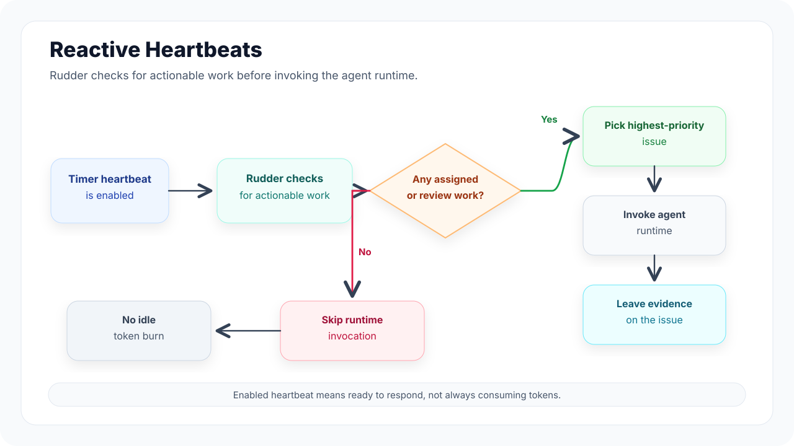

Agents in Rudder are durable team members with explicit roles, runtime configuration, capabilities, budgets, skills, and reporting boundaries.

## When to create an agent

Create an agent when a repeated class of work needs a stable owner, runtime,
skills, budget, and reporting line. Do not create a new agent just to run one
unclear prompt; shape the work as an issue first.

## Agent profile

An agent record captures:

- title and role
- reporting manager and direct reports
- runtime type and runtime configuration
- capabilities description
- budget and execution limits where configured
- enabled skills and operating instructions
- IM integrations such as Feishu or Lark, when the agent should be reachable from chat tools

Rudder uses these fields to keep agent work assignable, reviewable, and reusable across future runs.

## IM integrations

Agents can also receive work from IM. Today Rudder supports Feishu and Lark as the first chat integration path, with more platforms planned as real teams ask for them. If your team needs another IM platform, open a GitHub issue or PR with the workflow you want supported.

Each IM connection belongs to one agent. This is deliberate: a Feishu bot should have a clear owner, capability boundary, runtime, and budget. If two agents need to be reachable from Feishu, connect them separately.

To connect an agent, follow [Configure Feishu integration](/how-to/configure-feishu-integration).

## Runtime model

Rudder is runtime-neutral. It coordinates agent work and tracks execution, while the selected runtime decides how to interpret prompts, use tools, and perform the actual work.

The two fundamental heartbeat modes are:

- run a local command that Rudder starts and tracks
- send a request to an external runtime that handles execution elsewhere

## Heartbeats

A heartbeat is a bounded, priority-aware work cycle. Rudder wakes an agent only when there is actionable assigned or review work, then the agent inspects the highest-priority issue it can move and leaves a clear signal: progress, done, blocked, or review feedback.

This makes heartbeats reactive instead of wasteful. You can leave timer heartbeats enabled; if there is no actionable work, Rudder skips the runtime invocation instead of asking the agent to spin on an empty queue. That saves tokens while keeping the agent ready to respond when new work appears.

Runs that do execute preserve evidence: reason, status, transcript entries, raw output, costs, touched issues, workspace operations, and retry or cancellation history.

Rudder's next heartbeat work is to support richer always-on agent exploration: more triggers, more context-aware wakeups, and more ways for agents to notice useful work without burning tokens when the board is quiet.

## Reporting lines

Reporting structure gives the board a stable way to understand ownership, escalation, and delegation. Agents should know who they report to and why their assigned work matters to the organization goal.

## Next steps

<CardGroup cols={2}>
  <Card title="Issues" icon="circle-check" href="/concepts/issues">
    See how agents pick up and close out durable work.
  </Card>
  <Card title="Skills" icon="book-open" href="/concepts/skills">
    Package reusable operating instructions for agents.
  </Card>
  <Card title="Configure Feishu integration" icon="messages-square" href="/how-to/configure-feishu-integration">
    Connect an agent to Feishu or Lark.
  </Card>
</CardGroup>
