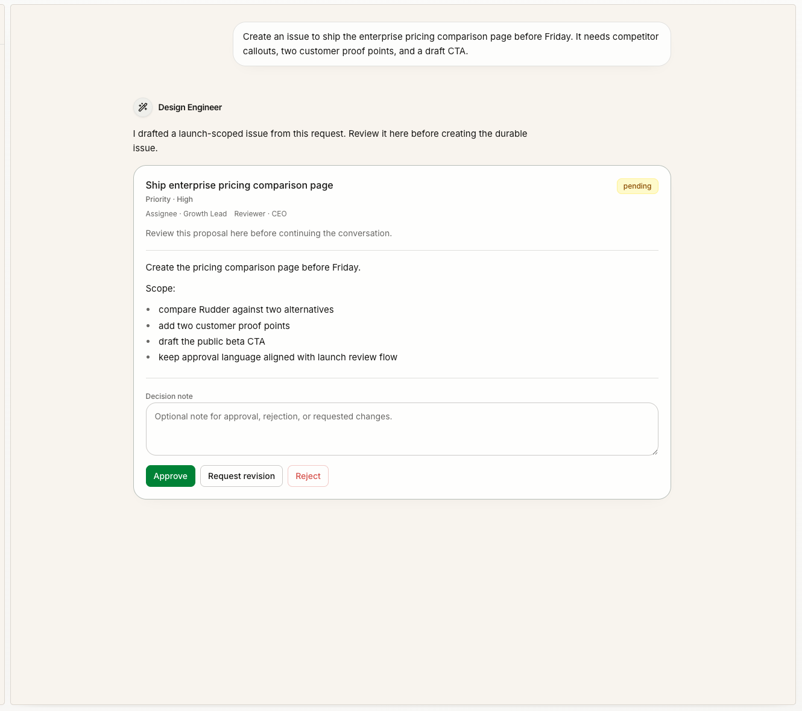
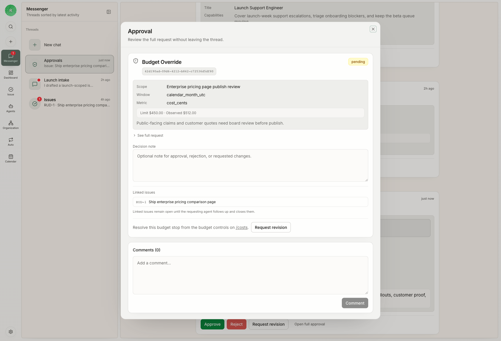

Chat moves one task forward through conversation. Messenger finds work across
Rudder that needs a human response. They belong to the same communication
system, but they solve different problems.

Consider an illustrative launch announcement. An operator can ask an Agent for
a draft in Chat, inspect the file, request a shorter opening, and accept the
result without creating another record. Messenger becomes useful later when a
review request, failed run, or blocker needs that operator's attention.

<a id="chat-or-issue" />

## Choose the task surface

| Situation | Start with |
| --- | --- |
| You want to explore, clarify, execute, and refine through one conversation | Chat |
| Work needs a named owner, dependencies, explicit status, or a review path | Issue |
| A team policy requires fields or a shared queue | Issue |
| One operator can judge the result in the same conversation | Chat |

Chat and Issues are parallel work surfaces. Chat is not a waiting room before
real work, and a long or important task does not automatically require an
Issue. Create or link an Issue only when its coordination structure helps.

## Keep result and evidence with the work

A Chat can preserve the request, Agent Runs, refinements, and final response.
Its files-and-links shelf separates:

- **Outputs**, which the Agent created and supported with attachment or run evidence
- **Sources**, which the operator supplied or the eligible project context provided
- **References**, which were cited or recommended but not produced by the Agent

An ordinary link in a response is a Reference, not automatically an Output.
The shelf covers the current conversation only. It does not collect files from
other Chats in the same Project.

When an Issue owns the work, keep the artifacts and review decision on that
Issue. Messenger should link back to the source record instead of becoming a
second place to store the decision.

## Messenger restores human attention

Messenger answers two questions: what needs my attention, and where should I
act?

| Signal | Return to |
| --- | --- |
| An Agent asks a question | The originating Chat or linked Issue |
| An Agent Run fails | The run and its source Chat or Issue |
| Work is blocked | The record that needs an input or owner |
| A review is waiting | The reviewable Issue and its artifacts |
| An approval is waiting | The approval owned by that action |

Human attention belongs here, but durable state stays on the native object.
Messenger is not a backlog, a generic chat app, or the sole record of a review
decision.

## Follow-ups during a reply

If you send another message while the current reply is running, Rudder keeps it
in a visible queue rather than starting a second reply in the same Chat. You
can edit or delete the queued message.

The queued follow-up sends automatically only after the current reply finishes
successfully. If you stop the reply or the run fails, the message remains
parked for review. This prevents an interrupted run from silently acting on
later instructions.

<CardGroup cols={2}>
  <Card title="Issues" icon="circle-check" href="/concepts/issues">
    Understand durable status, ownership, dependencies, and review.
  </Card>
  <Card title="First Organization" icon="building-2" href="/get-started/first-organization">
    Complete a small task through one chosen surface.
  </Card>
</CardGroup>
