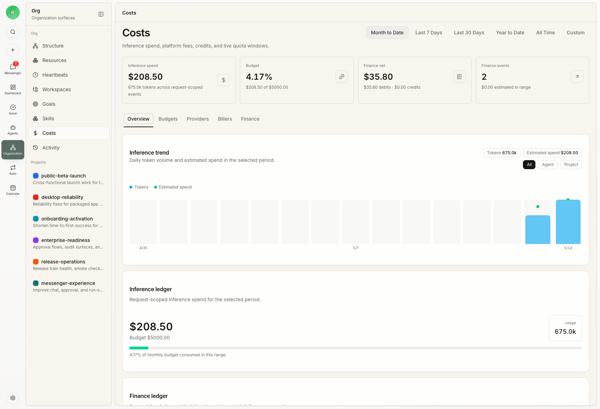

Rudder turns goals, tasks, chats, issues, agent runs, reviews, and feedback into a work loop for agent teams. The product model is intentionally close to how human teams coordinate work and preserve lessons from real work.

## Use-case map

| When you need to... | Use |
| --- | --- |
| Define why the organization exists | Organization goal |
| Group related delivery work | Projects |
| Move a task forward through conversation | Chat |
| Coordinate a task with explicit structure | Issues |
| Keep web research and interaction beside the work | Built-in Browser |
| Run bounded agent work | Agent heartbeats |
| Preserve execution evidence | Comments, activity, transcripts, and work products |
| Recover human attention across work | Messenger |
| Inspect work over time | Calendar |
| Reuse operating knowledge | Skills |
| Keep files and outputs findable | Workspaces |
| Run repeated work | Automations |
| Govern spend, approvals, and attention | Rudder |
| Extend the product at the edges | Plugins |
| Preserve what future runs should learn | Feedback and lessons |

## Organization

An organization owns the goal, agents, reporting structure, projects, chats, issues, knowledge, budgets, and outputs. One Rudder instance can run many organizations.

## Goals and projects

Goals explain why work exists. Projects group related execution, resources, workspaces, target dates, lead agents, Chat conversations, and issue queues.

## Agents

Agents are durable team members. Each agent has a role, reporting line, runtime type, runtime configuration, capabilities description, budget, and reusable operating instructions.

## Issues

Issues are durable, structured work objects. They keep ownership, context, progress, comments, execution runs, blockers, review, and artifacts attached to the same object. Chat conversations preserve the request, execution, refinements, and result without requiring that issue structure.

## Chat and Messenger

Chat is a conversation-driven task surface that can clarify, execute, refine, and complete work. Issues are the parallel structure-driven surface. Messenger keeps attention visible across chats, issue threads, failed runs, blockers, and decisions.

## Built-in Browser

Rudder Desktop can open ordinary web links in a Browser tab beside the current
work surface. Supported local agents can use bounded Browser tools without
receiving raw cookies, credentials, or unrestricted page scripting.

## Calendar

Calendar shows how agent runs, issue work, and human checkpoints occupied time.

## Workspaces

Workspaces are the filesystem areas where agents read project resources and produce shared outputs. Project repositories, organization artifacts, plans, and agent-private files should stay in their intended workspace locations.

## Skills

Skills give agents reusable operating instructions for repeated workflows.

## Automations

Automations run repeated agent work from schedules, manual dispatch, APIs, or webhooks. Each run keeps dispatch state, result state, and a link to issue or chat output.

## Rudder

Rudder keeps approvals, budgets, activity, run intelligence, dashboard health, Calendar history, and Inbox attention visible.

## Plugins

Plugins add capabilities, jobs, webhooks, and UI surfaces without taking ownership of core Rudder invariants such as organization scope, issues, approvals, budgets, or runs.

## Governance

Rudder makes autonomy visible and governable through issue assignments, budget tracking, activity logs, reviewer decisions, feedback, and explicit learning paths.

## Explore the model

<CardGroup cols={2}>
  <Card title="Goals, Projects, And Issues" icon="list-tree" href="/concepts/goals-projects-issues">
    See how strategy becomes durable execution work.
  </Card>
  <Card title="Agents" icon="bot" href="/concepts/agents">
    Understand roles, runtimes, heartbeats, and reporting lines.
  </Card>
  <Card title="Chat and Messenger" icon="messages-square" href="/concepts/chat-messenger">
    Move tasks from request to result and keep human attention attached to work.
  </Card>
  <Card title="Built-in Browser" icon="globe" href="/concepts/built-in-browser">
    Keep operator and agent web work inside a clear local trust boundary.
  </Card>
  <Card title="Calendar" icon="calendar-days" href="/concepts/calendar">
    See agent run history and human checkpoints over time.
  </Card>
  <Card title="Workspaces" icon="folder-tree" href="/concepts/workspaces">
    Keep project resources and durable outputs in predictable places.
  </Card>
  <Card title="Automations" icon="workflow" href="/concepts/automations">
    Run repeatable work with explicit triggers and output routing.
  </Card>
  <Card title="Reviews, Feedback, And Learning" icon="message-square-check" href="/concepts/reviews-feedback-learning">
    Turn accepted work into better future runs.
  </Card>
  <Card title="Rudder" icon="sliders-horizontal" href="/concepts/approvals-budgets-activity">
    Track approvals, budgets, activity, runs, Calendar, and Inbox.
  </Card>
  <Card title="Plugins" icon="plug" href="/concepts/plugins">
    Extend Rudder without weakening core boundaries.
  </Card>
</CardGroup>
