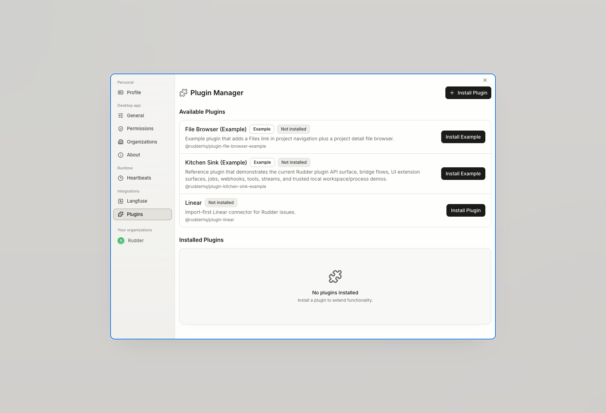

<a id="definition" />

## Definition

A Plugin is an optional package that Rudder's host installs and manages. A
Plugin can declare tools, state, HTTP access, UI slots, event subscriptions,
webhooks, jobs, and host service access.

The host validates the manifest, starts or stops the worker, checks declared
capabilities for bridge operations, and preserves status, configuration, logs,
jobs, webhooks, and state for inspection. Plugin tools use namespaced names, so
they cannot shadow core tools or another Plugin.

<a id="case" />

## One illustrative case

A team installs a CRM Plugin that adds a project panel and a scheduled account
sync. The Plugin's configuration identifies the external service, its job is
attributed to the Plugin, and a failed sync appears in Plugin logs. The CRM
panel can link to Rudder work, but the Plugin does not invent a new Issue status
or bypass the normal approval path.

<a id="when-useful" />

## When it is useful

Use a Plugin for optional integrations or specialized surfaces that do not
belong in Rudder's core work loop. Plugins fit provider connectors, custom
tools, background jobs, webhooks, widgets, and operational views.

Use built-in product objects for goals, Chat, Issues, Agent Runs, reviews,
approvals, budgets, and workspaces. A Plugin may connect to those objects
through host APIs, but it does not own their rules.

<a id="operating-boundaries" />

## Operating boundaries

Plugins are additive. They cannot override core routes or names, cross
organization scope through undeclared state, or change approval, authentication,
Issue checkout, or budget enforcement except through public host APIs that
already enforce those contracts.

The highest-risk boundary is trust. Plugin workers and frontend bundles are
installed code, not a security sandbox for untrusted packages. Review the source,
declared capabilities, configuration, external services, and update before
activation. Uninstall is a host-managed lifecycle operation and must not erase
core Issues, approvals, budgets, or Run history.

Follow [Manage Plugins](/how-to/manage-plugins) to install and inspect one.
