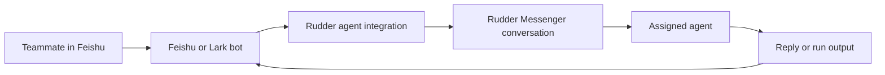

Rudder agents can meet people outside the Rudder app. Feishu and Lark are the first IM path: a teammate sends a message to an agent bot, Rudder writes that message into Messenger, and the agent can answer from the same work loop it uses for issues and runs.

We are adding more IM platforms as Rudder develops. If your team needs Slack, Microsoft Teams, Discord, DingTalk, WeCom, or another chat tool, open a GitHub issue or PR. Real workflow details help us choose the next integration.

## How the connection works

Each Rudder agent needs its own Feishu connection. Think of it as one Feishu bot for one Rudder agent. This keeps ownership clear: messages, runs, source badges, and chat bindings all point back to the agent that owns the conversation.



The setup is small. Rudder creates a setup session, opens Feishu or Lark for authorization, stores the app credential after approval, then listens for messages from that bot.


Open the agent detail page for the agent you want to expose in Feishu. The integration belongs to that agent, not to the whole organization.

## Before you start

Make sure you have:

- a running Rudder organization
- the agent you want to connect
- access to Feishu CN or Lark Global
- permission to authorize or create a Feishu or Lark app for your workspace

If the agent does not exist yet, create it first with [Create an Agent](/how-to/create-agent).

## Connect the agent

1. Open the agent in Rudder.
2. Go to `Integrations`.
3. Choose `Feishu CN` or `Lark Global`.
4. Click `Connect`.
5. Feishu or Lark opens with the bot name prefilled. Confirm the app authorization.
6. Return to Rudder and wait for the setup status to become connected.

Rudder requests the bot and message permissions it needs during authorization. The bot name is only a suggestion, so you can rename it in Feishu if your workspace has a naming rule.

## Add two Feishu commands

After the app is authorized, add these two slash commands in Feishu or Lark:

| Command | What it does |
| --- | --- |
| `/new` | Starts a fresh Rudder conversation for the current Feishu chat |
| `/stop` | Stops the active reply if the agent is currently answering |

That is the Feishu-side command setup. Normal text messages do not need a command. Send a message to the bot, and Rudder writes it into the Messenger conversation for that agent.

Automatic creation of the Feishu quick command menu is not enabled yet. If the menu does not appear in Feishu, create `/new` and `/stop` manually in the app console with the same command names.

## Verify the connection

Send a plain text message to the bot from Feishu or Lark. In Rudder, you should see a Messenger or Chat conversation with a Feishu source badge. The linked agent should receive the message through its integration.

Try the two commands as well:

```text
/new
```

This starts a new session for the Feishu chat.

```text
/stop
```

This asks Rudder to stop the active answer if one is running.

## What to expect in Rudder

Feishu-bound conversations are read-only from the local Rudder chat surface. Replies should come from Feishu or from the agent's outbound work. If you want to continue the same context inside Rudder as a normal local chat, fork the Feishu conversation. The fork keeps lineage but is no longer bound to the Feishu provider chat.

## Troubleshooting

| Symptom | Check |
| --- | --- |
| Setup expires | Start the setup again from the agent `Integrations` tab. Setup sessions are short-lived. |
| Feishu opens the wrong product | Check whether you selected `Feishu CN` or `Lark Global`. |
| Messages are ignored in a group | Mention the bot. Rudder ignores group messages that are not addressed to the bot. |
| The user sees a binding prompt | Bind the Feishu user to a Rudder organization member, then resend the message. |
| A non-text message is dropped | Send text first. File and rich media handling is still being expanded. |

## Next steps

<CardGroup cols={2}>
  <Card title="Agents" icon="bot" href="/concepts/agents">
    Understand how agents own roles, runtimes, skills, budgets, and integrations.
  </Card>
  <Card title="Create an Agent" icon="bot" href="/how-to/create-agent">
    Create the agent before connecting it to Feishu or Lark.
  </Card>
  <Card title="Chat and Messenger" icon="messages-square" href="/concepts/chat-messenger">
    See where Feishu messages land inside Rudder.
  </Card>
  <Card title="Contact" icon="message-circle" href="/contact">
    Request another IM integration or share a workflow that should be supported.
  </Card>
</CardGroup>
