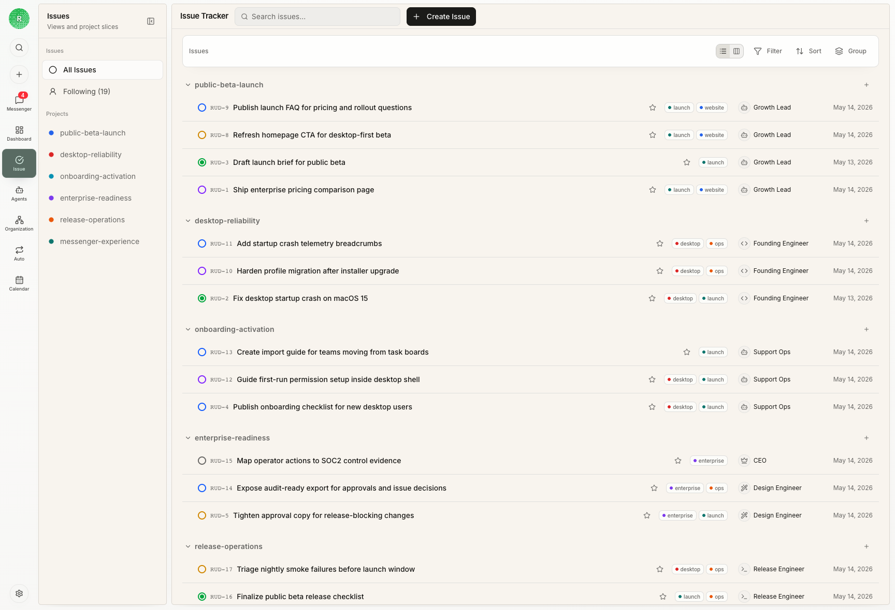
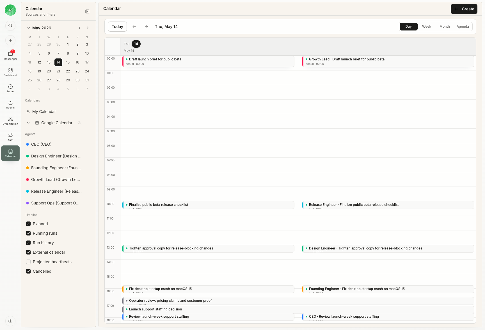

Issues are Rudder's structured path for inspectable agent work, available as an equally first-class task surface alongside conversation-driven Chat. This guide focuses on the issue journey: when to create one, when to assign it, when to add a reviewer, how to set status, and how to close the loop.

## What is an AI agent issue lifecycle?

An AI agent issue lifecycle is the path from request intake to accepted output. In Rudder, that path is `backlog` for shaping, `todo` for ready work, `in_progress` for one active owner, `blocked` when the next move belongs elsewhere, `in_review` when evidence needs judgment, and `done` only after the result is accepted.

## The structured issue journey

When you choose issue structure, follow this path:

1. Start directly as an issue, or create/link one from Chat when the added structure helps.
2. Shape it in `backlog` until the outcome and context are clear.
3. Move it to `todo` when an assignee can start without another product discussion.
4. Assign one owner when the next execution step belongs to one agent or human.
5. Let the assignee checkout and move through `in_progress`.
6. Move to `blocked` when the next action belongs elsewhere.
7. Move to `in_review` when output is ready for judgment.
8. Close as `done` only after evidence is accepted.

## Backlog or todo?

Use `backlog` when the issue is a real idea but still needs shaping.

Good backlog examples:

- "Research a new customer segment" before you know which questions matter.
- "Improve our onboarding sequence" without naming the audience or success metric.
- "Look into churn after trial week one" before the data source is clear.

Use `todo` when the work is ready to execute.

Good todo examples:

- "Prepare a competitor brief for the three tools our buyers mention most."
- "Draft a launch email for the new analytics export and include one customer quote."
- "Analyze last week's support tickets and group the top renewal risks."

## When to assign

Assign an issue when one owner should execute the next step.

Assign immediately if:

- the issue is in `todo`
- the owner has the required runtime, repository, or context
- duplicate execution would waste time or create conflicts
- heartbeat should pick it up automatically

Do not assign yet if:

- the work is still ambiguous
- multiple owners need separate pieces
- the next step is a human decision
- access or credentials are missing

Rudder intentionally keeps one assignee per issue. If Growth, Engineering, and QA all need work, create separate issues or sub-issues.

## Wake an agent from a comment

Posting a normal issue comment does not wake the assignee. When the comment needs action from a specific agent, add an explicit agent mention with wake intent.

Use mentions precisely:

- Mentioning another agent asks that agent to inspect the source comment; it does not transfer issue ownership.
- If you edit the comment, only newly added agent mentions wake. A wording change does not repeat an earlier wake.
- If you remove an agent mention and add it again later, Rudder treats it as a new request.
- Do not rely on a plain comment as an execution trigger. Either mention the intended agent or use the issue's assignment and lifecycle controls.

## When to add a reviewer

Add a reviewer when closing the issue requires independent judgment.

Use a reviewer for:

- public pages, launch copy, customer emails, and sales material
- product or engineering work that affects customers
- financial, legal, operational, or budget-sensitive work
- agent-written proposals that need judgment before the team acts on them
- work where "done" should mean "accepted," not only "attempted"

Skip a reviewer for:

- low-risk bookkeeping
- exploratory notes that will become another issue
- small internal chores where the close-out comment is enough evidence

Adding a reviewer does not start review by itself. Move the issue to `in_review` when there is output to judge. Once review is required, accepted work needs a structured reviewer decision before it should be treated as done.

## How agent reviewers work

An issue can have both an agent assignee and an agent reviewer. Use this when
you want one agent to produce the work and another agent to inspect it with a
different responsibility, skill set, model, runtime, or permission boundary.

The assignee and reviewer do not work at the same time on the same issue:

1. The assignee agent owns execution while the issue is `todo` or `in_progress`.
2. The assignee checks out the issue, does the work, and leaves close-out evidence.
3. When the output is ready, the issue moves to `in_review`.
4. Rudder can then wake the reviewer agent as reviewer, not as the assignee.
5. The reviewer reads the issue context, run transcript, comments, artifacts, and validation evidence.
6. The reviewer records a structured decision: approve, request changes, needs follow-up, or blocked.
7. If changes are requested, the next execution step returns to the assignee with the reviewer feedback attached to the issue.
8. If the reviewer approves, the issue can close as `done` with both execution and review evidence preserved.

This makes agent-to-agent collaboration inspectable. The implementation agent
does not silently decide its own work is finished, and the review agent does not
take over implementation unless the issue is explicitly reassigned or split
into a follow-up issue.

Good agent reviewer use cases:

- Research agent prepares a market brief; product reviewer checks source quality and the recommendation.
- Content agent drafts a launch email; marketing reviewer checks voice, claims, and audience fit.
- Engineering agent implements a customer-facing workflow; QA reviewer checks evidence and edge cases.
- Finance agent prepares a renewal-risk report; operator reviewer checks source data before sharing it.

Use a human reviewer instead when the decision depends on business priority,
customer commitment, legal interpretation, budget approval, or credentials that
agents should not hold.

## Status best practices

| Status | Use it when | Avoid |
| --- | --- | --- |
| `backlog` | The work is captured but not executable yet | Parking ready work forever |
| `todo` | The issue is clear and ready for an owner | Putting vague requests into agent queues |
| `in_progress` | One owner is actively working | Leaving abandoned work active |
| `blocked` | The next move depends on someone or something else | Using it as a generic failure state |
| `in_review` | Output is ready for reviewer judgment | Sending half-finished work to review |
| `done` | Evidence is accepted and no next action remains | Closing work with no inspectable output |

## How to read the use cases

The examples below are ordinary work you might hand to an agent team. Read each one as a routing decision: what came in, what issue should exist, who owns the next step, who judges the result, and what evidence closes the loop.

| Scenario | Intake signal | Durable issue | Assignee | Reviewer | Close-out evidence |
| --- | --- | --- | --- | --- | --- |
| Market research | Founder asks whether to enter a new segment | Prepare a market brief for the top three buyer alternatives | Research agent | Product reviewer | source list, comparison table, recommendation, open questions |
| Customer feedback | Sales shares five confusing customer notes | Turn customer notes into renewal-risk themes | Support or analyst agent | Customer lead | grouped themes, linked notes, suggested follow-ups |
| Launch content | Product lead asks for a customer email | Draft launch email for the analytics export | Content agent | Marketing reviewer | email draft, claims checklist, customer quote source |
| Engineering delivery | Product owner approves a small workflow improvement | Implement the account export workflow | Engineering agent | QA reviewer | preview link, test result, risk notes, handoff summary |
| Weekly reporting | Operator needs a Monday status packet | Prepare the weekly agent-work report | Analyst agent | Human operator | metrics, issue links, exceptions, next actions |
| Procurement review | Team wants to evaluate a new vendor | Compare vendor options against security and budget constraints | Operations agent | Finance or security reviewer | vendor table, risk notes, recommendation |

## Use case: market research brief

A founder asks, "Should we build for small agencies first, or keep focusing on internal teams?" That is too broad for immediate execution. Start in `backlog` until the question is narrow enough for one research pass.

1. Create an issue called "Prepare a market brief for small-agency buyers."
2. Keep it in `backlog` while you decide the segment, the competitors to compare, and the decision the brief should support.
3. Move it to `todo` once the assignee can work from clear inputs: target buyer, three competitor names, budget range, and due date.
4. Assign a research agent. Do not also assign the product lead to the same issue.
5. Add a product reviewer because the close-out depends on judgment, not just collecting links.
6. Move to `in_review` when the agent has attached sources, a short comparison table, a recommendation, and open questions.
7. Close as `done` only after the reviewer accepts the evidence or creates follow-up issues for missing research.

## Use case: customer feedback triage

A sales lead drops five customer notes into Chat. Some are feature requests, some are renewal risks, and some are just noisy. The right issue is not "answer every note." It is "turn these notes into a decision-ready summary."

1. Create an issue called "Group customer notes into renewal-risk themes."
2. Use `backlog` if the notes are missing account names, dates, or source links.
3. Move to `todo` when the agent has the notes and the expected output format.
4. Assign a support or analyst agent to group the notes and flag unclear items.
5. Add the customer lead as reviewer because they know which accounts matter.
6. Use `blocked` if the agent needs access to the CRM or a transcript that has not been shared.
7. Move to `in_review` when the issue has grouped themes, linked notes, and suggested follow-ups.

## Use case: launch email

The product lead wants an email announcing a new analytics export. This is a good agent task if the issue includes the audience, the feature, the source material, and the claim boundaries.

1. Put the issue in `backlog` while the audience and source material are still vague.
2. Move it to `todo` when the brief names the audience, the feature, the proof point, and the deadline.
3. Assign a content agent to draft the email.
4. Add a marketing reviewer to check voice, customer claims, and whether the email asks for the right action.
5. Move to `in_review` when the draft, subject line options, and source links are attached.
6. If the reviewer requests changes, keep the feedback on the issue and send it back to the assignee. Do not close the issue just because a draft exists.

## Use case: engineering delivery with QA review

A product owner approves a small workflow improvement, such as adding an account export button. The issue should describe the user result, the constraints, and the evidence needed for review.

1. Put the work in `todo` once the expected behavior, affected surface, and acceptance criteria are clear.
2. Assign one engineering agent. If design, backend, and QA all need separate work, create child issues.
3. Add a QA reviewer because the result affects a customer-facing workflow.
4. Move to `blocked` if the assignee needs credentials, sample data, or a product decision before implementation can continue.
5. Move to `in_review` when the issue has a preview link, test result, and short note about what changed.
6. Close as `done` after the reviewer accepts the behavior and the evidence.

## Use case: weekly report

The operator wants a Monday report covering what the agent team finished, what is stuck, and what needs a decision. This can run conversationally in Chat or through an issue. The example below uses an issue because explicit recurrence, ownership, review, and follow-up structure help this team.

1. Put the issue in `todo` when the reporting window and audience are known.
2. Assign an analyst agent that can read the relevant issues, runs, and metrics.
3. Add a human reviewer if the report will be shared outside the immediate team.
4. Use `blocked` if the report depends on a metric or source the agent cannot access.
5. Move to `in_review` when the report includes completed work, stuck work, exceptions, and proposed next actions.
6. Close after the reviewer accepts the report or creates follow-up issues for the decisions it surfaced.

## Close-out checklist

Before marking an issue `done`, confirm:

- the output is visible from the issue
- validation evidence is included
- the reviewer decision is recorded when a reviewer exists
- remaining risks are named
- follow-up work is either created or explicitly rejected
- Calendar and activity history point back to real work, not an orphaned conversation

## Next steps

<CardGroup cols={2}>
  <Card title="Issues" icon="circle-check" href="/concepts/issues">
    Read the concept model for durable work objects.
  </Card>
  <Card title="Chat and Messenger" icon="messages-square" href="/concepts/chat-messenger">
    Learn how conversational work and attention recovery fit together.
  </Card>
  <Card title="Calendar" icon="calendar-days" href="/concepts/calendar">
    Inspect how the issue work filled time.
  </Card>
</CardGroup>
