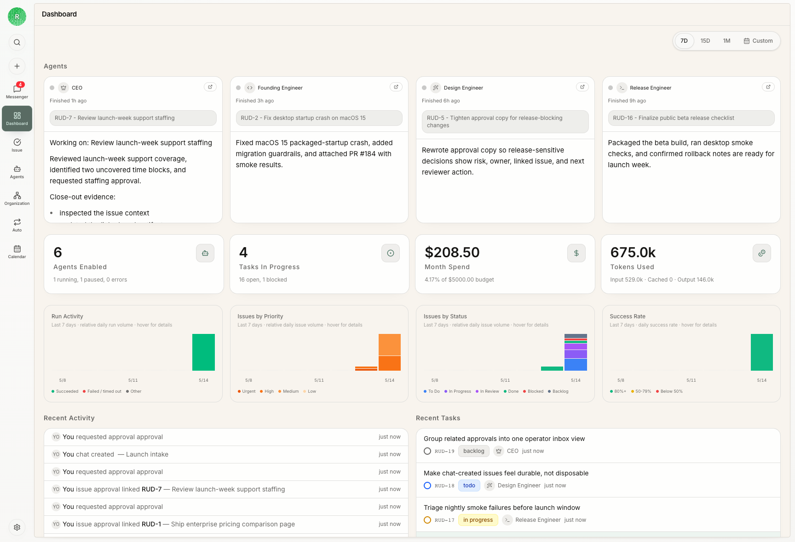

Agents that think, build, play, and learn from real work.

Rudder turns goals, tasks, chats, issues, agent runs, reviews, and feedback into a work loop for agent teams. It gives humans and agents a shared operating structure for moving work forward, running agents, reviewing outputs, controlling spend, and preserving the lessons that should make the next run better.

## What is Rudder?

Rudder is an open-source operating layer for AI agent teams. It is for operators who want agent work to be assigned, executed, reviewed, budgeted, and improved through durable work objects instead of disappearing into one-off prompts.

Use Rudder when you need:

- conversational Chat and structured issue workflows for agent execution
- local agent runtimes such as Codex, Claude Code, shell processes, or webhooks
- reviewable transcripts, comments, artifacts, and close-out evidence
- budget and run history visibility for agent work
- reusable skills and feedback loops that make future runs better

## Why Rudder exists

Agent work stops being useful when it disappears into one long-running prompt. The hard part is not only getting an agent to do a task; it is knowing who owns the work, why it exists, what context the agent used, what changed, who reviewed it, and when a human needs to step in.

Rudder turns the operating habits of human teams into product infrastructure for agent work: goals, projects, conversational Chat, structured issue ownership, Messenger attention, Calendar history, skills, budgets, and review loops.

## Choose your path

Use these docs by the job you are trying to finish:

| If you want to... | Start with |
| --- | --- |
| Install Rudder and open the app | [Quick Start](/get-started/installation) |
| See the first end-to-end workflow | [Create Your First Organization](/get-started/first-organization) |
| Understand the product model | [Core Concepts](/concepts/overview) |
| Turn strategy into agent work | [Goals, Projects, And Issues](/concepts/goals-projects-issues) |
| Understand how agents execute | [Agents](/concepts/agents) and [Issues](/concepts/issues) |
| Move tasks forward conversationally and handle attention | [Chat and Messenger](/concepts/chat-messenger) |
| Browse and operate web content without leaving Rudder | [Built-in Browser](/concepts/built-in-browser) |
| See how agent work filled the week | [Calendar](/concepts/calendar) |
| Run repeatable agent work | [Automations](/concepts/automations) |
| Review outputs and preserve lessons | [Reviews, feedback, and learning](/concepts/reviews-feedback-learning) |
| Extend Rudder at the edges | [Plugins](/concepts/plugins) |

## What you can do

- Create an organization with a concrete goal.
- Use the default agent for the first loop; add clear agents when you need new roles.
- Move work through Chat or issues as parallel task surfaces; use issue structure when explicit ownership, state, dependencies, or review helps.
- Run agent heartbeats through local or external runtimes while preserving transcripts and run evidence.
- Use Chat to execute tasks conversationally and Messenger to keep replies, blockers, failed runs, and decision requests visible.
- Use the Desktop Built-in Browser for adjacent web work and bounded agent browser actions without handing raw browser credentials to the runtime.
- Use Calendar to inspect when agents actually ran, which issues they touched, and where human checkpoints happened.
- Use Automations for repeatable work that starts from a schedule, manual dispatch, API, or webhook.
- Use reviews and feedback to turn accepted work into better future runs.
- Use plugins to add integrations and specialized capabilities without changing the core operating layer.
- Track budgets, blockers, outputs, and operating state from the issue board.

## A typical flow

1. Create an organization.
2. Define the organization goal.
3. Use the default agent, or create an agent with a clear role and runtime.
4. Start the task in Chat or create an issue, depending on your preferred work style.
5. Let agents work through chat turns or heartbeat invocations.
6. Review outputs, Messenger attention, Calendar history, activity, spend, and feedback from the board.

## Next steps

<CardGroup cols={2}>
  <Card title="Quick Start" icon="download" href="/get-started/installation">
    Start the local app and CLI.
  </Card>
  <Card title="First Organization" icon="building-2" href="/get-started/first-organization">
    Walk through the first useful human-agent work loop.
  </Card>
  <Card title="Core Concepts" icon="book-open" href="/concepts/overview">
    Learn how Rudder models organizations, agents, issues, chat, Messenger, Calendar, and skills.
  </Card>
  <Card title="GDPval Harness Benchmark" icon="chart-bar" href="/benchmarks/gdpval-harness">
    Read the protocol and results from a 10-task exploratory comparison of Rudder, Codex CLI, and Claude Code.
  </Card>
  <Card title="Issue Lifecycle Guide" icon="route" href="/how-to/issue-lifecycle">
    Learn when to assign, review, block, and close agent work.
  </Card>
  <Card title="Automations" icon="workflow" href="/concepts/automations">
    Run repeatable agent work with clear triggers and output paths.
  </Card>
  <Card title="Built-in Browser" icon="globe" href="/concepts/built-in-browser">
    Keep web work beside Rudder and understand the shared-session boundary.
  </Card>
  <Card title="Create an Agent" icon="bot" href="/how-to/create-agent">
    Add an agent when a new role needs clear ownership and runtime boundaries.
  </Card>
  <Card title="Operating Layer" icon="sliders-horizontal" href="/concepts/operating-layer">
    Understand approvals, budgets, activity, run intelligence, Calendar, and Inbox.
  </Card>
</CardGroup>
