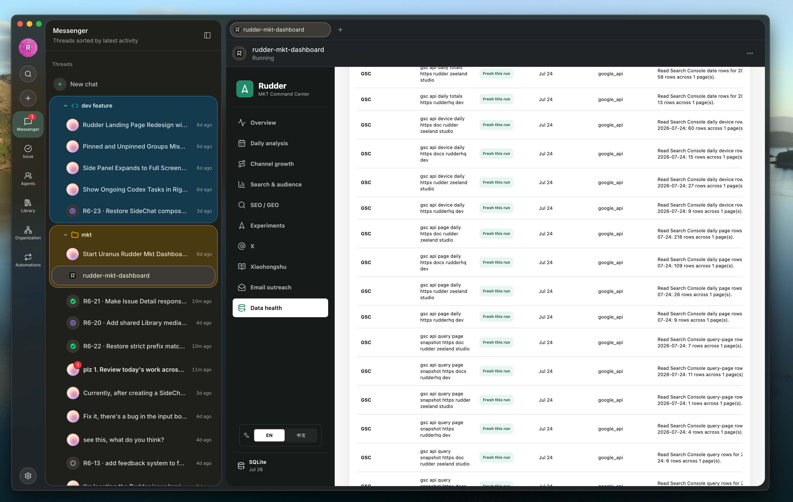
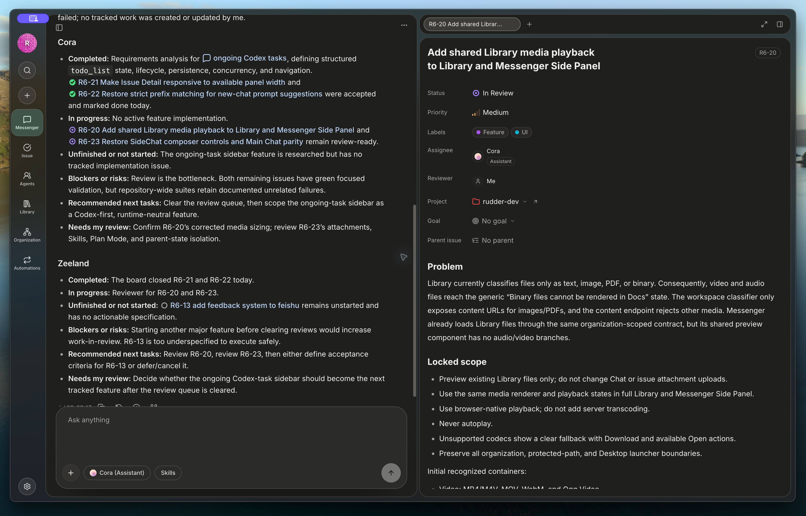

Rudder publishes stable releases for the default install path:

```sh
npx @rudderhq/cli@latest start
```

<Update label="August 15, 2026" description="v0.7.7" tags={["New","Improved","Fixed"]}>

## v0.7.7

[GitHub Release](https://github.com/Undertone0809/rudder/releases/tag/v0.7.7)

This release makes packaged Desktop updates safer and less disruptive by downloading them in the background and completing replacement only after a natural app quit.

### New

- Added silent packaged macOS updates that download in the background and install after a natural app quit.
- Added one-shot release notes on the first launch after an automatic update.

### Improved

- Automatic update transactions now verify signed release policy, exact staged candidates, and an external recovery helper before replacement.

### Fixed

- Prevented window close, resident hide, and operating-system shutdown from applying a staged update.

</Update>

<Update label="August 14, 2026" description="v0.7.6" tags={["New","Improved","Fixed"]}>

## v0.7.6

[GitHub Release](https://github.com/Undertone0809/rudder/releases/tag/v0.7.6)

This release adds experimental Computer Use and Plugin V1, gives Agents clearer human-help and recovery paths, improves Chat, Goals, transcripts, and Issue timelines, and fixes critical macOS Desktop startup and Windows Desktop installation issues.

v0.7.6 supersedes v0.7.4 and v0.7.5 and is the recommended version for all users.

### New

- Added experimental Computer Use for supported macOS Rudder Desktop builds. It is off by default and requires device permissions.
- Added Codex-compatible Plugin V1 support for inspecting and installing packages containing Skills, MCP servers, and Local Apps.
- Added a unified Requests surface for Agent assistance and approvals across Issue detail, Inbox, and Messenger.
- Added multi-target transcript file inspection for opening local or generated files without losing run context.

### Improved

- Improved Goal collaboration and acceptance with clearer work state, owner and contract requirements, progress, evidence, change proposals, and result review.
- Improved Chat and Messenger continuity across navigation, including clearer runtime and model selection and simpler mobile Chat navigation.
- Improved Markdown editing with direct table-cell editing and more reliable image paste, upload, and preview.
- Improved Issue timelines with adaptive disclosure and bidirectional loading.
- Improved Local App start, stop, and background refresh behavior.

### Fixed

- Fixed transcript image evidence persistence and local file preview continuity.
- Fixed Chat composer flicker during streaming and several narrow-layout Side Panel states.
- Fixed assistance and approval cards showing actions that did not match their decision type.
- Fixed missing or duplicated activity while loading Issue timeline history.
- Fixed an issue that could cause the packaged macOS Desktop app to quit before opening.
- Fixed Windows portable Desktop extraction failing when the installer used absolute drive-letter paths.

</Update>

<Update label="August 14, 2026" description="v0.7.5" tags={["Status"]}>

## v0.7.5

[GitHub Release](https://github.com/Undertone0809/rudder/releases/tag/v0.7.5)

**Superseded by v0.7.6. Do not install this version.** Windows Desktop installation through the public CLI could fail during archive extraction.

### Status

- Upgrade to v0.7.6, which retains the macOS launch fix from this release and restores Windows public installation.

</Update>

<Update label="August 13, 2026" description="v0.7.4" tags={["Status"]}>

## v0.7.4

[GitHub Release](https://github.com/Undertone0809/rudder/releases/tag/v0.7.4)

**Superseded by v0.7.6. Do not install this version.** The packaged macOS Desktop app could quit before opening its first window.

### Status

- Upgrade to v0.7.6, which includes the features introduced in this release and fixes the affected macOS startup path and Windows public installation.

</Update>

<Update label="August 11, 2026" description="v0.7.3" tags={["Improved","Fixed"]}>

## v0.7.3

[GitHub Release](https://github.com/Undertone0809/rudder/releases/tag/v0.7.3)

This release makes per-issue Agent run-profile settings easier to adjust and improves production startup and Messenger continuity.

### Improved

- Moved per-issue model and thinking controls into a compact control beside Assignee, removing them from the Assignee picker and More menu while keeping them accessible on desktop hover or keyboard focus and on mobile layouts.

### Fixed

- Fixed production startup for large local databases by streaming migration backups and accepting valid historical migration records while keeping unknown migrations blocked.
- Fixed Messenger refresh flicker and full-page fetch errors during background updates so an open chat stays visible through transient network failures.

</Update>

<Update label="August 7, 2026" description="v0.7.2" tags={["New","Improved","Fixed"]}>

## v0.7.2

[GitHub Release](https://github.com/Undertone0809/rudder/releases/tag/v0.7.2)

This release gives teams a more continuous agent workbench, clearer Goal progress and acceptance, and richer run evidence.

**Beta:** The Goal workspace and Goal alignment and acceptance flows are currently in beta. Enable them under **Settings > Experimental** before use.

### New

- Added the Messenger Workbench for keeping Browser, Library, Automation, Local App, and saved views together in reorderable tabs while retaining live surfaces across the Side Panel and main workbench.
- Added a Goal workspace that groups work by the next actor or state, including Agent advancing, needs your attention, waiting for an external result, ready for acceptance, and history.
- Added Goal alignment and contract flows that preview the outcome, success signal, owner, boundary, and first action before work starts, with feedback, evidence, change review, and result acceptance.
- Added structured run-artifact inspection for file changes, unified diffs, image evidence, and local file previews in agent transcripts.
- Added Hermes API Server as an Agent runtime.

### Improved

- Improved Agent runtime configuration with model-aware reasoning controls, model discovery, fallback ordering, and refreshed OpenClaw Gateway compatibility.
- Improved Messenger continuity so Side Chat streams, saved views, and live workbench surfaces retain their context across navigation.
- Improved Desktop and local workspace startup and upgrade reliability around packaged server compatibility and embedded PostgreSQL migrations.

### Fixed

- Fixed Side Chat streams losing their identity during navigation and stale Messenger issue attention remaining visible.
- Fixed transcript artifact inspection on narrow screens, long inline labels, and Side Panel source scrolling.
- Fixed inline issue images disappearing from preview while editing, along with chat scrolling and streaming composer boundary states.
- Fixed Browser actions being triggered without an explicit Rudder Browser invocation.

</Update>

<Update label="August 4, 2026" description="v0.7.1" tags={["New","Improved","Fixed"]}>

## v0.7.1

[GitHub Release](https://github.com/Undertone0809/rudder/releases/tag/v0.7.1)

This release gives users direct privacy controls, richer account and Agent configuration, and a more dependable Desktop sign-in and work-review experience.

### New

- Added Privacy & Telemetry settings for choosing off, anonymous, or account-linked sharing, with clear data boundaries and local delivery status.
- Added Rudder Account avatar uploads in Desktop account settings.
- Added thinking-effort controls for Claude, Codex, OpenCode, and Pi agents, plus execution-mode controls for Cursor.
- Added a confirmation before sending an issue comment without mentioning an Agent, reducing comments that may go unnoticed.

### Improved

- Strengthened telemetry consent handling so sharing remains off by default, account-linked data requires explicit consent, and revoked consent clears unsent data in that scope.
- Improved Desktop account settings with clearer sign-in progress, profile management, and browser handoff.
- Improved runtime setup and Automation selectors so managed Pi authentication, model choices, and reasoning options stay aligned.

### Fixed

- Fixed Desktop sign-in failures when the browser had not yet established a Rudder Account session, including secure fallback for unsigned macOS builds.
- Fixed visible-text selection and block actions in Markdown live preview, and kept the run annotation editor readable.
- Fixed Automation model-menu alignment and made historical activity timestamps unambiguous.
- Fixed Browser sessions failing to recover after broker registration was interrupted.

</Update>

<Update label="August 3, 2026" description="v0.7.0" tags={["New","Improved","Fixed"]}>

## v0.7.0

[GitHub Release](https://github.com/Undertone0809/rudder/releases/tag/v0.7.0)

This release brings Rudder's account, local workspace, agent runtime, and work-review flows together into a more dependable end-to-end workbench.

### New

- Added Rudder Account sign-in and device-session controls, with native email verification and password flows alongside Google and GitHub sign-in.
- Added the experimental App Builder workspace and local project entrypoints for creating, verifying, and previewing local applications from Chat.
- Added transcript-aware Chat run feedback and annotations, including evidence links for agent-run activity and a clearer work manifest for active and completed subagents.
- Added CodeMirror Markdown live preview for supported Library, issue, project, goal, automation, and file-review surfaces.
- Added scoped Smart Model search fallback and a privacy-preserving local product-analytics ledger for measuring completed work cycles.

### Improved

- Improved Messenger groups, saved views, Side Chat continuity, scrolling, and activity projections so busy workspaces remain easier to scan.
- Improved Chat and automation runtime selection, agent identity, skill loading, local runtime compatibility, and heartbeat/run projections.
- Improved Desktop startup, account recovery, local-app process ownership, browser registration, update checks, restart behavior, and packaged verification across macOS, Windows, and Linux.
- Improved file review, Markdown editing, workspace navigation, mobile Messenger entry, organization onboarding, and account/profile settings.

### Fixed

- Fixed account OAuth and device-approval convergence, native email authentication recovery, secure local-session handling, and update checks that could run without the expected session.
- Fixed historical Chat actions, Side Chat turn visibility, response-annotation range handling, file links and previews, Markdown cursor movement, and composer state after Library references.
- Fixed local-app readiness and cleanup races, runtime ownership checks, platform-specific packaged launch behavior, issue activity timestamps after no-op edits, and several branding and file-bridge edge cases.

</Update>

<Update label="July 29, 2026" description="v0.6.5" tags={["Improved","Fixed"]}>

## v0.6.5

[GitHub Release](https://github.com/Undertone0809/rudder/releases/tag/v0.6.5)

This release makes everyday navigation and review flows more dependable across Messenger, Chat, the Side Panel, Workbench, and the public documentation.

### Improved

- Refined the new-agent setup experience, approval details, and Chat model selector for clearer, more compact interaction.
- Reworked the public guides to make installation, onboarding, core concepts, and common workflows easier to follow.

### Fixed

- Fixed Messenger virtual scrolling leaving blank space while moving through long activity lists.
- Restored latest-activity ordering in Messenger so recently active conversations stay easy to find.
- Fixed issue-description references, sibling Side Panel tabs, and Workbench file selections failing to open or retain the expected context.
- Restored the Chinese documentation navigation after the public-guide rewrite.

</Update>

<Update label="July 29, 2026" description="v0.6.4" tags={["New","Improved","Fixed"]}>

## v0.6.4

[GitHub Release](https://github.com/Undertone0809/rudder/releases/tag/v0.6.4)

This release makes Chat and Messenger faster to follow, improves contextual onboarding and side-panel workflows, and substantially reduces the Desktop package footprint.

### New

- Added contextual onboarding callouts and clearer progress stages while creating the first organization.
- Issue proposals can now open directly in the Side Panel so users can review them without leaving the conversation.
- Added copy actions for generated and attached images.

### Improved

- Coordinated live run and transcript updates reduce redundant rendering and keep active conversations smoother under sustained activity.
- Refined Messenger groups, member placement, navigation icons, and active-state styling.
- Slimmed the packaged Desktop runtime while preserving the built-in server and database capabilities.

### Fixed

- Fixed Chat references, selection annotations, and Side Panel tabs losing or obscuring the active context.
- Restored subagent transcript activity while keeping internal execution-only events out of user-visible messages.
- Fixed approval requester identity and removed redundant or empty transcript content.
- Discord links now open in the system browser instead of the built-in browser.

</Update>

<Update label="July 27, 2026" description="v0.6.3" tags={["Fixed"]}>

## v0.6.3

[GitHub Release](https://github.com/Undertone0809/rudder/releases/tag/v0.6.3)

This patch restores reliable in-app updates from older Rudder Desktop builds.

### Fixed

- Fixed older Desktop updaters rejecting a complete PostgreSQL runtime when its timezone data uses the official nested directory layout.
- Added migration compatibility so already-installed builds can prepare and switch to the new runtime before the replacement app starts.

</Update>

<Update label="July 26, 2026" description="v0.6.2" tags={["New","Improved","Fixed"]}>

## v0.6.2

[GitHub Release](https://github.com/Undertone0809/rudder/releases/tag/v0.6.2)

This release makes Chat easier to direct, improves agent setup and analysis, and fixes several Desktop and runtime reliability problems.

### New

- Added conversation runtime and model controls, drag-and-drop attachments, and richer issue context in Chat.
- Added guided agent-skills onboarding and simpler managed MCP access across supported local runtimes.
- Added one-day and distribution views for agent activity and cost analysis.
- Simplified workspaces by removing organization hierarchy and reporting-line concepts.

### Improved

- Improved response annotations, Side Chat behavior, transcript loading, proposal context, long-content handling, and agent identity continuity.
- Improved failed-run recovery with complete conversation transcripts, durable issue references, and clearer diagnostics.
- Improved local file handling and the reliability of running development and installed Rudder apps at the same time.

### Fixed

- Fixed macOS MCP and command-line processes appearing as duplicate Rudder icons in the Dock.
- Fixed malformed persisted transcripts that could prevent runs from loading or completing.
- Fixed stale Desktop command launchers, missing built-in database support files, and shutdown paths that could affect another Rudder instance.
- Fixed regressions involving managed MCP connections, OAuth, image attachments, streaming replies, initial transcript loading, and queued agent identity.

</Update>

<Update label="July 25, 2026" description="v0.6.1" tags={["Fixed"]}>

## v0.6.1

[GitHub Release](https://github.com/Undertone0809/rudder/releases/tag/v0.6.1)

This patch makes first-time installation on macOS reliable again.

### Fixed

- Fixed an issue that could prevent a fresh macOS installation from preparing Rudder's built-in database.
- macOS users who installed v0.6.0 should upgrade to v0.6.1.

</Update>

<Update label="July 25, 2026" description="v0.6.0" tags={["New","Improved","Fixed"]}>

## v0.6.0

[GitHub Release](https://github.com/Undertone0809/rudder/releases/tag/v0.6.0)

This release expands Messenger, Chat, managed connections, Browser, and Library into more complete work surfaces.



### New

- Added a persistent Messenger workbench that can move saved views and Side Panel content into the main workspace without losing context.
- Added response annotations in Chat and Side Chat so feedback can point to an exact part of an agent response.
- Added managed MCP connections with OAuth sign-in and automatic availability in supported agent runtimes.
- Expanded the built-in Browser with guided setup, downloads, agent tools, and safer page references.
- Added audio and video playback in Library.

### Improved

- Simplified onboarding and issue creation so new users can begin useful work with less setup.
- Increased default agent-run concurrency and made failed runs and subagents easier to inspect.
- Improved Messenger organization, Side Panel resizing, Desktop recovery, and runtime reuse.

### Fixed

- Fixed duplicate transcript updates, queued-message delivery races, and stale composer state.
- Fixed several Chat recovery, organization skill, Browser isolation, saved-view, and responsive-layout issues.

</Update>

<Update label="July 22, 2026" description="v0.5.1" tags={["New","Improved","Fixed"]}>

## v0.5.1

[GitHub Release](https://github.com/Undertone0809/rudder/releases/tag/v0.5.1)

This release makes new chats, saved Messenger views, visual results, and file previews more dependable.

### New

- New chats now stay as local drafts until the first message is accepted, avoiding empty or partially created conversations.
- Added Messenger saved views, project-aware groups, and Side Panel tab actions for organizing active work.
- Added inline visual results and Side Panel previews for local files referenced by agents.
- Added clearer failed-run origin cards, a new agent avatar style, and the option to open unsupported Library files in a system app.

### Improved

- Made transcript summaries, steering controls, streaming updates, issue scrolling, and large Messenger groups easier to follow.
- Reworked public documentation around common Rudder tasks.

### Fixed

- Fixed repeated stop, edit, follow-up, and Side Chat state races.
- Prevented internal execution events from appearing in user-visible transcripts.
- Fixed saved-view persistence, unread retry loops, and several Automation and Library edge cases.

</Update>

<Update label="July 19, 2026" description="v0.5.0" tags={["New","Improved","Fixed"]}>

## v0.5.0

[GitHub Release](https://github.com/Undertone0809/rudder/releases/tag/v0.5.0)

This release introduces richer visual, browser, Chat, Library, and Automation workflows.

### New

- Added the Visualize skill for creating responsive charts, timelines, comparisons, and dashboards inside Chat.
- Added a built-in Desktop browser with local profiles, cookie import, settings, and agent-ready browser access.
- Added a persistent Work manifest, website previews, named chat forks, and improved prompt starters.
- Added PDF preview, Markdown editing, system-app actions, and Side Panel access for Library files.
- Added Automation templates and expanded Desktop recovery and diagnostics.

### Improved

- Redesigned Settings, onboarding, Messenger groups, resource selection, and Side Panel interactions.
- Improved runtime recovery, organization and workspace migration, local-file safety, and Browser error reporting.

### Fixed

- Fixed Visualize results not being saved with their Chat messages.
- Fixed Chat steering, stopping, scrolling, references, project visibility, and organization switching.
- Fixed packaged Desktop startup, Browser connection, update, shortcut, Messenger, Library, and website-preview issues.

</Update>

<Update label="July 11, 2026" description="v0.4.5" tags={["New","Improved","Fixed"]}>

## v0.4.5

[GitHub Release](https://github.com/Undertone0809/rudder/releases/tag/v0.4.5)

This release gives Automations a clearer workspace for browsing definitions and reviewing runs.



### New

- Added a three-column Automation workspace with search, run history, and an in-context editor.

### Improved

- The Automation detail pane can now be collapsed while keeping the selected automation and run timeline in view.
- Codex models are ordered newest-first during agent setup, onboarding, and issue creation.

### Fixed

- Fixed Automation layout, collapsed-pane visibility, Messenger sidebar restoration, and transcript attachment previews.

</Update>

<Update label="July 9, 2026" description="v0.4.4" tags={["New","Improved","Fixed"]}>

## v0.4.4

[GitHub Release](https://github.com/Undertone0809/rudder/releases/tag/v0.4.4)

This release adds a global Side Panel and makes shared files and Rudder actions easier to use from agent runtimes.

### New

- Added a global Side Panel for opening Chat references, Library files, local pages, and issue context without leaving the conversation.
- Added built-in Rudder tools for supported local agent runtimes.
- Added friendlier workspace folders, backup downloads, Library copy actions, hidden-section controls, and system-app file opening.

### Improved

- Improved Messenger and issue-detail editing, pinned groups, reference tokens, scrolling, and new-chat shortcuts.
- Improved startup and availability feedback for Codex, Claude, OpenCode, and Pi.

### Fixed

- Fixed Side Panel page loading, branch switching during streams, stopped-response leakage, Library tabs, mention icons, and pinned-row alignment.

</Update>

<Update label="June 30, 2026" description="v0.4.2" tags={["New","Improved","Fixed"]}>

## v0.4.2

[GitHub Release](https://github.com/Undertone0809/rudder/releases/tag/v0.4.2)

This release adds more agent actions, appearance options, and navigation for long conversations.

### New

- Added a broader set of Rudder actions for connected agents.
- Added Appearance settings with more base colors and action themes.
- Added a message scroll map for quickly navigating long chats.

### Improved

- Improved agent integration setup and compatibility for Pi, OpenCode, and Codex follow-ups.

### Fixed

- Fixed packaged Desktop startup when the built-in database files were missing.
- Fixed composer recovery after stopping a response and several Chat navigation edge cases.
- Fixed repeated stop-command handling in Feishu.

</Update>

<Update label="June 27, 2026" description="v0.4.1" tags={["New","Improved","Fixed"]}>

## v0.4.1

[GitHub Release](https://github.com/Undertone0809/rudder/releases/tag/v0.4.1)

This release improves Feishu conversations and makes Rudder easier to run on headless systems.

### New

- Added Feishu quick commands and clearer setup and stop interactions.
- Added a server-only install option for environments that do not need the Desktop app.
- Added in-app release-note links and made integrations easier to find during agent setup.

### Improved

- Improved Desktop startup, embedded database preparation, workspace placement, unread indicators, search timestamps, and run safeguards.

### Fixed

- Fixed Feishu display and stop-command issues.
- Fixed missing run results, recoverable failures, Windows Codex startup, and release notes appearing before an update completed.

</Update>

<Update label="June 24, 2026" description="v0.4.0" tags={["New","Improved","Fixed"]}>

## v0.4.0

[GitHub Release](https://github.com/Undertone0809/rudder/releases/tag/v0.4.0)

This release brings Feishu into Rudder and expands Chat, Messenger, Library, and local runtime workflows.

### New

- Added Feishu setup, incoming and outgoing messages, source labels, and safe handoff from read-only Feishu chats.
- Added Chat forks, Messenger groups, pinned groups, generated titles, group icons, and conversation actions.
- Added organization skills in Library, downloadable workspace backups, code editing, PDF and CSV previews, and richer runtime context.

### Improved

- Improved reliability and diagnostics for Codex, Claude, Cursor, OpenCode, Pi, and the built-in database.
- Improved mentions, unread handling, composer references, queued steering, and Messenger performance.

### Fixed

- Fixed Feishu routing and fork naming, Desktop update and database issues, Library navigation, comments, previews, run views, and cost summaries.

</Update>

<Update label="June 18, 2026" description="v0.3.5" tags={["New","Improved","Fixed"]}>

## v0.3.5

[GitHub Release](https://github.com/Undertone0809/rudder/releases/tag/v0.3.5)

This release improves Messenger organization, Library previews, and cost visibility.

### New

- Added richer Messenger groups, default tabs, generated Chat titles, and clearer links from agent runs to conversations.
- Added Library previews for PDF, CSV, and HTML files.
- Added Codex subscription cost controls, default cost estimates, and user activity ledger commands.

### Improved

- Improved runtime onboarding and diagnostics for Codex, Claude, OpenCode, Pi, and custom providers.
- Improved high-volume cost, analytics, Automation, transcript, and preview screens.

### Fixed

- Fixed Chat completion, title preservation, comment wake-up behavior, organization cache isolation, and other stability issues.

</Update>

<Update label="June 14, 2026" description="v0.3.4" tags={["New","Improved"]}>

## v0.3.4

[GitHub Release](https://github.com/Undertone0809/rudder/releases/tag/v0.3.4)

This release makes proposal feedback, global navigation, and project identity clearer.

### New

- Added mention-aware proposal feedback for agents and skills.

### Improved

- Improved global search with scoped results, loading feedback, and remembered navigation.
- Polished links, comment previews, hover cards, website chips, issue-status mentions, and project icons.

</Update>

<Update label="June 9, 2026" description="v0.3.3" tags={["Improved","Fixed"]}>

## v0.3.3

[GitHub Release](https://github.com/Undertone0809/rudder/releases/tag/v0.3.3)

This patch restores reliable startup on Apple Silicon Macs and improves issue and Desktop details.

### Improved

- Rudder now detects incomplete local runtime downloads and repairs them with clearer guidance.
- Refined issue details, parent links, comment deletion, project groups, Desktop cards, Library icons, and update diagnostics.

### Fixed

- Fixed Apple Silicon startup failures caused by a missing built-in database package.

</Update>

<Update label="June 7, 2026" description="v0.3.2" tags={["New","Improved"]}>

## v0.3.2

[GitHub Release](https://github.com/Undertone0809/rudder/releases/tag/v0.3.2)

This release adds inline Chat editing and makes Messenger, mentions, Markdown, and Desktop navigation more polished.

### New

- Added followed Automation issues so recurring work can surface its related Issue.
- Added inline Chat message editing.

### Improved

- Improved Messenger navigation, unread handling, project switching, and issue context.
- Improved mention menus, patch-style code blocks, code copying, editor design, and Desktop navigation.

</Update>

<Update label="June 6, 2026" description="v0.3.1" tags={["New","Improved","Fixed"]}>

## v0.3.1

[GitHub Release](https://github.com/Undertone0809/rudder/releases/tag/v0.3.1)

This release polishes Chat composition, Messenger issue work, and Library navigation.

### New

- Added code-copy controls, Library-folder mentions, preserved composer text after references, relative timestamps, and Markdown comment links.

### Improved

- Improved Messenger issue notifications, pinned rows, issue links, thread filters, agent avatars, and row alignment.
- Improved Library launchers, project icons, tab design, empty states, mention editing, and runtime recovery.

### Fixed

- Fixed stale Messenger rows, issue search, comment wake-up boundaries, stalled runs, and recoverable refresh behavior.

</Update>

<Update label="June 4, 2026" description="v0.3.0" tags={["New","Improved"]}>

## v0.3.0

[GitHub Release](https://github.com/Undertone0809/rudder/releases/tag/v0.3.0)

This release makes Library the main place for shared files, skills, and workspace launchers.

### New

- Promoted Library to the main navigation for organization folders, project files, bundled skills, and workspace launchers.
- Added Library-folder mentions to Chat, comments, and Markdown editors.

### Improved

- Improved issue details, status icons, sub-issue workspace checks, run durations, Messenger density, activity timestamps, and mention search.

</Update>

<Update label="May 29, 2026" description="v0.2.9" tags={["New","Improved","Fixed"]}>

## v0.2.9

[GitHub Release](https://github.com/Undertone0809/rudder/releases/tag/v0.2.9)

This patch improves run history readability and first-run reliability.

### New

- Added occurrence timestamps to agent-run lists and avatars to heartbeat runs.

### Improved

- Collapsed long failed-run output, tightened assignee labels, and improved Chat and proposal ownership.
- Improved Messenger and heartbeat performance for organizations with more activity.

### Fixed

- Fixed first-run runtime downloads missing optional platform packages.
- Restored the Windows Desktop application icon.

</Update>

<Update label="May 27, 2026" description="v0.2.8" tags={["New","Improved"]}>

## v0.2.8

[GitHub Release](https://github.com/Undertone0809/rudder/releases/tag/v0.2.8)

This release makes agent runs easier to filter and strengthens first-run and update behavior.

### New

- Added skill filters to the agent-run timeline.

### Improved

- Improved proposal review readability.
- Improved first-run downloads, Desktop updates, runtime caching, and Claude authentication guidance.

</Update>

<Update label="May 27, 2026" description="v0.2.7" tags={["New","Improved"]}>

## v0.2.7

[GitHub Release](https://github.com/Undertone0809/rudder/releases/tag/v0.2.7)

This release adds reusable organization context and expands Chat, Messenger, and Automation workflows.

### New

- Added organization intelligence profiles for reusable operating context.
- Added multi-select questions, Chat-created Automations, agent attribution links, proposal improvements, and attachment previews.

### Improved

- Improved Messenger, cost, approval, and run-list performance.
- Improved agent avatars, working-issue counts, scheduled backups, and heartbeat completion.
- Refreshed English and Chinese onboarding and product documentation.

</Update>

<Update label="May 22, 2026" description="v0.2.6" tags={["New","Improved","Fixed"]}>

## v0.2.6

[GitHub Release](https://github.com/Undertone0809/rudder/releases/tag/v0.2.6)

This release expands attachments, Automation replies, and issue hierarchy controls.

### New

- Added image attachments for supported runtimes, attachments in user questions, and Automation replies that can start new chats.
- Added issue hierarchy controls, wider sub-issue selection, and clearer assignment prompts.

### Improved

- Improved startup when an exact matching server package is not yet available.
- Improved workspace backup browsing.

### Fixed

- Fixed Desktop packaging and installation issues on Windows.

</Update>

<Update label="May 20, 2026" description="v0.2.5" tags={["Improved"]}>

## v0.2.5

[GitHub Release](https://github.com/Undertone0809/rudder/releases/tag/v0.2.5)

This patch focuses on Desktop reliability and smoother issue, Chat, Messenger, Automation, and approval workflows.

### Improved

- Improved Desktop startup, updates, workspace launcher icons, and update shutdown behavior.
- Improved issue, Chat, Messenger, Automation, and approval interactions.

</Update>

<Update label="May 18, 2026" description="v0.2.4" tags={["New","Improved"]}>

## v0.2.4

[GitHub Release](https://github.com/Undertone0809/rudder/releases/tag/v0.2.4)

This release expands agent commands and improves issue, Automation, Calendar, Chat, and board workflows.

### New

- Added private skill creation and more issue search, comment, and document commands for agents.

### Improved

- Improved Desktop and CLI startup, updates, cached downloads, and workspace launcher icons.
- Added starred issues, activity filters, stronger reviewer and approval behavior, and clearer comment-save feedback.
- Improved Automation, Calendar, Chat previews, card metadata, and agent avatars.

</Update>

<Update label="May 16, 2026" description="v0.2.3" tags={["New","Improved"]}>

## v0.2.3

[GitHub Release](https://github.com/Undertone0809/rudder/releases/tag/v0.2.3)

This release makes local runtime storage, Desktop updates, and everyday issue work more resilient.

### New

- Added automatic cleanup for old local runtime downloads.

### Improved

- Improved Desktop updates, restart confirmation, cached downloads, macOS icons, and CLI authentication.
- Improved workspace checks, sub-issue creation, parent context, user-question answers, mentions, and command search.
- Polished the app shell, organization screens, agent avatars, and run and cost metadata.

</Update>

<Update label="May 14, 2026" description="v0.2.2" tags={["Improved"]}>

## v0.2.2

[GitHub Release](https://github.com/Undertone0809/rudder/releases/tag/v0.2.2)

This patch makes Windows installation and Desktop updates more reliable.

### Improved

- Improved Windows Desktop installation and preserved the user's active package manager.
- Improved Desktop update feedback, app-shell layout, agent views, issue hierarchy, workspace routes, and run durations.

</Update>

<Update label="May 14, 2026" description="v0.2.1" tags={["New","Improved"]}>

## v0.2.1

[GitHub Release](https://github.com/Undertone0809/rudder/releases/tag/v0.2.1)

This release improves run visibility and connects Messenger, issues, and Chat more naturally.

### New

- Added memory-update visibility and optional developer diagnostics in run transcripts.

### Improved

- Added contextual issue Chat, retry for failed replies, unread controls, safer issue context, faster Chat titles, and image actions.
- Improved local runtime authentication, agent screens, dashboards, workspaces, and bilingual documentation.

</Update>

<Update label="May 10, 2026" description="v0.2.0" tags={["New","Improved"]}>

## v0.2.0

[GitHub Release](https://github.com/Undertone0809/rudder/releases/tag/v0.2.0)

This release adds reviewer-aware issue handoffs, richer cost visibility, and more capable Messenger-driven work.

### New

- Added reviewer display, blocked-reviewer handoffs, reviewer recovery, and clearer approval status.
- Added organization cost trends, per-agent run costs, and clearer transcript and tool output.

### Improved

- Improved Messenger issue work with runtime selection, approval steps, persistent streaming, unread handling, Markdown, mentions, images, and isolated draft autosave.
- Improved local runtime authentication, issue search, CLI caching, file upload, Desktop updates, onboarding, and product polish.

</Update>

<Update label="May 5, 2026" description="v0.1.0" tags={["New"]}>

## v0.1.0

[GitHub Release](https://github.com/Undertone0809/rudder/releases/tag/v0.1.0)

Rudder's first stable release provides the core workspace for running and reviewing agent work.

### New

- Added the stable first-run command: `npx @rudderhq/cli@latest start`.
- Shipped portable Desktop apps for macOS, Windows, and Linux.
- Added organization-scoped goals, issues, agents, runs, memory, workflows, and activity.
- Added local runtime support for Codex, Claude, Cursor, Gemini, OpenCode, Pi, and OpenClaw.
- Added plugins and reusable bundled skills.

</Update>
