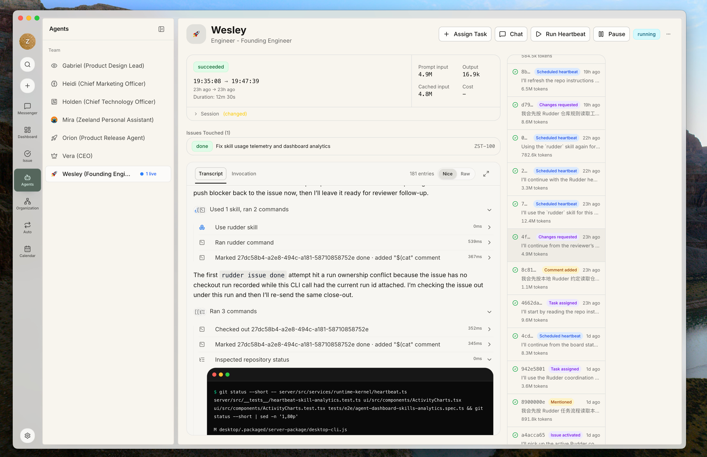

<a id="definition" />

## 定义

Agent 是组织中长期存在的成员。它的档案保存职责、能力范围、汇报关系、运行环境配置、技能、预算和权限状态。

Agent 运行是这个 Agent 的一次有边界执行。运行环境是 Rudder 在这次执行中调用的程序或服务。Rudder 负责协调和留档，运行环境负责真正执行。

一次运行中的几类记录不能混为一谈：

| 记录 | 回答的问题 |
| --- | --- |
| 结果摘要 | 已完成的运行环境调用报告了什么 |
| 产物 | 工作实际生成了什么，例如文件、报告、截图或链接 |
| 成本和用量 | 运行环境能够报告时，这次运行消耗了多少 |
| 原始证据 | 底层发生了什么，包括对话记录、日志、工具操作和终止错误 |

可读摘要不会替代原始证据。被停止或没有完成的输出片段，也不能因为已经出现文字就算作最终结果。

<a id="case" />

## 一个示意案例

某个发布团队有一名长期负责发布文案的 Agent。一篇公告完成后，这项职责仍然属于它。接到新公告任务时，Rudder 通过已配置的本地运行环境发起一次运行。这次运行留下草稿文件、简短结果摘要、成本数据和可供评审人检查的对话记录。

如果草稿需要重做，团队会再发起一次运行。Agent 没有变，但两次运行的证据和成本彼此分开。

<a id="when-useful" />

## 什么时候需要 Agent

一类工作会反复出现，而且需要稳定负责人和操作边界时，才值得新建 Agent。一次性请求如果符合现有 Agent 的职责，直接交给现有成员即可。只有后续工作确实需要继承相同职责、运行环境、技能、预算或上报路径时，长期档案才有价值。

运行可以由 Chat、Issue 分配、评审路由、自动化或手动与定时心跳触发。入口不同不改变三者关系：Agent 长期存在，运行有明确边界，运行环境只在具体运行中被调用。

<a id="operating-boundaries" />

## 操作边界

不同运行环境支持的能力并不相同。本地适配器可能支持托管工具、Browser 控制、会话复用、对话记录或成本元数据，其他适配器未必支持。Rudder 应如实显示差异，不能暗示所有运行环境能力一致。

风险最高的是权限边界。运行环境中的工具只能使用 Rudder 提供的组织、Agent、运行和权限上下文。当前负责人或评审人的关系加上明确请求，可以授权不受状态限制的 Issue 工作；Rudder 再通过 Issue 执行租约串行化该运行，租约本身不是另一道权限门槛。看得到工具，不代表可以绕过关系、运行、审批、预算或工作区规则。

精确选项见[运行环境类型](/zh/reference/runtime-types)。需要配置时，继续阅读[配置 Agent 运行环境](/zh/how-to/configure-agent-runtime)。
