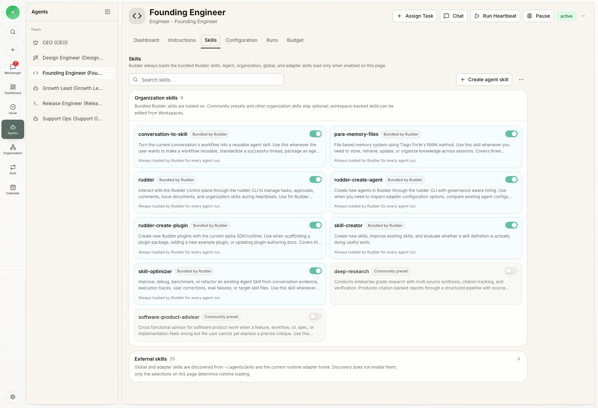
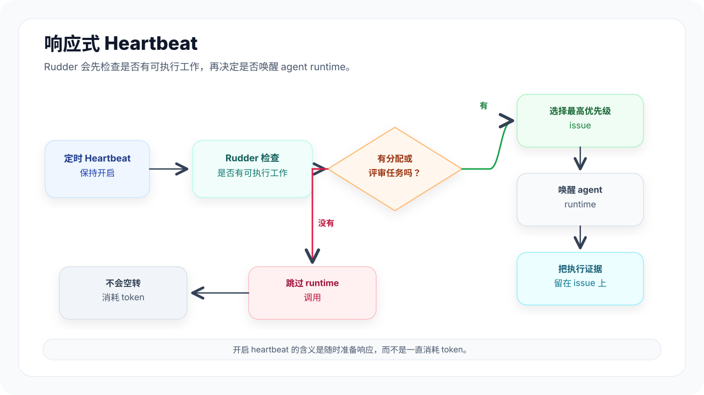

在 Rudder 里，agent 是稳定的团队成员。Agent 属于某个组织，有自己的角色、汇报关系、运行时、预算、技能和能力边界。

## 什么时候创建 agent

当一类重复工作需要稳定 owner、运行时、技能、预算和汇报线时，再创建 agent。不要为了跑一个还没想清楚的一次性 prompt 就新建 agent；先把工作整理成任务。

## Agent 档案

Agent 记录包含：

- 标题和角色
- 汇报经理和直接下属
- 运行时类型和运行时配置
- 能力描述
- 已配置的预算和执行限制
- 已启用的技能和操作说明
- IM 集成，例如把这个 Agent 接入飞书或 Lark

Rudder 用这些字段让 agent 工作可以被分配、评审，并在未来 run 中复用。

## IM 集成

Agent 也可以从 IM 接收工作。Rudder 现在先支持飞书和 Lark，后面会继续兼容更多平台。如果你的团队需要别的 IM，欢迎开 GitHub issue 或 PR，把你希望支持的工作流说清楚。

每个 IM 连接都属于一个具体 Agent。这样飞书 bot 的 owner、能力边界、运行时和预算都很明确。如果两个 Agent 都需要接入飞书，就分别为它们创建连接。

接入步骤见 [配置飞书集成](/zh/how-to/configure-feishu-integration)。

## 运行时模型

Rudder 不绑定某一种运行时。它负责安排 agent 工作和记录执行过程；具体怎么理解提示词、调用工具、完成工作，由你选的运行时决定。

Heartbeat 主要有两种执行方式：

- 运行 Rudder 启动并跟踪的本地命令
- 向外部运行时发送请求，由外部环境完成执行

## Heartbeat

Heartbeat 是一次有边界、按优先级响应的工作周期。Rudder 只会在存在可执行的分配任务或评审任务时唤醒 agent，然后让 agent 检查自己能推进的最高优先级 issue，并留下清晰信号：有进展、已完成、被阻塞，或给出评审意见。

这让 heartbeat 更像响应式调度，而不是浪费 token 的轮询。你可以一直打开定时 heartbeat；如果当前没有可执行工作，Rudder 会跳过 runtime 调用，不会让 agent 对着空队列空转。

真正执行的 run 会保留证据：原因、状态、transcript、原始输出、成本、涉及的任务、工作区操作，以及重试或取消记录。

Rudder 下一阶段会继续探索更复杂的全天候 agent 自我探索机制：更多触发方式、更理解上下文的唤醒策略，以及在看板安静时不消耗 token 的发现机制。

## 汇报线

汇报结构让看板能看清归属、升级和委派。Agent 应该知道自己向谁汇报，也应该知道自己的工作为什么服务于组织目标。

## 下一步

<CardGroup cols={2}>
  <Card title="任务" icon="circle-check" href="/zh/concepts/issues">
    查看 agent 如何接手并关闭持久工作。
  </Card>
  <Card title="技能" icon="book-open" href="/zh/concepts/skills">
    为 agent 打包可复用操作说明。
  </Card>
  <Card title="配置飞书集成" icon="messages-square" href="/zh/how-to/configure-feishu-integration">
    把 Agent 接入飞书或 Lark。
  </Card>
</CardGroup>
