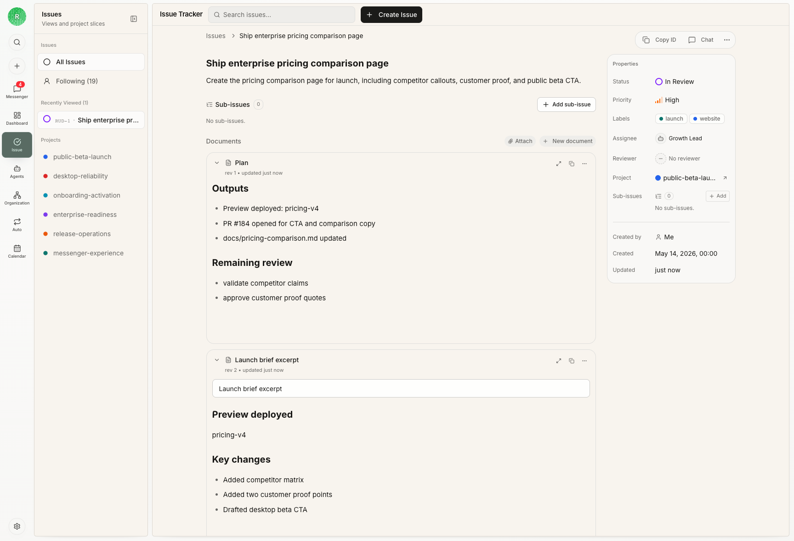

<a id="issue-definition" />

Issue（任务单）是带有明确状态和生命周期的任务记录。需要指定负责人、跟踪依赖或安排评审时使用；评论、Agent 运行、产物和评审结论可以留在同一条记录中。

例如，Agent 正在起草一份发布公告。如果只是一个人不断调整文字，任务可以一直留在 Chat。当发布负责人需要分配执行者、跟踪法务依赖，并请评审人批准最终文件时，Issue 会更合适。

## 一条任务单保存哪些内容

同一条 Issue 可以保存：

- 期望结果和验收标准
- 负责下一步执行的唯一负责人
- 依赖关系和当前状态
- 评论和定向提及 Agent 的请求
- Agent 运行、摘要与对话记录
- 文件、截图、链接和其他产物
- 评审人与持久的评审结论

使用 Issue 并不会让工作比 Chat 更真实。它只是把协作状态写得更明确，让团队在多件任务之间快速查看。

## 生命周期概览

| 状态 | 含义 |
| --- | --- |
| `backlog` | 请求已经记录，但范围、优先级、负责人或验收标准仍待决定 |
| `todo` | 信息足够，负责人可以开始执行 |
| `in_progress` | 负责人已经签出并开始工作 |
| `blocked` | 下一步依赖某个人、其他任务、权限或外部条件 |
| `in_review` | 已经有产物等待评审人判断 |
| `done` | 结果和证据已被接受 |

只有发布需求已经清楚到可以直接开始时，才进入 `todo`。如果连目标读者都没有决定，就留在 `backlog`。状态用于表达谁现在可以行动，不是装饰进度。

## 负责人和签出

一条 Issue 只有一个负责人。Agent 开始实现前会先签出任务，Rudder 据此避免重复执行，也让当前责任清楚可见。两个 Agent 各有独立职责时，应拆成不同 Issue 或子任务。

普通评论只保存上下文，不会唤醒负责人。如果评论是在要求某个 Agent 行动，需要明确提及它并发出唤醒意图。提及另一个 Agent 不会改变任务负责人。

## 评审和关闭

执行者负责实现和证据。Issue 进入 `in_review` 后，评审人负责下一步质量判断。有效结论应明确写出：通过、要求修改、需要跟进或阻塞。

发布公告进入 `done` 前，后来查看任务的人应该能直接找到 Markdown 文件、验证记录、评审结论和剩余风险。

最需要避免的情况是运行失败后没有关闭信号。此时保持 Issue 打开，附上失败证据；如果下一步属于别人，就移到 `blocked`，并写明哪位负责人或哪项依赖可以解除阻塞。

## 编号边界

带编号的 Issue 有组织范围内的可读编号，例如 `R6-42`，由组织的 **Issue Key** 和任务序号组成。负责人可以在组织设置中修改 **Issue Key**。已有序号和底层身份不会变化，使用旧 **Issue Key** 的链接也会继续解析。

<CardGroup cols={2}>
  <Card title="从接收到完成" icon="route" href="/zh/how-to/issue-lifecycle">
    在完整流程里使用状态、分配、评审和恢复。
  </Card>
  <Card title="Chat 和 Messenger" icon="messages-square" href="/zh/concepts/chat-messenger">
    比较对话式工作与 Issue，并找到需要处理的提醒。
  </Card>
</CardGroup>
