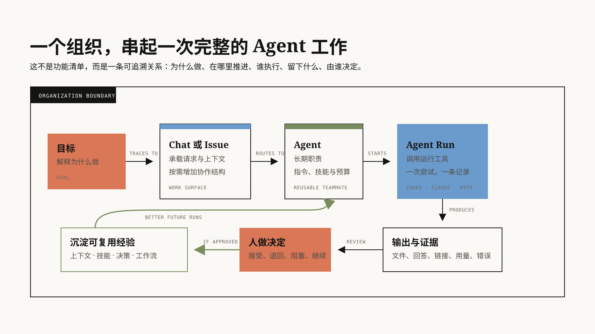

使用 Rudder 前不需要学完整套产品。先理解五件事就够了。

## 1. 组织就是团队工作空间

一个组织包含某个团队或某类工作的 Agent、对话、任务、项目、文件和设置。
如果只有你自己使用，创建一个个人组织，然后直接开始。

## 2. Agent 是可以反复合作的执行者

一个 Agent 有自己的职责和运行工具。职责说明它适合做哪类工作；运行工具是真正
执行任务的程序，例如 Codex、Claude Code、本地命令或 Webhook。

Agent 每工作一次，Rudder 就会创建一条**运行记录**。Agent 会长期保留，运行
记录只代表一次尝试。想看进度、用量、错误或底层细节时，再打开运行记录。

## 3. 工作可以从 Chat 或 Issue 开始

想在对话里提出要求、补充信息和反复修改，就用 **Chat**。

任务需要明确负责人、状态、依赖或评审人时，就用 **Issue（任务单）**。它是一种
按需增加的结构，不是每件事的必经步骤。

## 4. 结果应该和请求放在一起

Agent 可能返回一段回答、修改文件、创建报告、截取图片或提供链接。Rudder 会把
这些结果连接到提出请求的 Chat 或 Issue，方便你以后仍然看得懂。

## 5. 下一步仍然由人决定

你可以要求继续修改、接受结果、指定评审人、标记阻塞或创建后续任务。Rudder
让这些决定更清楚，但不会悄悄把每次 Agent 回复都当成正确答案。

## 只在有帮助时增加结构

| 当你想要…… | 使用 |
| --- | --- |
| 在一段对话里持续推进任务 | Chat |
| 跟踪负责人、状态、依赖或评审 | Issue |
| 汇总相关任务、对话、文件和日期 | 项目 |
| 复用已经验证过的操作步骤 | 技能 |
| 按日程或触发条件运行稳定任务 | 自动化 |
| 找到等你处理的问题、失败和评审 | Messenger |
| 整理长期文件和项目目录 | Library 和工作区 |

Dashboard 和 Calendar 用来快速了解情况。它们会带你回到原始的 Chat、Issue、
运行记录或自动化，而不会再复制一套任务状态。

<a id="learning-path" />

## 接下来读什么

1. [完成第一个任务](/zh/get-started/first-organization)。
2. [选择 Chat 或 Issue](/zh/concepts/chat-messenger)。
3. [理解 Agent 和运行记录](/zh/concepts/agents)。
4. [让一条 Issue 从开始走到完成](/zh/how-to/issue-lifecycle)。
5. [评审 Agent 工作](/zh/how-to/review-agent-work)。

<CardGroup cols={2}>
  <Card title="上一篇：完成第一个任务" icon="arrow-left" href="/zh/get-started/first-organization">
    先拿到一个有用结果，再了解更多功能。
  </Card>
  <Card title="下一篇：Chat 还是 Issue？" icon="arrow-right" href="/zh/concepts/chat-messenger">
    为任务选择最轻量的组织方式。
  </Card>
</CardGroup>
