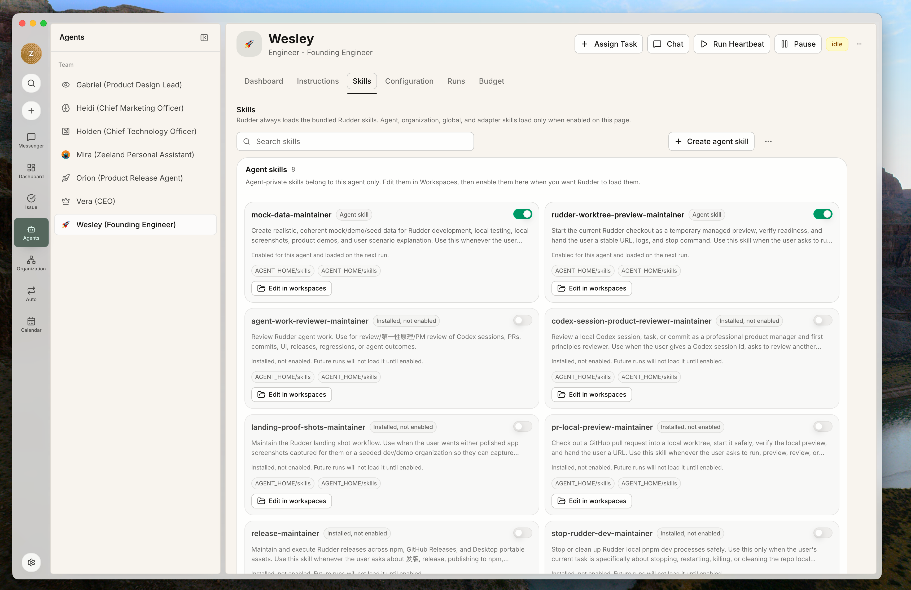

技能把说明、参考资料、脚本和资产打包给 agent 使用。重复工作不需要每次复制一大段 prompt。

## 内置技能

Rudder 自带一组经过维护的内置技能。当运行时具备对应 capability 时，Rudder 会管理这些技能并把它们注入兼容的 agent runtime。

| 技能 | 能帮助 agent 完成什么 |
| --- | --- |
| `visualize` | 在 Chat 中把分析转换为安全的 inline charts、timelines、comparisons 和 decision dashboards。 |
| `browser` | 通过 Rudder 内置 Browser 查看和操作网站。 |
| `rudder-docs` | 从内置文档中查询 Rudder CLI、API、control-plane、技能和操作规范。 |
| `para-memory-files` | 使用 PARA 方法维护持久化的文件记忆。 |
| `skill-creator` | 创建并评估可复用的 agent skills。 |
| `rudder-create-agent` | 起草并提交符合治理要求的 agent 配置。 |
| `rudder-create-plugin` | 按照当前 runtime contract 创建并验证 Rudder plugin。 |

Visualize 技能使用不含脚本的 HTML、SVG 和 CSS，不依赖外部资产或网络请求。Rudder 从 agent 的 thread-scoped 输出中捕获 artifact，并把它作为 message-owned attachment 渲染在 Chat 内。

Visualize 适合 charts 和紧凑的 decision views；如果静态 node-and-edge diagram 更清晰，它会使用 Mermaid。

## 什么时候创建技能

当同一套流程反复出现在多个任务或多个 agent 身上，就应该创建技能。常见例子包括发布检查、预览环境、transcript 调试、mock 数据和记忆维护。

一次性说明留在任务里。流程稳定、值得复用时，再提升为技能。

## 什么适合放进技能

技能应该足够聚焦，触发后能直接用。常见示例包括：

- 调试某一类运行 transcript
- 维护 mock 数据
- 运行预览 server
- 整理记忆文件

## 个人技能和组织技能

个人技能保存在 agent 的 home 目录下。组织技能保存在共享组织技能目录中，可以为 agent 启用。

把个人技能提升为组织技能时，复制到组织技能目录并同步共享路径。未来运行不应该依赖某个 agent 的私有副本。

Agent 可以在自己的 agent home 中管理个人技能和工作记忆。个人技能适合自己的习惯、本地笔记和还在试验的流程。只有当多个 agent 都应该依赖同一套说明时，才把它提升到组织技能库。

## 技能加载

运行时会根据 Rudder 里 agent 的 enabled-skills 配置加载技能。把文件安装到磁盘上，不等于未来运行已经启用它。

Rudder 把技能选择权放在 agent 自己的 Skills 页面，而不是放在 adapter 里。即使这个 agent 使用 Codex、Claude Code 或其他运行时 adapter，运行时要加载哪些 Rudder agent skills，也只应该由这个 agent 在 Skills 页面启用的技能决定。

这条边界很重要：adapter 负责把 Rudder 的运行请求交给具体工具执行；Rudder 负责决定 agent 身份、issue 上下文、工作区和 enabled skills。不要让某个 adapter 自动装载它自己环境里的技能，覆盖或绕过 Rudder 里的 agent 配置。

## 下一步

<CardGroup cols={2}>
  <Card title="Agents" icon="bot" href="/zh/concepts/agents">
    为需要该工作流的 agent 启用技能。
  </Card>
  <Card title="工作区" icon="folder-tree" href="/zh/concepts/workspaces">
    把共享输入和输出放在可预测的位置。
  </Card>
</CardGroup>
