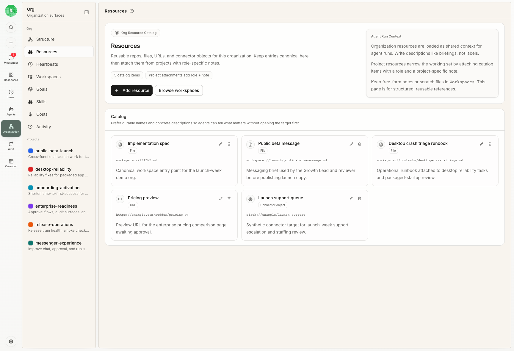

Rudder 为项目 Library 文件、技能、运行时工作和 agent 私有状态提供固定的文件系统位置。



## 应该使用哪个工作区？

| 场景 | 位置 |
| --- | --- |
| 源码或项目仓库工作 | 项目工作区 |
| 持久报告、截图、导出、计划和交接文件 | Library 中的项目文件夹 |
| 跨项目引用和可复用文档 | 共享 Library 文件 |
| Agent 私有说明、记忆和本地状态 | Agent home |
| 临时验证草稿 | `/tmp` 或系统临时目录 |

## 工作区边界

使用 Rudder 托管的工作区路径，不要随手新建临时目录：

- 项目仓库保存在其附加的项目资源位置
- 持久项目文件应写入对应项目的 Library 文件夹
- agent 私有记忆、说明和技能保存在这个 agent 的 home 目录下

## 持久输出

创建项目时，Rudder 会在 Library 下创建对应项目文件夹：

```text
projects/<project-slug>/
  README.md
```

Agent 应该把持久项目文件写在这个项目文件夹内，并根据工作需要自行创建 `research/`、`screenshots/`、`proposals/`、`evals/` 或 `handoff/` 等子目录。Rudder 不要求固定的 `plans/` 文件夹。

`/tmp` 只放临时草稿和验证产物。

## 项目资源

一次运行链接到项目时，Rudder 会把相关项目资源注入运行时上下文。这些资源可以是外部引用或 Library 文件。Project Context 是默认起点，不是知识边界；上下文不够时，Agent 可以继续检查更广的 Library 文件。

Library 文件树也会在对应的 `projects/<project-slug>/resources/` 下展示这些项目资源。这里是指向资源目录的虚拟引用；外部仓库、URL 和 connector 对象不会被复制进 Library 文件。

## 检查和编辑 Library 文件

Library 引用可以在 Rudder Side Panel 中打开，因此你不需要离开当前 Chat、issue 或 Messenger 页面。PDF 等支持的文件会直接内联预览。需要完整的 Library 工作面时，再选择 **Open in Library**。

Markdown 文件可以直接在 Side Panel 中编辑。Autosave 会以上次确认的版本为条件，不会静默覆盖更新内容。如果另一个写入者先改了文件，本地草稿会继续保留，并让你选择 **Keep mine** 或 **Use latest**。

在 Rudder Desktop 里，文件 **Open** 菜单可以用系统默认应用或检测到的 IDE 打开经过校验的文件。Folder 和 terminal 操作会打开文件所在目录。这些是本地 Desktop 能力；无法访问本机文件的 browser 或 remote deployment 不会提供这些入口。

## 本地 Desktop 文件夹

默认本地 Desktop 布局会把组织文件放在 `~/Documents/Rudder/<org-folder>` 下的可读文件夹里。这个文件夹和组织的稳定身份绑定，修改显示名称不会静默移动或替换它。如果一个已经建立的组织文件夹丢失，应恢复原文件夹或 workspace backup，不要创建一个空目录来代替。

## 本地开发

Rudder 仓库本身使用 `pnpm dev` 本地开发。Codex 管理的 worktree 会被 dev runner 自动隔离；手动创建的 worktree 在启动第二个本地 server 前，应先初始化隔离的 worktree 实例。

## 下一步

<CardGroup cols={2}>
  <Card title="技能" icon="book-open" href="/zh/concepts/skills">
    为 agent 打包可复用的操作知识。
  </Card>
  <Card title="任务" icon="circle-check" href="/zh/concepts/issues">
    把执行、证据和评审保存在同一个工作对象上。
  </Card>
  <Card title="管理 Workspaces 和 Library" icon="folder-tree" href="/zh/how-to/manage-workspaces-and-library">
    把 resources、outputs 和 backups 放在正确位置。
  </Card>
  <Card title="Workspace boundaries" icon="list-checks" href="/zh/reference/workspace-boundaries">
    检查文件和 runtime state 应该放在哪里。
  </Card>
</CardGroup>
