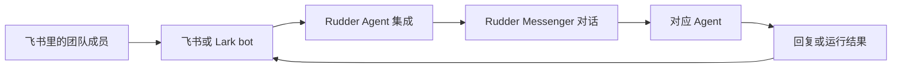

Rudder Agent 可以接到 Rudder 之外的 IM 里。飞书和 Lark 是第一条路径：团队成员给 Agent bot 发消息，Rudder 把消息写入 Messenger，然后由对应的 Agent 接着处理。

我们还在继续补更多 IM 平台。如果你的团队需要 Slack、Microsoft Teams、Discord、钉钉、企业微信，或者别的聊天工具，欢迎开 GitHub issue 或 PR。最好带上真实使用场景，这样我们能判断下一个该接什么。

## 连接机制

在 Rudder 里，每个 Agent 都需要单独创建一个飞书连接。可以把它理解成：一个 Rudder Agent 对应一个飞书 bot。这样归属更清楚，消息、运行记录、来源标记和聊天绑定都能回到同一个 Agent。



接入过程不复杂。Rudder 创建一个 setup session，打开飞书或 Lark 授权页，授权完成后保存 app credential，然后开始接收这个 bot 的消息。


先打开你想接入飞书的 Agent 详情页。飞书连接挂在具体 Agent 上，不是挂在整个组织上。

## 开始前

先确认这几件事：

- Rudder 已经启动，并且你在一个组织里
- 要接入飞书的 Agent 已经创建
- 你能访问飞书中国区或 Lark Global
- 你有权限为工作区授权或创建飞书、Lark app

如果 Agent 还没创建，先看 [如何创建 Agent](/zh/how-to/create-agent)。

## 连接 Agent

1. 在 Rudder 里打开这个 Agent。
2. 进入 `Integrations`。
3. 选择 `Feishu CN` 或 `Lark Global`。
4. 点击 `Connect`。
5. 飞书或 Lark 会打开授权页，bot 名字会提前填好。确认授权。
6. 回到 Rudder，等 setup 状态变成已连接。

Rudder 会在授权时请求 bot 和消息相关权限。Bot 名字只是建议值，如果你的工作区有命名规范，可以在飞书里改。

## 添加两个飞书命令

授权完成后，在飞书或 Lark 里添加两个 slash command：

| 命令 | 作用 |
| --- | --- |
| `/new` | 为当前飞书聊天开启一个新的 Rudder 对话 |
| `/stop` | 如果 Agent 正在回复，请求停止当前回复 |

飞书侧需要配置的命令就是这两个。普通文本消息不需要命令，直接发给 bot 就行。Rudder 会把消息写入这个 Agent 对应的 Messenger 对话。

Rudder 目前还不会自动创建飞书 quick command 菜单。如果飞书里没有出现菜单，请在 app console 里手动创建 `/new` 和 `/stop`，命令名保持一致。

## 验证连接

从飞书或 Lark 给 bot 发送一条普通文本消息。回到 Rudder 后，你应该能看到带 Feishu source badge 的 Messenger 或 Chat 对话。这个消息会进入刚才连接的 Agent。

也可以试一下两个命令：

```text
/new
```

这会为当前飞书聊天开启一个新 session。

```text
/stop
```

如果 Agent 正在生成回复，这会请求 Rudder 停止当前回复。

## Rudder 里的行为

飞书绑定的对话在 Rudder 本地 Chat 里是只读的。回复应该从飞书侧进入，或者由 Agent 的 outbound work 发回去。如果你想在 Rudder 里继续作为普通本地对话处理，可以 fork 这条飞书对话。Fork 会保留来源关系，但不会继续绑定飞书 provider chat。

## 常见问题

| 现象 | 检查点 |
| --- | --- |
| Setup 过期 | 回到 Agent 的 `Integrations` 页面重新开始。Setup session 有有效期。 |
| 打开了不对的产品 | 检查你选的是 `Feishu CN` 还是 `Lark Global`。 |
| 群聊里的消息没有进入 Rudder | 在群里提到 bot。Rudder 会忽略没有指向 bot 的群消息。 |
| 用户收到绑定提示 | 先把飞书用户绑定到 Rudder 组织成员，再重新发送消息。 |
| 非文本消息没有处理 | 先用文本消息验证。文件和富媒体处理还在扩展中。 |

## 下一步

<CardGroup cols={2}>
  <Card title="Agents" icon="bot" href="/zh/concepts/agents">
    理解 Agent 如何承载角色、运行时、技能、预算和集成。
  </Card>
  <Card title="创建 Agent" icon="bot" href="/zh/how-to/create-agent">
    先创建 Agent，再把它接入飞书或 Lark。
  </Card>
  <Card title="Chat 和 Messenger" icon="messages-square" href="/zh/concepts/chat-messenger">
    看飞书消息进入 Rudder 后会落在哪里。
  </Card>
  <Card title="联系与反馈" icon="message-circle" href="/contact">
    申请新的 IM 集成，或者把你的工作流建议发给我们。
  </Card>
</CardGroup>
